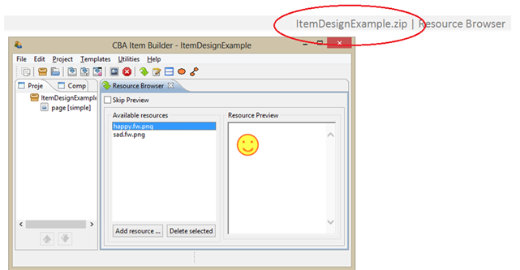

How to use this manual
======================

The present manual seeks to help test and item authors to understand the general concept of the software *CBA ItemBuilder* (IB), i.e., which components, functionalities and features are included, and how to use them.

The different parts of this manual:

The first part introduces the IB as a tool for item authoring (Part I: [IB at a Glance](IB-at-a-Glance.md)). The second part gives a detailed description about how to use the specific features of the IB (Part II: [User Guide](User-Guide.md)). This is followed by a third part, which guides through the building process necessary to create items with specific properties step-by-step (Part III: [Cookbook](Cookbook.md)). Finally, the last part points out possible drawbacks or difficulties regarding the usability of the IB (Part IV: [Things you might need to know...](Things-to-know.md)).

As a supplement, the IB manual includes a digital folder with a variety of IB projects (*IB\_manual\_examples*). The examples (zip-files) in this repository can be opened with the IB (see II.2.2.2). They serve as construction examples to understand certain features or sub-steps easier.

Furthermore, some of the manual?s screenshots will refer to these examples. Figure 1 provides an example for such a reference. In the upper right corner of figure 1 the name of the used zip-file is given (see the red circle in the screenshot). If you want to follow the instructions step-by-step, you can open the corresponding IB project within the IB environment (see II.2.2.2 for how to open an IB project).

Illustration of Correspondence to ZIP-File Examples in the IB Manual: 

However, this manual can only give an introduction to general functions and work processes in the IB. As the IB is constantly improved and its functionalities can be used in manifold ways, this manual claims no totality. Your opinions as IB users, however, matter and we are always pleased to receive any suggestions, especially for the ?Cookbook? part. 

You can find our contact information in section [Contact](3_Contact.md).