[Home](README.md) | [IB at a Glance](2_IB-at-a-Glance.md) | [User Guide](3_User-Guide.md) | [Cookbook](4_Cookbook.md)

---

IB at a Glance
==============

This part gives a brief overview about what the *CBA ItemBuilder* (IB) actually is and how it can be used. Chapter 1 seeks to outline why an item authoring tool such as the IB is needed and in which settings it can be used. Regarding the field of application, computer based test delivery and navigation are addressed, too. Subsequently, the chapter closes with an exemplification of the used technical terms. Chapter 2 presents some examples of real computer based items which have been created with the IB. The examples are classified by different formats of response and also provide an idea of item arrangement and embedding. The last chapter of part I contains details on contact, offered support as well as technical information and the terms of license.

Introduction
------------

### Why an Item Authoring Tool?

Computer based and technology based assessment is gaining importance in fields of research that investigate human education, experience and behavior. Methods of technology based assessment provide many advantages for testing in general and measuring competencies in particular (cf. Bugbee, 1996; Clariana & Wallace, 2002; Mason Patry & Bernstein, 2001). On the way to a computer based test, however, a first obstacle often lies in the development and technical implementation of a single item. The *CBA ItemBuilder* provides an easy solution: It is an authoring tool for computer based assessment that enables test authors to design different item types with a graphical editor.

The unique feature of the IB is its suitability for persons with no or hardly any programming experiences. Therefore, it is possible that researchers with no specific IT background can create and implement complex items on their own within a fairly short time. The IB itself provides a graphical designer that looks very much like a WYSIWYG editor with a toolbox window that can be used to add elements to the design view of the item. Item authors can use this graphical editor to design one or several items by creating pages with images, texts or videos, implementing special features for test takers like timers or feedback loops, and defining rules for automatic scoring.

The available features of the IB are permanently extended and updated. This manual describes version 05-00-00 of the IB and many of the features available in this version. For further information about the different versions of the IB see chapter II.1.5. Note that some of the screenshots might show older versions of the IB.

### Benefits using an Item Authoring Tool 

The need of computerized items for technology based assessment is equivalent to asking for a specific computer program which shows the item stimulus and linked questions on a computer screen, to show the additional input elements with their specific behavior and to gather all log, process and result data. Implementing computer programs or web pages would usually require technical efforts, i.e., programming. However, if each item for technology based assessment would be a separate computer program or web page, the developed programs would be very similar to each other from a technical point of view. To avoid this redundancy, the IB was developed as a graphical editor to define a variety of different items. For these items the IB adopts the role of the programmer.

When an item author saves his or her creation, the IB stores a zip-file in which it automatically generates the needed program code necessary for the item defined at the design time (*Code Generation*). The generated code, the item definition as well as all included resources bundled in a zip-file then provides the basis for technical displaying and presenting the item to test takers at run-time and gathering different kinds of log, process and result data (see Figure 2).

### Test Deployment and Navigation

Computer based assessment can be implemented with different test deployment strategies, which are described in the following.

*Notebook*. Software for offline test delivery, i.e., for item sequencing, data storage, account management and response logging, is installed on notebooks. Offline delivery with notebooks provides the highest operational safety, because the software for offline test delivery can be installed on the target systems (notebooks) with administrative privileges. Hence, test authors are able to define specific actions which the test takers are allowed to do in the offline test delivery system. In this way test authors can also guard the content of their items. Notebook delivery, though, can cause logistic challenges, especially regarding storage and transport.

*Online*. A more comfortable deployment option is online delivery, i.e., browser based testing. For online delivery, a) a central web server has to be set up with an appropriate software for online test delivery which provides items and item resources, functionalities for data storage and item sequencing as well as b) an application server is necessary for running interactive parts of the items (such as finite state machines, see section II.5). Online test deployment is based on standard web technologies (HTML5) with standard protocols (http, https) and the necessary browser requirements (e.g., JavaScript) are low. To support a larger number of concurrent users, however, using one server might not be sufficient. In this case, a so-called server farm or a cloud solution has to be considered. No specific software is expected on the client side because standard web browsers are used to render items developed with the IB. In principle, all devices connected to the internet can be used, but often this has to be restricted to devices offering certain features like a minimum of screen size, a special browser version, etc. Test security is also more difficult to maintain in an online assessment setting, because the software within the browser runs with restricted access to system resources.

*USB flash drive*. Delivery by USB flash drives combines some advantages of notebook and online delivery. It concedes the test author to define exactly possible actions within the test, but it is also very flexible in bringing the test to the test taker. A compatible hardware, though, is presumed at the place of test administration, e.g., in classroom settings within schools.

#### Integration in Delivery Systems

The IB is a flexible item authoring tool, capable for various item types and formats. However, the developed items cannot be used for CBA without an additional software for “test deployment”, i.e., to administer tests composed by multiple items or units, additional software that controls access to the test or the items, the navigation between items and the storage of data is necessary.

A web browser is used for platform independent presentation of items developed with the IB and a portable version of the Firefox browser is used in the current version for previewing items (see II.2.2.3 for preview function), but using other browsers at run-time is possible as well.

A simple delivery system, the *Execution Environment*, is bundled with the IB. Other delivery systems that can be used with the IB are the *TAO* system as well as, with the help of a *TBA Tools*, an implementation of the JavaScript API which can be used to include the generated code for items in browser-based environments.

Note that items created with the IB also can be integrated in other existing software packages and web applications (see section I.3.1 for more information about the technical documentation). Hence, items created with the IB are “delivery-independent” (I.1.1) und the items can be used under different test deployment scenarios. Each of the deployment scenarios contains different advantages and disadvantages. The particular scenario used for test deployment of a specific test has to be selected individually for each research project.

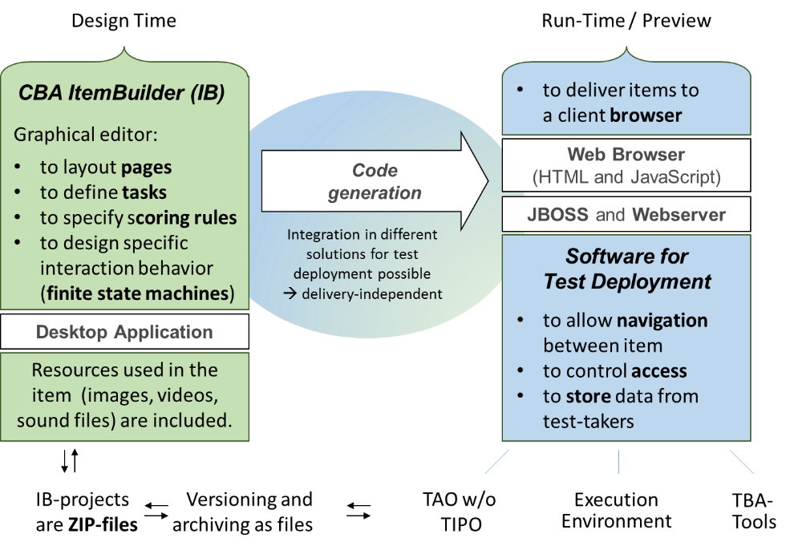
Figure Description: Idea of code generation and item presentation in the IB  

Note [1]: The necessary connector for [TAO](http://wwww.tao.lu) is not deployed in the official package of tao version 2.5.3 and a local test package is necessary to use tao with items developed in the IB.

#### Navigation Method 

Navigation addresses questions about how to move *between* or *within* IB items. Inside, each IB item has to provide the necessary user interface components (e.g., Buttons, Links) to allow task-completion as well as navigation between pages.

Test authors can also decide how test takers can navigate between IB items. This navigation is usually implemented with the help of the chosen delivery platform. Options referring to forward, backward, or hidden navigation might be available and have to be chosen by the test author.

### Glossary

A computer based test usually consists of one or several items. We name the elements which require the test taker to give a response as the “answer” of the item. An item usually consists of a stimulus, i.e., the material that the test taker is supposed to work with before accomplishing the task (e.g., texts or charts), and a task that the test taker is supposed to accomplish (e.g., an instruction or a question). We use the term “unit” for stimuli that are aligned to multiple items. More terms are described shortly in Table 1.

Table Description: List of terms used in this manual

| Term                        | Description                                                                                                                                                                                                                                                                                                                                                                                                                                                                    |
|-----------------------------|--------------------------------------------------------------------------------------------------------------------------------------------------------------------------------------------------------------------------------------------------------------------------------------------------------------------------------------------------------------------------------------------------------------------------------------------------------------------------------|
| Container                   | Elements that can hold other elements are called “containers”. Elements that belong to a common container might share properties (see 0 for a description).                                                                                                                                                                                                                                                                                                                    |
| Elements                    | Each container can hold one or multiple elements. Elements can be part of the presentation layer (e.g., texts or images), elements can represent response options (e.g., RadioButtons), and elements can be containers which can hold several related (child-)elements (e.g., RadioButtonsGroups).                                                                                                                                                                             |
| Finite State Machines (FSM) | Finite state machines allow to modify the visual presentation or behavior of items in a very flexible way (see II.5), according to states of “machines”, i.e., distinct values of variables. Many of the advanced functions of the IB can be constructed by using one or multiple finite state machines, such as “Drag and Drop”.                                                                                    |
| Item                        | An element of a test corresponding to an exercise with either one or more related questions.                                                                                                                                                                                                                                                                                                                                                                                   |
| Navigation                  | The term “navigation” is used to describe how test takers can move between different pages, items and units. Response elements (e.g. Buttons) can be used to trigger navigation (see II.3.5), either with the help of commands or links.                                                                                                                                                                                                                                       |
| Page                        | Each project consists of one or more pages. Pages can contain containers and elements, e.g., presentation elements (such as texts, images) and response elements (such as inputfields, check boxes, buttons or hyperlinks; see II.3).                                                                                                                                                                                                                                          |
| Page Type                   | Each page is of a particular type, and several page types are available in the IB. The elements and containers which can be used to create a page depent on the page type. I.e., pages of different types have to be used to implement specific parts of a computer based item. The type of a page, e.g., *WebBrowserPages*, *TaskBarPages*, *Dialog* and *Modal Dialog* (see II.3.1.1) is defined when the page is created and it is impossible to change the type of a page. |
| Palette                     | The palette is the “toolkit” of the item authoring system, containing all elements and containers that can be added to a page of a particular type (see II.2.3.5).                                                                                                                                                                                                                                                                                                             |
| Project File                | Test authors build and edit “project files” within the IB. A project file can contain either a single item, several units, or even a complete test. The decision about how many separate files are used to computerize a particular test material is up to the test author. Howerver, very large files with many items in single IB project are not suggested, because the size of the zip-files might become too large. For the sake of simplicity, projects described in this manual contain only a single item, unless otherwise stated. Note that the name of the project and the saved zip-file are identic (see II.2.2.7).                                                                                                                                                                                                                                                                         |
| Properties                  | The term properties refers to the specific design and features of a selected element (see II.2.3.6). Properties are listed and can be changed in the *Properties View*.                                                                                                                                                                                                                                                                                                        |
| Ressources                  | Resources include all elements that have been uploaded in the IB for creating items, e.g., pictures, audio and video files (see II.3.3).                                                                                                                                                                                                                                                                                                                                       |
| TAO                         | The TAO framework is an open-source project which provides a very general and open architecture for computer-assisted test development and delivery.                                                                                                                                                                                                                                                                                                                           |
| Template                    | Pages can be saved as templates for re-using a created page inside and outside of a project file, i.e., in the same or other projects several times (see II.3.6).                                                                                                                                                                                                                                                                                                              |
| Scoring                     | Scoring refers to the automatized assessment of the test taker’s response (see II.4). Test authors can precisely define scoring patterns for each possible response. Scoring patterns are organized within tasks.                                                                                                                                                                                                                                                              |
| Task                        | IB tasks are selfcontained item-packages defined by test authors. They have two functions: IB tasks interconnect IB items with the delivery system as so called *entry points* (see II.4.1) and they also include rules for automatic scoring (see II.4.2).                                                                                                                                                                                                                    |

Real Life Examples
------------------

The purpose of an assessment is usually to measure certain skills or competencies of test takers (e.g., reading, problem solving). With the IB it is possible to create test scenarios that allow measuring competencies in different areas or domains. Therefore, the IB supports a wide range of item formats and characteristics for computer based test items. From static to dynamic, from simple to complex, using only text or multimedia, with a linear or a hyper textual structure – many different item types can be created.

To name just a few, item formats (sorted by increasing difficulty) might be

* simple multiple choice questions with each question on a separate page,

* assessment in unit structure with a text stimulus followed by multiple aligned questions,

* simulated browser and hypertext for the assessment of digital reading competence ,

* behavior and simulation-based assessment of ICT-literacy ,

* assessment of Problem Solving (PS), dynamic PS, and collaborative PS , and

* assessment embedded in simulated, complex computer environments.

Answers and responses from computerized test items can be collected by different response formats. Some of them are comparable with response modes in paper based assessments; others make use of specific interactions that are only possible in computer based assessments. The IB supports a variety of response formats out-of-the-box. Additional response formats can be realized using the advanced functions of the IB (e.g., finite state machines).

The number of response formats supported by an item authoring tool determines the range of item types that can be created with this particular software. The following examples in this section should illustrate typical response formats available with the IB. Although not exhaustive, the list should give a first impression of possible response formats and item types.

### Click Responses 

Click responses represent a rather simple type of response formats given in computer based testing. Items that contain click responses can be solved only by using a mouse or, in case of touchpads, by pointing on the touchscreen. Click responses are mainly used in tasks that require a selection out of several alternatives or marking of a specific area, for instance, in a chart.

#### Check Boxes 

Check boxes can be used when test takers have to select several elements from a given assortment. The selection itself serves as response. Check boxes are activated by clicking on the corresponding field or, if available, on the text near to the field[2] (Figure 3). It is possible to deselect each check box.

|------------------------------| 
|  |  
| Figure Description: Example of Selection/Identification Implemented with Check Boxes in the IB (from Scalise, 2006, Figure 2) |
| Example Project: **FIXME** |

#### Radio Buttons

Compared to check boxes, radio buttons are also used for selecting an element of a given group. In contrast, radio buttons only allow one selection at a time (Figure 4). The circle (i.e., the radio button) itself can be clicked to give the answer as well as the text or image next to the radio button.

|------------------------------|------------------------------|
| 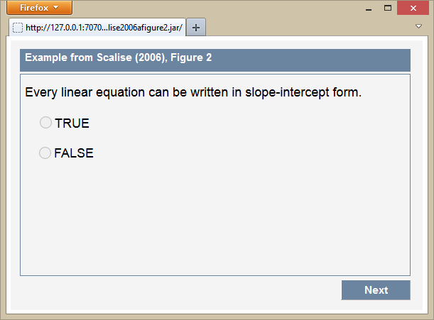 | 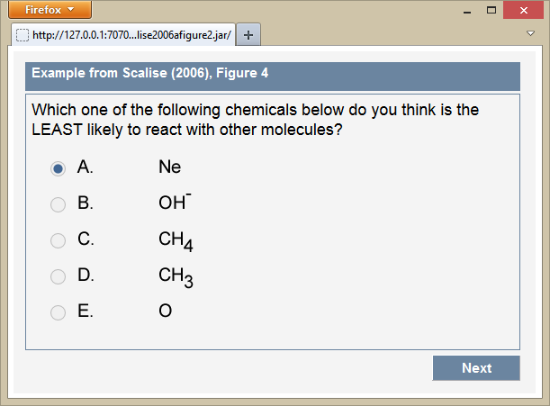 |

| Figure Description: Examples of Multiple Choice with Radio Buttons (from Scalise, 2006, Figure 2 and Figure 4) |
| Example Project: **FIXME** |

In the IB radio buttons are assigned to groups (so called radio-button-groups) to bundle radio buttons that belong together to one item. Within each radio-button-group only one element can be selected. Note that once a radio button of a group is selected, it is usually impossible to deselect it (see **FIXME**).

With multiple radio-button-groups several single-choice items can be implemented in one project or at one page, respectively. Multiple radio button groups or check boxes arranged in rows or columns (known as complex multiple choice, CMC) can be created in this way (see Figure 5 for an example).

|------------------------------| 
| 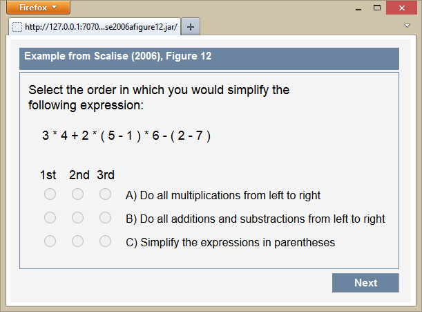 |  
| Figure Description: Example of Rearrangement Implemented with RadioButtons in the IB (from Scalise, 2006, Figure 12) |
| Example Project: **FIXME** |

#### Image Maps

With image maps charts can be divided into clickable and non-clickable areas. When test takers select a clickable part, the area will be highlighted in a different color. Test takers can also deselect areas by clicking again.

|------------------------------| ------------------------------| 
| 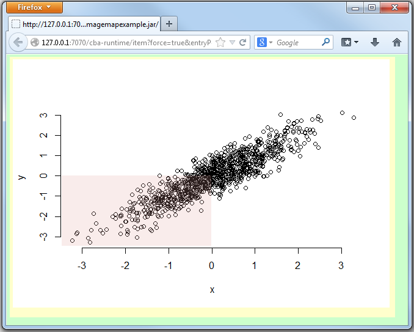 |  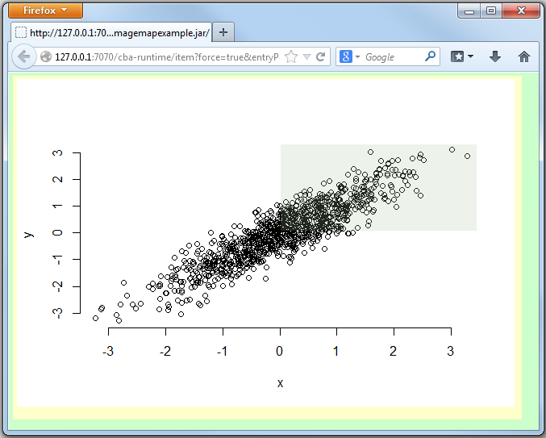 |  

| Figure Description: Example of an Item Using Image Maps to Provide Clickable Areas in a Coordinate |
| Example Project: ImageMapExample.zip |

**FIXME** Create a more "real life" example.

#### Combo Boxes

Similar to radio buttons, combo boxes provide a group of alternatives from which one has to be selected. In contrast, only one option is visible at a time. For seeing all alternatives test takers have to open the list of possible options by clicking on the grey triangle-icon. The chosen, i.e., clicked option remains in the combo box, albeit the list has been closed.

| 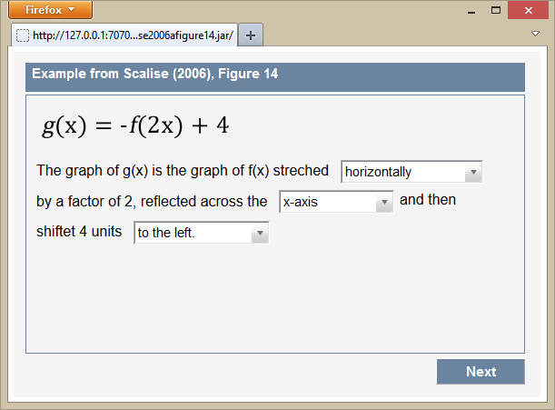   
| Figure Description: Example of Substitution / Correction with Combo Box (from Scalise, 2006, Figure 14) 
| Example Project: **FIXME** 

**FIXME** Describe that various elements such as the font size and the number of visible elments can be configured. 

### Text entries 

The IB also supports writing texts as a response format. Items containing text entries require the use of either a real or virtual keyboard. Textual IB item formats can be differentiated by the amount of text to be written (short answers vs. open formats). For the implementation test authors just have to define the location and size of the text field. 

#### Single Line Input Fields

With single line input fields test authors can implement items requiring, for example, just short answers or sentence completions as a response. 

| 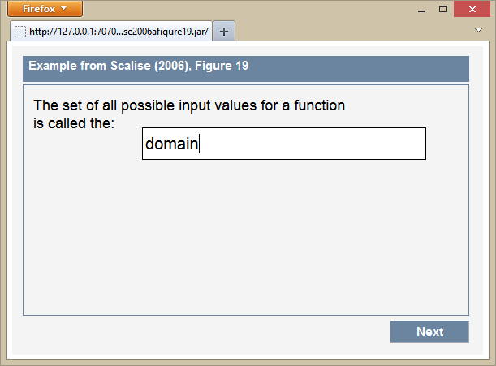 |  
| Figure Description: Example of Completion with Single Line Input Field 
  (from Scalise, 2006, Figure 19) 
| Example Project: **FIXME**  

Depending on assignments of items the possible amount of characters can be restricted (see II.6.2.1), e.g., to realize numerical inputs as exemplified in following figure:

| 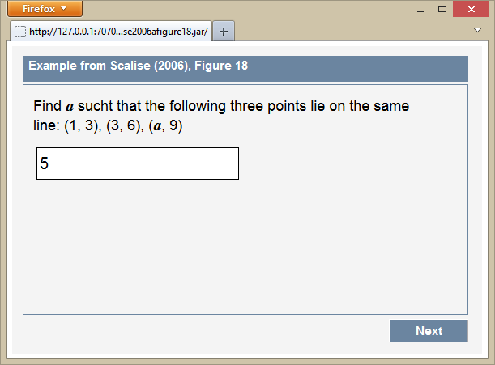 |  
| Figure Description:Example of Completion with Single Line Input Field (from Scalise, 2006, Figure 18)
| Example Project: **FIXME**  
 
**FIXME** Mention that more complex restrictions are possible based on regular expression. 

#### Input Fields

For more complex text answers, the IB offers multi-line input fields (Figure 10). Line breaks in multi-line input fields are included automatically, and can be added with “enter”.

| 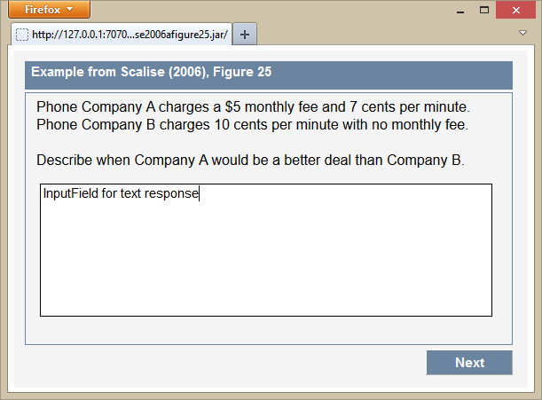                                                                                                                                                     |
|-----------------------------------------------------------------------------------------------------------------------------------------------------------------------------------|
| Figure 10. Example of Construction with Input Field (from Scalise, 2006, Figure 25) |

### Advance Response Formats

The IB also provides a series of further and partially more complex item response formats. To highlight just a few options, the IB also supports selecting elements that, for instance, lead test takers to other pages (e.g., selection of buttons, links, menu entries, lists), or moving and selecting elements by dragging the mouse (e.g., drag and drop, text highlighting).

#### Using navigation elements as response format

With the IB it is possible to include navigation steps in item response formats. For instance, in the example presented in Figure 11 a simulated email client is presented to test takers with the instruction to respond to an email. For task completion test takers are supposed to select the reply-button at first (red circled button in the left part of Figure 11). The reply button leads test takers to a new page where an email can be written. Finally, test takers have to send the answer by clicking on the send button (red circled button in the right part of Figure 11). The selection of the particular button serves as response. 

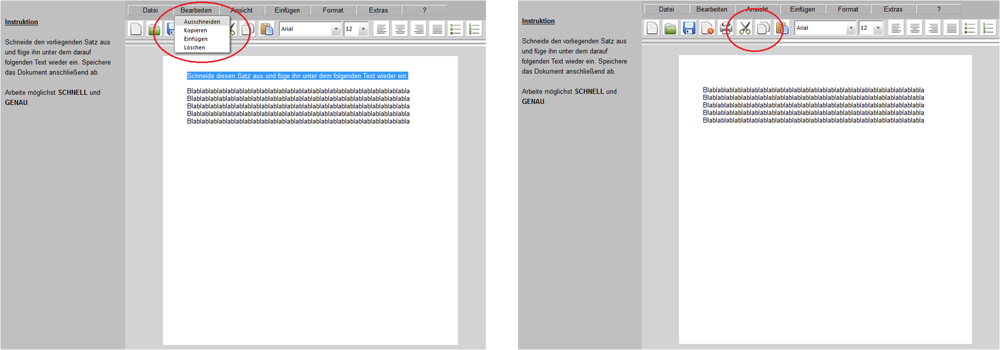 

Figure Description: Example of Construction with Buttons (from Goldhammer et al., 2012, released item)

Example Project: **FIXME**  
 
#### Using processing steps as response format

Besides navigation, certain processing steps are also recorded by IB items and, therefore, can serve as item responses, too. In the example presented in Figure 12 test takers are instructed to cut out parts of the text (highlighted blue text in the left part) and paste it somewhere else in the document. Therefore, some menu entries (red circled in the left part of Figure 12) and buttons (red circle in the right) are combined with commands like copy, paste or cut.

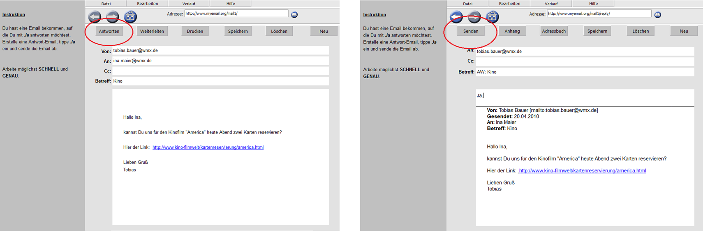 

Figure Description: Example of Construction with Menu Entries (from Goldhammer et al., 2012, released item)

Example Project: **FIXME**  
 
#### Drag and Drop

Another class of response formats that enables constructing innovative items is to drag and drop elements. Test takers interact with drag-and-drop elements by clicking on an element and dragging it to another position. Possible drag-elements and drop-positions have to be determined by the test author. In the example in Figure 13 test takers have to distribute weights in order to balance the scale. To complete the task they have to drag weights out of the collection below the scale and drop them on either of both scale pans.

|--|--|
| 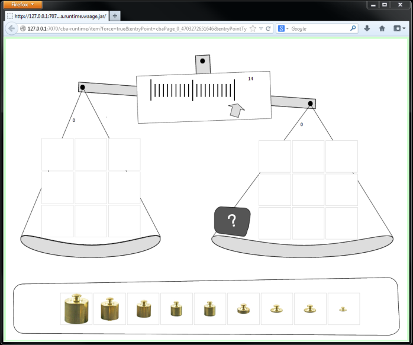 | 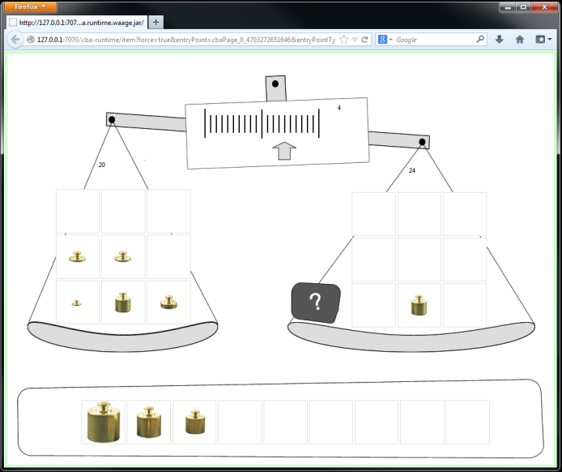 |

Figure Description: Example of a Drag and Drop item

Example Project: Waage.zip

#### Highlighting

Besides marking image areas, highlighting is also available as a response format for textual items. Text highlighting requires construction of text fields in which test authors have to mark highlightable lines. Test takers then need to press the left mouse button and drag it over the text they want to highlight (Figure 14).

|--|--|
| 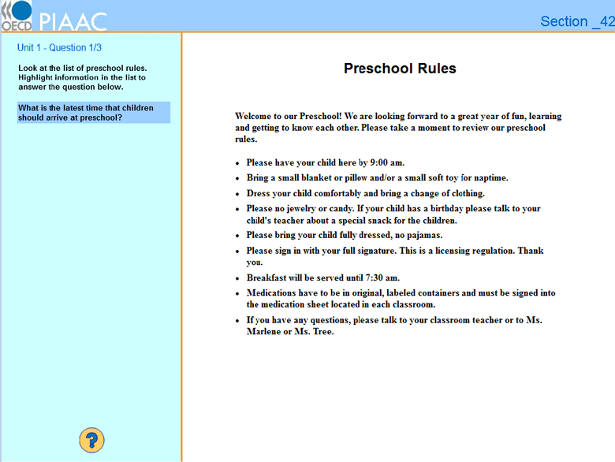 | 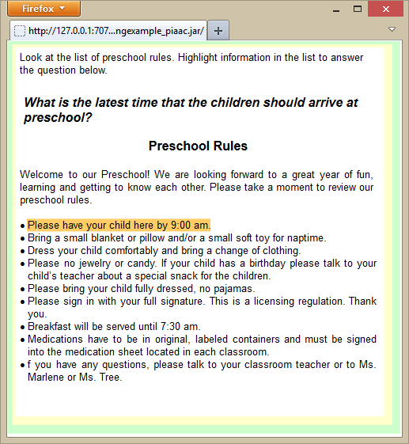 |

Figure Description: Example of Construction with Highlightable Text (from NCES, 2013, released OECD PIAAC sample item) 

Example Project: **FIXME**  

### Multi-Page Questionnaires

With the IB it is also possible to design more complex projects that contain more than one item or even whole tests. For this purpose several item response formats can be combined. Figure 15 shows an example for a questionnaire with more than one item and different response formats. On the left part the ‘Design View’ is presenting how the projects looks like during the construction phase; on the right side the ‘Final View’ can be seen that is also shown to the test takers.

|--|--|
| 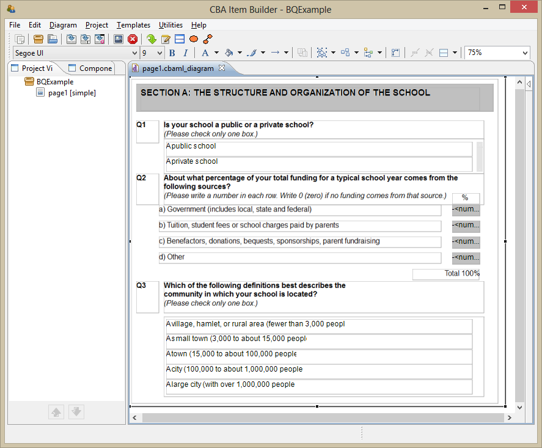 | 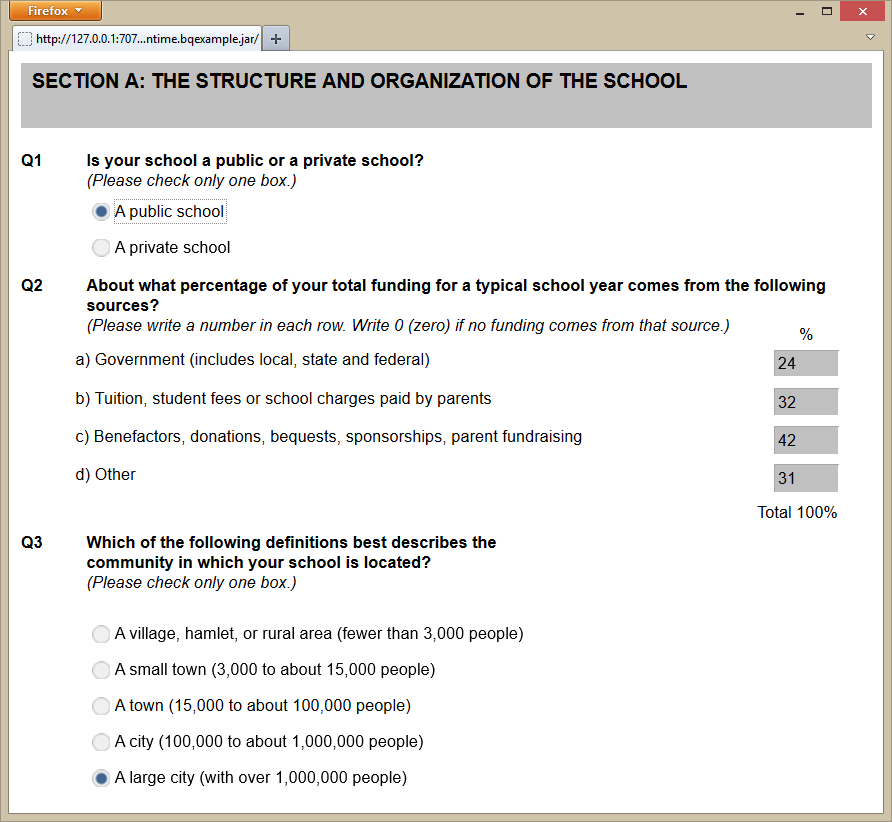 |

Figure Description: Example Page of a Questionnaire

Example Project: PQExample.zip

Contact, Support, and Technical Details
--------------------------------------- 

If you want to use the IB for building up items for your own research or assessments, please consider the terms of license (see I.3.2). To obtain a copy of the IB send a request to <tba-info@dipf.de>.

### Technical Information for Delivery 

The technical requirements for the delivery of IB items are described in detail in the document ?CBA-AdminManual.pdf?, which can be requested from TBA.

###  Terms of License

The license is included in the installer.
