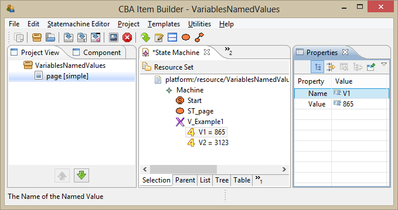
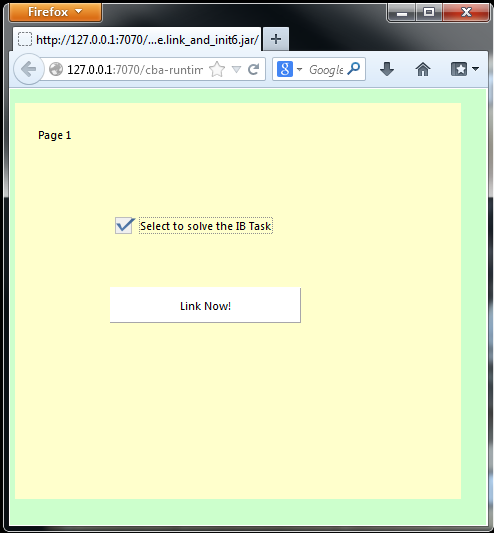

User Guide
==========

In this second part, general information about working with the *CBA ItemBuilder* (IB) is provided. Chapter II.1 is about technical requirements for the use and installation of the IB and describes how to deal with different versions. In chapter II.2 the general user interfaces, important views and different settings of the IB are introduced. Chapter II.3 explains basic features for designing items with the IB. Chapter II.4 is about the implementation of item scoring, i.e., about how to define a final score for different possible responses. A detailed introduction of the so-called Finite State Machine (FSM), used to develop innovative, interactive item types, is given in chapter II.6.

Installation
-------------------------------------------------------------------------------------------------------------------------------------------------------------------------------------------------------------------------------------------------------

### System Requirements

Before you start the installation of the IB make sure that your computer fulfills the following system requirements:

-   Operating system: Windows XP, Windows Vista, Windows 7, Windows 8 or Windows 8.1

-   CPU: Pentium D or higher, 2.6 GHz or higher (Pentium 4 or higher, 2 GHz or higher for XP)

-   RAM: At least 1 GB main memory

-   HDD: More than 750 MB free disk space

### Setup Wizard

To install the IB, start the “IB-{Version}-Setup.exe”. Make sure that you run this setup as ‘Administrator’. After verifying the installer, the following wizard is shown:

| Step 1   |  | Step 2   |  |
|----------|-------------------------------|----------|-------------------------------|
| Step 3   |  | Step 4   |  |
| Step 5   |  | Step 6   |  |

| Figure 16. Setup wizard for the IB |
|-----------------------------------------------------------------------------------|

Please read the license agreement (step 2) and accept by selecting “I Agree”.

Note that the destination folder selected in step 3, must not contain white spaces (e.g., “C:\\my work related programs\\”) and the overall length of the path (i.e., the depth in your computers directory tree) should be small. By default, the setup wizard suggests the directory “C:\\CBAIB\\{Version-Number}\\” which should work on most systems. Do not modify this directory unless it is necessary.

In step 4, optional features can be selected: The “Demo Projects” contain technical examples, used to test each new version of the IB, and the “Manual (PDF)” includes a PDF version of this manual as well as the examples, described in this document. After selecting or de-selecting the optional components, press the “Install” - button to start the installation. The actual installation in step 5 might take several seconds.

Note that multiple versions of the IB can be installed simultaneously on your computer.

### Manual Installation (X-Copy Deployment)

The TBA group (see I.3) might also provide a zip-file as download containing the IB program and a user’s license (“allFeatures.cbalicense”). For installation of the IB just unzip the zip-archive with suitable software (e.g., 7zip). Afterwards the IB can be started by (double-) clicking on “cba-itembuilder.exe”.

|----------------------------------------------------------------------------------------------------------------------|
| Figure 17. Start the IB by (double-)clicking on „cba-itembuilder.exe“ |

> **Important Note 1:** *Directory depth* – To avoid any processing problems make sure to choose a rather low directory depth for installation.
>
> **Good:** C:\\IB\\
>
> **Bad:** C:\\Users\\User.Domain.etc.\\Desktop\\MyCurrentProjects\\CBA\_ItemBuilder\_DIPF\\etc.
>
> **Important Note 2:** *Licensing –* Without a license the IB will just provide a grey surface without menu entries (e.g., file) when starting the program. In case of failing, copy your license in the unzipped IB archive. Otherwise, please contact the IB support (I.3).
>
> **Important Note 3:** To use the IB Scoring-Viewer function (see II.4.5) you might have to add a line in the configuration file “cba-itembuilder.ini”. If the viewer does not work, you have to type in “-DAllowScoreDebugging=true” in a separate line by using any text editor program.
>
> **Tip:** We recommend creating a shortcut on the desktop of „cba-itembuilder.exe“. It is easy to implement by right-clicking on „cba-itembuilder.exe“, selecting “Send to” and “Desktop (create shortcut)” (Figure 18).

|                                                                                                                                       |
|-------------------------------------------------------------------------------------------------------------------------------------------------------------------------------------------------|
| Figure 18. How to create a Shortcut on the Desktop |

### Deinstallation

A deinstallation of a previous version of the IB is (technically) not necessary. Multiple version of the IB can be used in parallel on the computer. However, if you have used the install wizard, the IB can be uninstalled by using the “uninstall.exe” from the selected installation directory. Otherwise, just delete the IB folder.

| Step 1   |  | Step 2   |  |
|----------|-------------------------------|----------|-------------------------------|

| Figure 19. Uninstall IB |
|------------------------------------------------------------------------|

### Migrating Projects

#### Compatibility between different IB versions

Note that you can open all projects saved with a certain version of the IB in a higher version of the tool – but it is not possible the other way around: A project that was saved in a certain version of the IB cannot be opened with a lower release version anymore.

For migrating an IB project to a higher version the project just has to be saved (“generate and save”) within the higher version environment.

#### Current Version

The current version can be checked in the menu “Help” with the menu entry “About” (see Figure 20).

|                                                                                                    |
|---------------------------------------------------------------------------------------------------------------------------------|
| Figure 20. About Dialog of the IB |

First Start of the IB
-------------------------------------------------------------------------------------------------------------------

This section describes start elements within the IB. First, how to start the IB environment (see II.2.1), second, how to create, open, save or close a project (see II.2.2). In section II.2.3 the graphical user interface of the IB is introduced in detail.

### Start an Instance 

For starting the IB double-click on the file “cba-itembuilder.exe” within the installation directory (see II.1.3) or on the respective desktop icon. It is important that only one instance of the IB can be opened at the same time.

|                                                                                                   |
|--------------------------------------------------------------------------------------------------------------------------------|
| Figure 21. Main Window of the IB |

The main window of the IB (see Figure 21) consists of at least two areas: On the left side the “Project View” is located, in the middle-right part of the screen the edition can be done in the designer view.

### Open, Preview, Save and Close Projects

#### Create a New Project

You can create a new project by either choosing *New Project* from the file menu entry or by clicking on the ‘brown-box-icon’ from the quick access toolbar. After selecting *New Project* you are asked to enter the project’s name (Figure 22).

> **Important Note:** The name of a project must neither contain white spaces and special characters nor start with a number. The project’s name is identical to its file name (see II.2.2.7).

#### Open a Project

To open an existing project you can choose *Open project* from the file menu or click the ‘blue-folder-icon’ from the quick access toolbar (Figure 22).

> **Important Note 1**: You can open only one project at the same time.
>
> **Important Note 2:** Depending on the project’s size opening can take a few seconds.

| A                                                                                                                                                                                     |     | B   |     |
|---------------------------------------------------------------------------------------------------------------------------------------------------------------------------------------|-----|-----|-----|
| Figure 22. Menu Entries and Icons for Creating a New Project or Opening an Existing One |

#### Preview a Project

In the designer view the different components of pages can be added and arranged. However, the designer view does not show how the page will look like at runtime. To see a preview of a page, a specific task or the complete project you can use the preview functionality.

There are different ways to preview the complete project. You can either use the menu button “Preview project” (see the icon in the part A of Figure 23), use the entry in the menu “Project” of the menu bar (see part B of Figure 23), use the context menu available by right-clicking on the project’s name in the “Project View” (see part C of Figure 23), or open the preview of a single page by right-clicking on the page’s name in the “Project View” (see part D of Figure 23).

The options A-C will open a dialog in which the scope for the preview can be selected (see **Fehler! Verweisquelle konnte nicht gefunden werden.**). If tasks had been defined in the project (see section II.4.1), a task can be selected to be previewed. Otherwise, the whole project can be previewed starting with the first page of the project. Finally, each page can be previewed separately by choosing “Page”. This is equivalent to option D in Figure 23).

| A                                                                                                                                    |  | B   |  |
|--------------------------------------------------------------------------------------------------------------------------------------|-------------------------------|-----|-------------------------------|
| C                                                                                                                                    |  | D   |  |
| Figure 23. Preview a Project or a Page |

|                                            |
|-------------------------------------------------------------------------|
| Figure 24. Preview Scope |

The preview automatically starts the portable firefox, which is included as browser in the IB installation, and shows the selected task, page or project.

> **Important Note 1**: Close the preview before switching back the IB: Once the preview is requested the IB will generate the necessary code to show a preview of the task, item or page in the browser. The generated code will be outdated as soon as you change anything in the underlying project file. To avoid any confusion, use only one preview at a time and always close the preview before switching back to your project.
>
> **Important Note 2**: Check the specified item size: The preview is always generated for the item size specified in the global preferences (see section II.2.2.4). If the item is not previewed as expected and, for instance, scroll bars are appearing although there is enough space to display the whole item make sure that you specified the correct item size in the preferences of the IB.
>
> **Important Note 3**: It can sometimes happen that the preview just displays a white window. In that case it helps to close IB and re-open it.

#### Item Display Size for Preview

IB items are designed according to a fixed item size. Therefore, before you preview an item, you have to define the size available for this item. The item size can be configured in the dialog “Preferences”, which can be found in the menu “Utilities” under the menu entry “Open preferences”. To change the item size, select the element “CBA Item Size” on the left and adjust height and width of the item in pixels (Figure 25).

|                                                                                           |
|------------------------------------------------------------------------------------------------------------------------|
| Figure 25. CBA Item Size |

> **Important Note 1**: The item size is different from the effective size of an item. The item size is defined in the dialog “Preferences” (see Figure 25); the effective item size results from the size of the frame (see II.3.1.2), added to a page as the root container. Both sizes are not perfectly in line with each other, because the item is located at the coordinates (X=1, Y=1) in the display area. Therefore, if you want to use the full item size without scrollbars, the size of the frame should be two pixels smaller than the item size defined in the preferences.
>
> **Important Note 2:** The arrangement of height and width input fields in the dialog *preferences* might be unfamiliar. If the size of your item is not correctly presented in the preview, check the arrangement of your height and width parameter inputs at first.

#### Save a Project

You can save projects by opening the menu item “Project” in the menu bar or by using the ‘blue-arrow-icons’. If a project is saved (or if the option “Save As” is selected) for the first time, a directory on your computer must be specified where the project file should be stored. The name of the ZIP-file represents the project name that was used when the project was created.

To save changes in an existing project you should usually use “Generate and Save”, either from the menu bar or from the menu buttons. “Generate and Save” differs from “Save” and “Save As” in the following way: “Generate and Save” generates the code necessary to run (see I.1.1) or preview (see II.2.2.3) the item while “Save” and “Save as” only stores all information relevant for a later code generation in the project file. However, instead of generating new code the code used for the last preview of the project is included in the project file, meaning that none of the changes you made after the last preview of the project will be available when using the item (as saved) in a test.

> **Important Note 1**: To be on the safe side, please make sure to always use “Generate and Save” when you want to save your changes.
>
> **Important Note 2:** Do not save your IB project within the IB path structure where you have installed it. Otherwise, problems can occur in item implementation.

#### Close a Project

To close an opened project you can choose *Close project* from the file menu or click the ‘x-icon’ from the quick access toolbar (see Figure 26).

|------------------------------------------------------------------------------------------------------------------------------------------------------------|
| Figure 26. Menu Entry and Icon for Closing an Opened Project |

#### Renaming an Existing Project

If you want to rename a project you need to open it in the IB and use the “Save as” option to save it under a different name.

> **Very Important Note:** Do not rename your project by just changing the name of the ZIP-file on your computer without opening it in the IB. If you rename a project file in the file explorer, the project will be destroyed and cannot be used any longer with the IB.
>
> **Explanation:** The IB saves projects as ZIP-files. The files contain the item specification, settings, resources (e.g., graphics) and templates used by the project. By using “Save as” and choosing a different name, the IB renames the project as well as all corresponding files and resources within the ZIP-archive. Just renaming the ZIP-file is therefore incomplete.

#### Global Properties / Project Settings 

Various project settings (see the build-in help of the IB for a description**Fehler! Verweisquelle konnte nicht gefunden werden.**) are editable in the global properties dialog. To open the global settings dialog right click on the project name in the project view and select the entry “Global Properties” from the context menu. The dialog “Project Settings” opens (Figure 27). Note that changes in the global properties are specific for each project.

|                                                                                                     |
|----------------------------------------------------------------------------------------------------------------------------------|
| Figure 27. Global project settings |

### Graphical User Interface 

In the following the elements and functions of the IB graphical user interface (GUI) are explained. A general overview of the main window (II.2.3.1) is followed by details on the menu bar (II.2.3.2). The sections guide through to the IB User Interface from left to right, starting at the Project View (II.2.3.3), to the Drawing Area (II.2.3.4), the Palette (II.2.3.5) to the Properties View (II.2.3.6). Finally, the function and settings of IB rulers and grids are explained (II.2.3.7).

#### Overview of the main window

The main window of the IB consists of three areas:

On the left side the Project View is located. The Project View provides an overview of the pages within the project. Use the Project View to open, save, rename etc. of your project.

Editing pages is done in the middle of the screen. You can open more than one page for editing. In case you have opened more than one page you can select a single page by clicking on the tabs above.

The Palette and the Properties View are located on the right side. The Palette holds tools like TextFields and Buttons. You can use these elements to design your pages. The Properties Views lists the properties of a selected element.

The IB also provides other views, e.g. Component View, Value Maps Editor and Task Editor that are described in separate sections in more detail (see specification in Figure 28).

|                                                                                                                                                                      |
|---------------------------------------------------------------------------------------------------------------------------------------------------------------------------------------------------|
| Figure 28. Central Elements of the IB User Interface |

#### Menu Bar and Menu Buttons

The menu bar in the upper left of the IB interface contains all general functions. The menu buttons below provides shortcuts for frequently used functions from the menu bar (Figure 29).

|                                                                                                       |
|------------------------------------------------------------------------------------------------------------------------------------|
| Figure 29. Menu Bar and Menu Buttons |

In the following, Table 2 gives an overview about the entries in the menu bar,

Table 3 lists the menu buttons and describes their function.

Table 2: Entries of the Menu Bar

| **Menu bar entry** | **Description**                                                                                                                                                                                                 |
|--------------------|-----------------------------------------------------------------------------------------------------------------------------------------------------------------------------------------------------------------|
| File               |                                                                                                                                                                                                                 |
|                    | Creating, opening, saving, and closing a project (see II.2.2).                                                                                                                                                  |
|                    | Ends the IB.                                                                                                                                                                                                    |
|                    |                                                                                                                                                                                                                 |
|                    | Undo cancels the former step. Redo cancels Undo.                                                                                                                                                                |
|                    | Does not work yet. In some cases the duplicate-function might work (see II.2.3.4).                                                                                                                              |
|                    | Only works for text copied externally from the IB.                                                                                                                                                              |
|                    | Selects all design elements. If a container is already selected, the container itself and included elements are selected (see II.3.1.5).                                                                        |
|                    | Appears only when a design element is selected (see II.3.1.5).                                                                                                                                                  |
|                    |                                                                                                                                                                                                                 |
|                    | Previews a project (see II.2.2.3).                                                                                                                                                                              |
|                    | Uses template function for generating pages (see II.3.6).                                                                                                                                                       |
|                    | Uses OLT functions for item translation (see II.6.5).                                                                                                                                                           |
|                    | Opens editors for viewing and editing text entries, e.g., names, texts, user defined IDs.                                                                                                                       |
|                    | Opens several editors (see Resources: II.3.3, Tasks: II.4.1, Value Maps: 0, or FSM: II.5).                                                                                                                      |
|                    |                                                                                                                                                                                                                 |
|                    | Opens the Template Browser (see II.3.6).                                                                                                                                                                        |
|                    |                                                                                                                                                                                                                 |
|                    | Opens the XLIFF Editor for item translation (see II.6.5).                                                                                                                                                       |
|                    | Opens preference settings for item translation (see II.6.5), item display size (see II.2.2.4) and rulers/grid settings (see II.2.3.7). Note that changes in the preferences remain until you change them again. |
|                    |                                                                                                                                                                                                                 |
|                    | Opens internal help files of the IB.                                                                                                                                                                            |
|                    | Opens the IB Reference.                                                                                                                                                                                         |
|                    | Doesnot work yet. Please contact the TBA group for an update (see I.3).                                                                                                                                         |

Table 3: Menu Buttons

| **Menu Buttons**              | **Description**                    |
|-------------------------------|------------------------------------|
|  | Create new page from page template |
|  | New project                        |
|  | Open project                       |
|  | Save project                       |
|  | Save project as                    |
|  | Generate and save project          |
|  | Preview project                    |
|  | Open XLIFF editor                  |
|  | Close project                      |
|  | Browse resources                   |
|  | Browse Tasks                       |
|  | Browse Value Maps                  |
|  | Edit State Machine                 |
|  | Edit State Chart                   |

#### Project View

One of the most important parts of the graphical user interface is the Project View. It lists all pages in a project. The root element of the Project View is the project name. Child nodes in the list correspond to pages in the project.

From the Project View you can access two important context menues. If you right-click on the root element (i.e., on the project name), the context menu for the project is opened (see Figure 30). When right-clicking on a child element (i.e., a page) you open the context menu for this page (see Figure 31).

|                                                                                                                  |
|-----------------------------------------------------------------------------------------------------------------------------------------------|
| Figure 30. Context Menu for the Current Project |

The first context menu entries add new pages of several types. Besides previewing the whole project you can also open the settings for global properties (see II.2.2.8) and global icons (see II.3.3.3), or several other editors (see Tasks: II.4.1, Value Maps: 0, or FSM: II.5) from project’s context menu.

|                                                                                                              |
|-------------------------------------------------------------------------------------------------------------------------------------------|
| Figure 31. Context Menu for a Selected Page |

To edit a page select “Open page” from its context menu. Alternatively, you can also double-click on a page as a shortcut to open its editor in the Drawing Area. The page context menu also contains “saving” and “previewing a single page” (see II.2.2). “Save page as template” and “Export page” are two functions for using a certain page as a template (see II.3.6). Last but not least, you can also rename or delete a page. Note that the page’s editor has to be closed for these two functions.

#### The Drawing Area 

The Drawing Area provides space for editing pages in the middle of the screen. Switch between multiple editors (Figure 32) by selecting a tab. The Drawing Area is also used for other syntax editors (e.g., see Resources Browser: II.3.6, Hit and Miss Syntax: II.4.2, FSM: II.5, or syntax editor for Task Initialization: II.6.3)

|                                                                                                                          |
|-------------------------------------------------------------------------------------------------------------------------------------------------------|
| Figure 32. Multiple Page Editors above the Drawing Area |

When you draw elements in page editors you can open their context menues by right-clicking on them (Figure 33). Menu entries vary depending on the selected element. The most important entries of this context menu are:

*Show Properties View*: Opens Properties View of the element.

*Link* \<another element\>: Links the element with another one (e.g., with pages for navigation, see II.3.5.3; with an images for design, see II.3.4.5; with events for FSM, see II.5.2)

*Add* \<element\>: Creates an element within a container (e.g., for ComboBoxes, Lists, Menus, Trees)

*Configure \<element\>*: Defines settings for a specific element (e.g., for Tables).

*Set* \<attributes\>: Defines attributes of selected elements.

*Edit – Duplicate*: Duplicates the selected element. Not always available.

*Delete from Model*: Deletes the selected element. You can also use Delete on PC keyboard.

|-----------------------------------------------------------------------------------------------------------------------------------|
| Figure 33. Context Menu of Elements |

#### The Palette 

The Palette contains all design elements of the IB. To select an element you just have to click on the Palette entry (the chosen label will be highlighted) and then draw a rectangle in the drawing area.

Note that the elements in the palette follow a simple structure: In the first part all elements are listed, followed by anchors in the second part and containers in the third part.

You can hide and open the Palette by using the white triangle-button top-right in the drawing area and Palette, respectively (see Figure 34).

|                                                                                                        |  |
|-------------------------------------------------------------------------------------------------------------------------------------|-------------------------------|
| Figure 34. Show (or Hide) the Palette |

The palette can be customized. For this reason open the Palette’s context menu by right-clicking on the Palette list (not on the word “Palette”). Select the entry...

…“Layout”, to edit the display of the Palette elements.

…“Use Large Icons”, to augment the size of the Palette icons.

…“Customize…”, to adjust the name, description and visibility of each Palette element.

…“Settings...”, to adjust font, layout and closing settings.

#### Property View

The Properties Views lists all attributes of a selected element. Open the properties by selecting the entry “Show Properties View” of an element’s context menu as shown in Figure 35.

> **Important Note:** It might occur that the Properties View displays nothing even if an element of the Drawing Area has been selected. In this case, close and re-open the Drawing Area.

|                                                                                                         |
|--------------------------------------------------------------------------------------------------------------------------------------|
| Figure 35. Opening the Properties View |

You can edit the properties by clicking in the “Value Column” of a certain attribute. Some attributes require text input (part A of Figure 36), selecting an entry from a combo box (part B of Figure 36), or opening a text editor (part C of Figure 36).

| | A   |     | B   |     | C   |     |                                                                                       
 |-----|-----|-----|-----|-----|-----|                                                                                        |
|-----------------------------------------------------------------------------------------------------------------------------|
| Figure 36. Editing Properties |

The Properties View can also be adjusted. The setting’s shortcuts are located at the upper right of the Properties View (Figure 37). Table 4 provides an overview about settings of the Properties View.

|--------------------------------------------------------------------------------------------------------------------------------------------------------------------------------------|
| Figure 37. Settings for Properties View |

Table 4: Suggested Settings for the IB Properties View

| **Setting**           | **Description**                                                                                                                   |
|-----------------------|-----------------------------------------------------------------------------------------------------------------------------------|
| Show Categories       | Classifies the Properties by topic or arranges them in alphabetic order.                                                          |
|                       | Not in use. All properties always are shown.                                                                                      |
| Restore Default Value | Restores default, if properties were changed.                                                                                     |
|                       | Pins the Properties View of the current selected element.                                                                         |
| View Menu             | Contains width adjustment for Property and Value column (“Columns...”) and opens another Properties View (“New Properties View”). |

#### Settings for the Graphical User Interface

If you use the IB for the first time, you may set the grid and ruler feature. Rulers and grids are useful for aligning design elements, later you are probably working with location parameters (see II.2.3.6). First, a project has to be open (see II.2.2.1). Make sure the “Properties” window is visible (see II.2.3.3). If not, right click on the empty background of a page (outside the Frame) and select “Show Properties View”. We suggest adjusting the settings in the tab “Rulers & Grid” in the “Properties View” (see Figure 38 as given in Table 5). The IB will save these settings.

|                                                                                                                     |
|--------------------------------------------------------------------------------------------------------------------------------------------------|
| Figure 38. “Rulers & Grid” for the IB drawing area |

Table 5: Suggested settings for the Drawing Area

| **Setting**      | **Description**                                                                |
|------------------|--------------------------------------------------------------------------------|
| Show Ruler       | If activated, rulers are displayed at the lateral edges of the drawing area.   |
|                  | If activated, a grid is placed over the drawing area.                          |
| Grid in Front    | If activated, the grid is placed over all design elements in the drawing area. |
|                  | Select the ruler’s unit out of inches, centimeters, and pixels.                |
| Grid Spacing: 10 | Defines the size of the grid.                                                  |
|                  | Defines the grid line color and style (solid, dashed, dotted, etc.).           |
|                  | Aligns elements to the grid (see left part A of Figure 39).                    |
| Snap to Shape    | Aligns elements to the other elements (see right part B of Figure 39).         |
| Restore Defaults | Sets all parameters back to default.                                           |

Figure 39 illustrates the “Rulers & Grid” settings “Snap to grid” and “Snap to Shape” (see Table 5).

| | A   |     | B   |     |                                                                                                                   
 |-----|-----|-----|-----|                                                                                                                    |
|---------------------------------------------------------------------------------------------------------------------------------------------|
| Figure 39. “Snap to Grid” and “Snap to Shape” |

Furthermore, in the tab “CBA Rulers and Grid” of the “Preferences” (select “Utilities” from the menu and open preferences) you can define if your rulers and grid setting should be applied for a single page or for all pages (Figure 40).

|                                                                                                                                             |
|--------------------------------------------------------------------------------------------------------------------------------------------------------------------------|
| Figure 40. Preference Settings for “Rulers & Grid” for the IB Drawing Area |

Generate Items with the IB
-----------------------------------------------------------------------------------------------------------------------------------------------------------------------

The following section describes how to use the IB for designing computerized items. The first part summarizes the basics by introducing Pages, Frames and Panels (II.3.1). Although the IB is primarily a graphical tool, some features require the use of syntax. An overview of these features and some advices on name printing are given in II.3.2. Because the IB is a tool for item building, it is not quite right to prepare single design elements, e.g., images or videos. Instead, the Resource Browser (II.3.3) can be used for importing and managing several external images, audio, and video files. Other (few) design features of the IB are described in II.3.4. Furthermore, the IB provides features for managing multiple pages and connecting them for navigation (II.3.5). For facilitating the work with the IB, features and functions of templates with which pages can be duplicated are introduced (II.3.6), and in the end some general remarks on item authoring workflow are given (II.3.7).

> **Tips for the beginning 1:** Do not miss to adjust the item size when you open and preview items developed by others (see Section II.2.2.4 for details).
>
> **Tips for the beginning 2:** Read the section “Things you might need to know …” for the current version of the IB.

### Basics of IB Item Design

This section deals with the basics of how to use the IB for designing functional and appealing items. The section starts with a short overview about different page types (II.3.1.1). After choosing a certain page format a Frame and a Panel have to be prepared before you can actually design elements of an IB item. Functions and features of Frames and Panels are presented in section II.3.1.2. A more precise introduction regarding the necessity of Frames and Panels, or the so called ‘container principle’, follows in section 0. The component view helps to keep an overview over all containers and elements. Finally, some remarks are given on an additional design bar that appears when you design a page (II.3.1.5).

#### Pages

After you created a new project the next step to an IB item is to create pages. Pages contain all elements that shall be visible and available to the test takers. Therefore, they are essential for the layout of an IB item.

The IB knows several page types which are more or less suitable for specific item formats. Some pages make use of so called “Child Pages” that means pages can also be presented within other pages.

Table 6 gives a first overview about the different page types in the IB. Note that not all elements can be placed on pages of every type (see III.1 for details).

Table 6: Short Description and Prototypical Layout of Different Page Types

| **Page**        | **Description**                                                                                                                                                                                                                                                                                              | **Prototypical Layout** |
|-----------------|--------------------------------------------------------------------------------------------------------------------------------------------------------------------------------------------------------------------------------------------------------------------------------------------------------------|-------------------------|
| Simple Page     | This is the basic page type. It can be used to implement independent pages, combined by links or FSM, or implement dialogs or modal dialogs.                                                                                                                                                                 |                         |
|                 | Additional extra pages can be combined with all other page types. They remain visible during navigation between different pages and can be used, for instance, to implement a common instruction part for items with multiple pages.                                                                         |                         |
|                 | One page is used as the common frame for multiple (Web-) pages, rendered in a child area. They can be used, for instance, for simulated Browser environments.                                                                                                                                                |                         |
| Tab Folder Page | Tab Folder Pages simulate multi-tasking systems with multiple applications. The single applications are closable.                                                                                                                                                                                            |                         |
| Task Bar Page   | This page type is used to simulate multi-tasking systems with multiple applications running in parallel.                                                                                                                                                                                                     |                         |
| Micro DYN Page  | Micro DYN Pages refer to a special item format. In the model part a linear equation structure can be defined to connect several exogeneous and endogeneous variables. Test takers can explore this structure by interacting with a defined item scenario. Their progress is reported in the history section. |                         |

Note that different pages have different properties. Table 7 provides the most important information on navigation between different page types (first and second column), connection to child pages (third and fourth column), and visibility of the page (fifth column). For more details on implementation see III.1.

Table 7: Connection and Navigation Features between different Page Types

| **Feature**     | **Can link to Simple Page** | **Can be linked from Simple Page** | **Can be connected with Child Page** | **Childs have to be ...**   | **Remains visible during navigation** |
|-----------------|-----------------------------|------------------------------------|--------------------------------------|-----------------------------|---------------------------------------|
| Simple Page     | x                           | x                                  |                                      |                             |                                       |
|                 |                             |                                    |                                      |                             | x                                     |
| Web Child Page  | x                           |                                    |                                      |                             |                                       |
|                 |                             | x                                  | x                                    | Web Child Pages             | only for navigation between childs    |
| Tab Folder Page | x                           | x                                  | x                                    | Simple Pages                | only for navigation between childs    |
| Task Bar Page   |                             | x                                  | x                                    | Simple or Web Browser Pages | only for navigation between childs    |
| Micro DYN Page  | x                           | x                                  |                                      |                             |                                       |

#### Frames and Panels

Each page has to consist of a frame (see green area in the *Drawing Area* of Figure 41) that can contain one or multiple panels (see yellow area in the drawing area of Figure 41). Frames are the basis for panels which in turn serve as basis for other design elements (see next section 0). The frame size of an IB item defines the size of its panel(s). If the panel size fits into the frame area, no scrollbars are shown in the preview. If the panel size is larger than the effective frame area size, scrollbars are displayed automatically (cf. II.2.2.4). To create a new page and add a Frame and a Panel to the page, follow the detailed instruction in the cookbook part of this manual (see III.1.1.1).

Table 8: Names of Frame, Panel and Child Area Types of different Pages

| **Page**        | **Name of Frame Element** | **Name of Panel Element** | **Name of Child Area Element** |
|-----------------|---------------------------|---------------------------|--------------------------------|
| Simple Page     | Frame                     | Panel                     | -                              |
|                 | Frame                     | Panel                     | -                              |
| Web Child Page  | WebChildFrame             | Panel                     | -                              |
|                 | WebBrowserFrame           | WebBrowserToolbar         | WebChildArea                   |
| Tab Folder Page | TabFolderFrame            | TabFolderGroup            | ChildArea                      |
| Task Bar Page   | TaskbarFrame              | TaskBarGroup              | ChildArea                      |
| Micro DYN Page  | MicroDynFrame             | -                         | -                              |

|--------------------------------------------------------------------------------------------------------------------------------------------------------|
| Figure 41. Frame and Panel in the Drawing Area of the IB |

> **Important Note:** MicroDYN Pages are excluded from creating a Panel. In this case, you create a Frame, right-click the new Frame and select “Configure MicroDyn Frame” from the context menu. A dialog opens with layout options to choose from.

#### Container vs. Elements

The IB works according to the ‘container principle’: All design elements are placed in a hierarchy to order them according to their properties and affilitation.

The frame is the most general container. It is necessary for each page to contain the panel (Figure 42). A Frame can also contain multiple panel elements. You can image the frame as a desk on which to put some sheets of paper, e.g., the panels, for item drawing.

Additional elements (Containers or Elements) can be added to a panel. However, each container only accepts specific elements as child. For instance, frames do not accept frames as child elements. When adding elements to the “Drawing Area”, elements can only be added to a container fitting to the element selected (Figure 43). Note that elements can also be new containers for elements lower in hierarchy. Finally, different page types accept only specific containers (see for instance II.3.1.2).

Note also that the location of an element (i.e., its coordinates in the properties) depends on the container. The coordinates of an element in the upper left edge of its container are always (0,0).

> **Example:** Frames contain one panel at least and panels need a frame as container, respectively.
>
> RadioButtons must be drawn in a RadioButtonGroup.
>
> CheckBoxes can be directly put inside a Panel.

|                                                                                                                       |
|----------------------------------------------------------------------------------------------------------------------------------------------------|
| Figure 42. Hierarchical Structure of Frame and Panel |

|                                                                                                                           |
|--------------------------------------------------------------------------------------------------------------------------------------------------------|
| Figure 43. Additional Elements and Containers on a Panel |

#### Component View 

The Component View offers an overview about all containers and elements in one IB project. It is available through the second tab in the “Project View” (Figure 44) and lists all elements of a selected page. Elements in lower hierarchy are indented. Following the element’s name the location coordinates are given in brackets.

| FrameAndPanel.zip | Resource Browser                                                                                                                                         |
|------------------------------------------------------------------------------------------------------------------------------------------------------------------------------|
|                                                                                                                                                 |
| Figure 44. Hierarchical List of Pages Elements in the Component View of the IB |

#### Additional Remarks

When opening a page an extended menu bar appears for editing properties of design elements. Figure 45 shows the most important functions of this extended menu bar. Especially note the zoom function with which you can zoom in or out the drawing area in order to enlarge or limit your view of the elements within the drawing area.

|                                                                                                                    |
|-------------------------------------------------------------------------------------------------------------------------------------------------|
| Figure 45. Additional Menu Bar for Editing a Page |

> **Important Note:** There are several ways to adjust the layout properties of elements. You can use the above mentioned additional menu bar, the appearing menu entry “Diagram” (see II.2.3.2), the context menu of the element (by right-clicking the element), or the appearance tab in the element’s properties (see II.2.3.6).

### Use of Additional Syntax 

Although the IB is primarily a graphical tool, some advanced features require the use of a very simple syntax. Syntax is comparable to natural language grammar. It defines how to “speak” to the IB to make clear what to do.

#### Overview of Syntax Types

Types of IB syntax are geared to common principles for all areas of application. But dependent of the intended use they slightly differ in their exact structure. Therefore, a detailed instruction is given in each corresponding section. The scope of application includes:

Scoring (for definition of “correct” and “false” responses to a task, see II.4)

Finite State Machines (for connecting states, variables and events, see II.5)

Conditional Links (for defining the circumstances in which certain linking occurs, see II.3.5.4)

Task Initialization (for starting a task under certain conditions, see II.6.3)

> **Important Note 1:** Conditional Links and Task Initialization share the same syntax principles. See II.6.3 for explanation on syntax.
>
> **Important Note 2:** You can make comments in your syntax by setting two slashes initially (i.e. // My Comment). This rule applies for the remaining syntax line and can be used in each editor for syntax writing.

#### Rules for Names and IDs

Names and IDs for various elements should be defined using the following rules:

only letters, digits and the underscores “\_” are allowed

the name must start with a letter (i.e., it is not allowed to use a digit or underscore as the first character)

the syntax is case sensitive (i.e., you have to pay attention to upper and lower case)

The restrictions can be expressed as regular expression (see II.6.2.2).

#### User-Defined IDs

User defined IDs are essential for implementing automatic scoring (see II.4) and detailed logging of data. Especially for the latter case, user defined IDs facilitate the interpretability of logged result and process data. User defined IDs are specified for each element in the properties view (Figure 46).

> **Important Note:** The IB itself also generates IDs for each element that was used when no user defined ID is determinated. The problems with IB generated IDs are that (1) they change each time you click “generate and save”, and (2) they look awful and are not intuitive for logging process data. We strongly recommend the usage of user defined IDs for each element (and a comprehensive documentation of the user defined IDs).

| CheckBoxExample.zip | Edit View                                                                                                       |
|---------------------------------------------------------------------------------------------------------------------------------------|
|                                                                                                          |
| Figure 46. Example for User Defined IDs |

Since version 04.15.00 an editor is available for editing all user defined IDs from the main menu (see II.2.3.2). The editor lists all elements together with the assigned user defined ID. If no user defined IDs are assigned, the editor is empty (Figure 47, left). You have to tickmark the check box “Show empty fields” to view all elements that have not been assigned yet (Figure 47, middle). Double-click on an element entry to edit its user defined ID (Figure 47, right).

|                                                                                                         |  |  |
|--------------------------------------------------------------------------------------------------------------------------------------|-------------------------------|-------------------------------|
| Figure 47. Editor for User Defined IDs |

### Resources

To create a visually appealing IB projects you should use the resources function of the IB. The IB does not provide many possibilities of designing elements but it allows uploading and using images, audio and video material. To use such files in the IB they have to be included in the project at first. All resources added to a project are saved within the project file.

#### Ressource Browser 

Resources can be managed with the build-in “Resource Browser”, which provides the following two options: A) Add a resource to the project file and B) delete a selected resource from the project file. The “Resource Browser” can be opened using either the entry “Browse Resources” of the “Project” menu or the following icon of the menu bar:  . The “Resource Browser” will open in a new tab in the “Drawing Area” (see Figure 48).

Table 9: File Formats of Media Resources in the IB

| **File Format** | **Extension ** | **Type**                        | **Comment**                       |
|-----------------|----------------|---------------------------------|-----------------------------------|
| GIF             | \*.gif         | Graphics Interchange Format     | bitmap image format               |
|                 | \*.png         | Portable Network Graphics       | raster graphics file format       |
| JPG             | \*.jpg         | Joint Photographic Expert Group | digital compression and coding    |
| Bitmap          | \*.bmp         |                                 | raster graphics image file Format |
| MP3             | \*.mp3         |                                 | encoding format for digital audio |
|                 | \*.flv         | Flash Video                     | container file format             |
| MP4             | \*.mp4         |                                 |                                   |
| WebM            | \*.webm        |                                 |                                   |
| Ogv             | \*.ogv         |                                 |                                   |

You can use the file formats listed in Table 9 for images, video or audio files that you want to use in an IB project. For audio- and video resources the built-in preview might start a “Save as”-dialog as soon as the corresponding entry is selected in the list of “Available resources”. To avoid this check the option “Skip Preview” (see Figure 48).

| ItemDesignExample.zip | Resource Browser                                                                                                            |
|-----------------------------------------------------------------------------------------------------------------------------------------------------|
|                                                                                                                        |
| Figure 48. The Resource Browser implemented in the IB |

> **Tip 1:** Delete unused resources to reduce the file size of a project. Many and large resources will slow down the processing of an IB project.
>
> **Tip 2:** Existing resources can be updated without re-assigning them to elements by deleting the resource with the resource browser and adding a resource with the identical name. Note however that “Generate and save” (see II.2.2.5) will be necessary to apply the update.
>
> **Tip 3:** An easier, but precarious way to “upload” resource material is to put your files directly into the project’s resource folder. Open the folder where you saved your IB project and double-click the zip-file. If you used the resource browser before, the folder “resources” is available. Copy all your images, audio, and video file in this folder and they will be available in your project. But be careful not to break down the project file.

#### Preparation of Resources

Before you upload resources in your project, you should prepare them to a suitable form. Images, for instance, should be prepared by image processing software. They should be, for instance, resized to the size you want to display them in your project. Indeed, the IB allows resizing an element such as an image field. But note that the linked resource is not rescaled, too. Thus, you should prepare your resources carefully before you use them in IB projects.

#### Global icons

For Web Browser Pages you can set global icons in the “Project Icon Settings”. First, you need to upload images you want to use (e.g. Back button, Home button). Then, you have to right-click the project’s name to select “Global icons” from the context menu. A Setting Dialog opens. Now you can chose an image for the icons by clicking on the presented combo boxes (Figure 49).

|------------------------------------------------------------------------------------------------------------------------------|
| Figure 49. Project Icon Editor |

### Design a Page 

For designing pages the IB provides specific design elements to display text on a page (II.3.4.1 and 0), and to show lines and rectangles (II.3.4.3). To dye a specific area within a page with a specific color, “Panels” can be used (see the gray “Panel” in Figure 50). To realize a more exciting design of pages images are used, either as elemente within a panel (ImageField, see II.3.4.4), or to format other elements (e.g., images used as background, see II.3.4.5). For interactive items Buttons can be used and designed to fit into the item layout (see II.3.4.6). Finally, the MediaPlayer for video and audio files is part of the layout of “Simple Pages” (see II.3.4.7).

| ItemDesignExample.zip | Edit View & Preview                                                                                                          |
|------------------------------------------------------------------------------------------------------------------------------------------------------|
|                                                                                                                         |
|                                                                                                                         |
| Figure 50. Examples of Basic Design Elements in the IB |

#### Text Fields

The IB provides a series of different text fields that serves slightly different functions: the Simple TextField, the HTMLTextField, and the TextField (see Figure 50).

The simplest text field you can select from the Palette is the SimpleTextField. It is a “light” version of a text field with less design options. You can configure the text by double-clicking the text field or by selecting “Edit text” in its context menu.

Note that SimpleTextFields can also serve as text input fields (see III.2.3), texts on web child pages (URL text, page description and tab text; see III.1.4), and result texts for compution with calculation engines (see **Fehler! Verweisquelle konnte nicht gefunden werden.**) (Figure 51). To assign a SimpleTextField to a specific function right-click the text field and select “Configure Input Source” from the Context menu.

|                                                                                                                         |
|------------------------------------------------------------------------------------------------------------------------------------------------------|
| Figure 51. Different Input Sources of SimpleTextFields |

The HTMLTextField provides more design options for texts. Double-click the HMTLTextField to edit text (see Figure 52). The HTML-Text editor opens that provides the following functions:

-   copy, cut and paste

-   font family, font size, font color

-   bold, italic, underlined and alignment (left-aligned, centred, right-aligned, and justified)

-   link (and unlink) text or text parts to other pages

-   listing text lines by numbering or using bullet points

-   tab stopps for paragraphs

-   superscript and subscript

-   rotate text

-   by tickmarking the check box “Selectable” the whole text field can be selected at runtime (see **Fehler! Verweisquelle konnte nicht gefunden werden.**)

After editing close the HMTL-Text editor by clicking the “Save and Close” button. The text appears now in the text field.

> **Important Note:** It can be problematic to have two blanks between words justified. Justify is represented in the editor as left aligned, it will only have an effect at runtime.
>
> The tool bar will show an empty font name and an empty font size if the selected text contains different fonts or sizes.

|                                                                                                  |
|-------------------------------------------------------------------------------------------------------------------------------|
| Figure 52. HTMLTextField editor |

The TextField is similar to the HTMLTextField (see Figure 53). In contrast, it uses rich text field specifics with which highlightable text blocks can be defined at runtime. Therefore, the check box “Highlightable” has to be tickmarked. If you mark text or text parts now, you can add them as text blocks needed to score highlightable text (see III.2.7). Images can also be added in text fields. The text editor is closed by the “Save and Close” button.

|                                                                                                       |
|------------------------------------------------------------------------------------------------------------------------------------|
| Figure 53. Text Editor for Rich Text |

> **Important Note:** It is preferable to use HTMLTextFields instead of rich TextFields which can cause problems in item presentation.

#### Links

Text, specifically used to link pages can be added to a panel as Link element (see Figure 50). The “Text” for the link as well as the “Mouse Over Text” can be defined in the core section of the link elements properties. Font family, font size, background color and border color are defined in the “Appearance”-section of the element’s properties. Links that have been already visited during the test administrations can be defined to be displayed in a different color (“Visited link color”). Note that general layout settings for links are defined in the global properties of a project (see II.2.2.8).

To specify the link target, you need to right-click the link element and select “Link Page” (see II.3.5.3 for details).

#### Lines & Rectangles

Simple lines and rectangles can be also added as design elements in the “Drawing Area” (see Figure 50). To use them select the entries Rectangle, LineHorizontal or LineVertical from the Palette and draw a rectangle in the “Drawing Area”.

Note that panels can be used to define backgrounds and Rectangles can be used to define borders (i.e., the background property of Rectangles and the border property of panels are ignored in the current version of the IB).

#### Image Fields 

Images are very important to generate items with a convincing layout. To include images in the item design, the ImageField element is available (see Figure 50 for an example). Before images can be used as design element of pages, the image file must be added to the project using the “Ressource Browser” (see II.3.3.1).

To use an image as a design element, add a so-called ImageField to the “Drawing Area” and specify the exact position (X- and Y-coordinates relative to the container). Once the ImageField is added right-click the element and select the entry “Link Image” of the context menu and select the image in the “Select Image” dialog (see Figure 54).

|                                                                                        |
|---------------------------------------------------------------------------------------------------------------------|
| Figure 54. Link Image |

Note that the size of the ImageField is automatically adjusted to the size of the image (see 0).

#### Images to Design Elements

In addition to displaying pictures with an ImageField, bitmap images can also be used to design other elements, such as the background of panels as images in TextFields, in Buttons, in Tables and for RadioButtons (see Figure 55).

To connect an image with an element, you need to right-click the element and select the entry “Link Image” of the context menu. Then, select the image in the “Select Image” dialog (see Figure 54). Note that you need to prepare the size of the image (see 0).

| ImageExamples.zip| Edit View and Preview                                                                                                                |
|---------------------------------------------------------------------------------------------------------------------------------------------------------|
|                                                                                                                            |
|                                                                                                                            |
| Figure 55. Examples for the Use of Images to Design Pages |

#### Buttons and Toggle Buttons

Buttons can be added easily. The size of the button can either be set in the properties menu. The IB supports three kinds of buttons, summarized with their important properties in the following:

-   *Standard button “Text”* – This is the standard button you receive by using Button from the Palette. Properties: text, mouse-over text and background color (see first row, first column in Figure 57)

-   *Standard button “Image”* – Standard buttons “image” are specified as in the left part of Figure 56. Properties: image, mouse-over text and background color (see second row, first column in Figure 57)

-   *Image button* – Image buttons need images to be activated or de-activated. Further properties: pressed, mouse-over image and mouse-over as specified in the right part of Figure 56 (see third row, first column in Figure 57).

For all kinds of button, the same Button element is added to the “Drawing Area”. However, no image is linked to a standard button “Text”. A standard button “Image” has one linked image and the type “Standard button” is selected in the “Link image” dialog (see Figure 56). Finally, an image button is configured by selecting this type in the “Link image” dialog and by specifying different images for the possible states of a button:

-   Activated: (default) appearance when activated

-   Deactivated: appearance when de-activated

-   Pressed: appearance when pressed

-   Mouse-Over: appearance when hovering about an activated button

|                                                                                                   |  |
|--------------------------------------------------------------------------------------------------------------------------------|-------------------------------|
| Figure 56. Link Image to Buttons |

The distinction between standard buttons (“Text” or “Image”) and image buttons is also relevant with respect to the flexibility with which buttons can be used. Image buttons can be used, in contrast to standard buttons, as image maps (see III.2.6) and on Web browser pages (see III.1.4).

Buttons provide a property “Is Toggle” in the section “Misc”, which allows to define a button as a so-called “toggle button”. A toggle button has, similar to RadioButtons, two states, namely toggled and un-toggled. Buttons and image buttons can be configured as toggle buttons by setting the property “Is Toggle” to true. By default, i.e., when the property “Is Toggle” is not specified, the buttons are in non-toggle mode. The first click on a toggle button switches the button into the pressed position (toggled) until a second click releases the button to its initial state (un-toggled). The following examples, Figure 57, show the visual state of toggle buttons (second and third column) for a standard button “Text” (first row), a standard button “Image” (second row), and for an image button (third row). Note that the assigned images for standard buttons “Image” and image buttons are not shown in the design view of the IB, but are displayed at runtime (see preview II.2.2.3).

Furthermore, buttons can be used as links. For this, you need to specify the link target for a Button, right-click the link element and select “Link Page” (see II.3.5.2 for details). Besides linking to different pages within a project, buttons can also be associated with commands (see II.6.1) or with events when selected or de-selected (see II.5.2). Note that buttons can also be assigned to spinner elements (see **Fehler! Verweisquelle konnte nicht gefunden werden.**).

| ButtonExample.zip | Preview                                                                                                                                               |
|---------------------------------------------------------------------------------------------------------------------------------------------------------------------------|
|                                                                                                                                             |
| Figure 57. Standard Button (Text), Standard Button (Image) and Image Button |

#### Multimedia Player

The IB can also play multimedia files. For this, you just need to add “Audio” or “Video” from the palette and draw a rectangle that serves as area for audio or video playbacks (Figure 59, left side). Files can be linked by right-clicking the rectangle and select “Link Audio” or “Link Video” from the context menu. Now, the preview shows the files (Figure 59, right side). Note that you might deselect the Audio or Video element at first to receive the context menu with the linking option. Video files are embedded according to their screen size (see 0).

Audio and Video elements have some standard controls which can be adjusted in the properties. Audio elements contain play, pause, stop, and volume. Video elements contain play, pause, video duration, volume, and full screen option. You have the option to hide the controls, too. Alternatively, audio and video controls can be implemented by FSM what allows for more constraints in using the controls (see **Fehler! Verweisquelle konnte nicht gefunden werden.**).

| Video.zip | Edit View and Preview                                                                       |
|---------------------------------------------------------------------------------------------------------|
|                                                                           |
| Figure 58. Implementing a video player within an IB item |

Note that it is also possible to include a media player in a stimulus for showing short films. The element MediaPlayer has to be selected from the Palette. A media player area is created in the editor by drawing a rectangular area in the editor (see **Fehler! Verweisquelle konnte nicht gefunden werden.**).

### Use Multiple Pages 

The following section is about the connection of multiple pages and the possibilities of navigation between them. It starts with listing some scenarios in which specific linking is needed (II.3.5.1). In II.3.5.2 is shown how multiple pages can be sorted. Section II.3.5.3 introduces how to implement links between pages which is extended in section II.3.5.4 to linking under certain conditions.

#### Scenarios for Multiple Pages

To create complex, innovative items, the IB provides the functionality to implement items a) with multiple pages of different types and b) different options of connecting these pages for navigation. Multiple pages can be linked in sequential, hierarchical or hypertextual (cross-linked) order. For this purpose Item authors have to pre-decide how single pages should be connected to each other. Table 10 shows some selected scenarios.

Table 10: Short Description and Examples for Flow Drafts of different Navigation Scenarios

| **Scenario** | **Description**                                                                                                                 | **Flow Draft**                 |
|--------------|---------------------------------------------------------------------------------------------------------------------------------|--------------------------------|
| Units        | For implementing a unit structure, for instance, a stimulus page is linked with several item pages referring to the stimulus.   |  |
|              | A tree structure is in particular applicable for simulating a web browser environment with continuative web texts.              |  |
|              | User actions or events can also lead, for instance, to feedback pages. Implementing conditional links is here the first choice. |                                |

#### Sorting of Pages in the Project View

Multiple pages can be ordered in the project view (see buttons in Figure 59).

|                                                                                                                 |
|-----------------------------------------------------------------------------------------------------------------------------------------------|
| Figure 59. Sorting of Pages in the Project View |

#### Link between Pages

To navigate between different pages within one IB project, Item authors need to implement links between the pages. Links can be embedded in many different basic input elements, i.e., TextFields, Buttons, ImageFields, Menus (see Figure 60).

| PageSelectionExample.zip | Edit View                                                                                                                       |
|------------------------------------------------------------------------------------------------------------------------------------------------------------|
|                                                                                                                              |
| Figure 60. Links can be Assigned to Different Input Elements |

Through links the current page can be changed because of an user interaction, i.e., when the test taker activates a link or an input element associated with a link (see Figure 61). For this, an element on the source page, i.e., the page from where to link, has to be right-clicked. Then, you need to select “Link page” from the context menu and the link editor opens. On the left side of the link editor the target page can be selected from the list below “Select page”. On the right side of the editor the color of the link, unvisited and visited, can be adjusted. The two buttons, “Edit Condition” and “Drop Condition”, add and remove conditions under which linking occurs (see next section II.3.5.4 for details).

> **Important Note:** You can unlink a connection just by clicking on the blue highlighted target page again. The blue highlight vanishes.

|                                  |
|----------------------------------------------------------------------------------------------------------------------------|
| Figure 61. How to Link Pages |

Last but not least, pages can be also assigned to states in the FSM, and the current page is changed along with transition between states (see II.5.3.3).

#### Conditional Links

Conditional links are links with an extended link mechanism. With it, link targets can be assigned statistically or dynamically with conditions incorporating other input elements, e.g., a button. According to the defined rule the link switches to a certain page at runtime (see Figure 62).

|                                                                                                             |
|-------------------------------------------------------------------------------------------------------------------------------------------|
| Figure 62. Principle of Conditional Linking |

Conditional linking requires a basic form of syntax (see II.3.2 for an overview or II.6.4 for details on syntax). Conditions and their corresponding target pages are defined by syntax. If not defined, the default link applies. In the syntax, a single rule consists of three parts:

**{ TargetPage : Condition | Initialization }**

The *TargetPage* is the page to which to be linked, if the condition is fulfilled. It is always separated by a colon “:” from its corresponding condition. *Conditions* can be single active response elements (e.g., clicking a check box) or more complex attributes or expressions.

Simple conditional links only need a target page and a defined condition. Another optional part to extend the conditional link is to initialize tasks or events (e.g., start a scoring mechanism or activate a timer). To implement an *initialization* the condition has to be separated by a vertical bar “|” at first. Then, initialization parameters are set. See II.6.4 for more details on initialization.

The *curly brackets* always have to be set because they close the definition of a conditional link rule. Therefore, multiple conditional links to different pages can be defined within only one syntax editor. For more details on the syntax structure see II.6.4.

> **Important Note 1:** If multiple conditions in a conditional link are fulfilled, the first target page defined in the syntax editor is linked.
>
> **Important Note 2:** TargetPages have to linkable (see Table 7 in section II.3.1.1). Therefore, WebChildPages, for instance, cannot be TargetPages.

In the following example test takers have to decide which of eight alternatives fits a given pattern (see Figure 63). If they select the correct answer, test takers should receive the “correct”-feedback. If not, they should be lead to a “false”-feedback. The source page contains the item. Two target pages contain the feedback.

| ConditionalLinkExample.zip | Edit View                                                                                            |
|-----------------------------------------------------------------------------------------------------------------------------------|
|                                                                                                     |
| Figure 63. Conditional Link Example |

The link is implemented in the button. After a test taker clicked on the button, the condition is checked whether the correct answer was selected or not. For the definition of the conditional link, the default link has to be selected at first (Figure 64, left side). In the example, the “wrong”-feedback was selected as default page because every condition leads to the “wrong”-feedback, except in case of a correct answer. For defining the rule for conditional linking you need to open the syntax editor by clicking the button “Edit Condition”. After the condition has been inserted and saved (Figure 64, right side), the conditional link works.

|                                                                                                                                                          |  |
|----------------------------------------------------------------------------------------------------------------------------------------------------------------------------------------|--------------------------------|
| Figure 64. Default Link (left) and Condition (right) for the ConditionalLiniking Example |

### Templates

Especially when creating very similar types of items, templates simplify working with the IB. The goal of templates is to avoid repetitive activities by creating identical pages. Defined parts or whole pages can therefore serve as templates. Pages just have to be saved as templates (see 0). Several templates are organized within the “Template Browser” (see II.3.6.2). Note that page creation proceeds slightly different when using templates (see II.3.6.3). Additionally pages can also be exported and imported which supports using templates with different IB versions and on different computers (see II.3.6.4).

> **Important Note 1**: All page types can be used as templates.
>
> **Important Note 2:** Templates do not copy User Defined IDs. Exporting and importing function do.

#### Save Page as Template

If you want to re-use a page as a template, you have to close all editors in the drawing area at first. Then, right-click the page you want to save. The context menu opens. Select “Save page as template” (Figure 65) to use your page as template.

|------------------------------------------------------------------------------------------------------------------------------------|
| Figure 65. Saving a page as template |

Enter the name of your template (regard the advices from 0) and confirm with OK. A dialog informs you about the saving process (see Figure 66).

|                                                                                                               |
|---------------------------------------------------------------------------------------------------------------------------------------------|
| Figure 66. Message of Correct Template Saving |

#### Template Browser

Templates are not stored within the project file but within the workspace of the local IB instance. That means, saved templates are only available within one IB version on one computer. To move templates from computer to computer or share templates between IB instances use the import and export function (see II.3.6.4).

The Template Browser gives an overview about all available templates (Figure 67). You can open the Template Browser with the menu entry “Browse templates” in the menu bar section “Templates” (see 0).

The window “Available templates” contains the names of all available templates within the IB. Click on the name of a template to select it. Now, a preview of the template appears in the window “Template Preview” and the buttons “Delete template” and “Export template...” are activated. Note, large templates slow down the processing time and might not be presented in the preview window. If you click the check box “Skip preview”, the preview of the template is passed. With the buttons “Import template...” and “Export template...” you can use the import and export function (see II.3.6.4). Use the “Delete template” button to remove a template from the Template Browser.

|                                                                                                       |
|-------------------------------------------------------------------------------------------------------------------------------------|
| Figure 67. Template Browser in the IB |

#### Create Page from Template

For using a template to create a new page you have to select “New page from template” from the menu bar entry “Project” or click on the double-sheet icon (Figure 68).

|----------------------------------------------------------------------------------------------------------------------------------------------------------------------|-----|
| Figure 68. Menu Bar Entry and Icon for Creating a Page from a Template |

The template browser opens with an additional line for the page name. Enter a page name (regarding the advices from 0) and select one of the available templates. Note, you have to tickmark the check box “Create as X-Page” on the upper right side if you want your new page to be an X-page. Click on the button “Create page”. Now you added a new page to your project that is identical to the chosen template.

|------------------------------------------------------------------------------------------------|
| Figure 69. Create a New Page from Page Template |

#### Export and Import of Pages

The template browser can be used to export and import single pages instead of saving templates that are stored within the IB instance. When exporting a page the IB locally saves the page as zip-files, so you can store, copy or send these templates to other computers.

For exporting a page you have to close all editors at first. Rigth-click on the page you want to export and select “Export page” from the context menu, or use the “Export template...” button from the template browser (Figure 70).

|------------------------------------------------------------------------------------------------------------------------------------------------------------------------------------|-----|
| Figure 70. Exporting Pages from Context Menu (left) or from Template Browser (right) |

Enter a name for theexported page (regarding the advices from 0) and confirm with “OK”. A dialog informs you about the saving process (see Figure 71).

|                                                                                                               |
|---------------------------------------------------------------------------------------------------------------------------------------------|
| Figure 71. Message of Correct Exporting Pages |

For importing templates you have to select “Import page” from the menu bar entry “Project" (Figure 72, left). Select and open the zip-file you want to import. The page with the corresponding name is directly imported in your project without using the template browser.

If you use the “Import templates...” button from the template browser (Figure 72, right), the page is imported as a template. Select the template from the template list, enter a page name (regarding the advices from 0) and confirm with the button “Create page”.

|--------------------------------------------------------------------------------------------------------------------------------------------------------------------------------|-----|
| Figure 72. Importing Pages from Menu Bar (left) or from Template Browser (right) |

> **Important Note 1**: It is not possible to import a page with an already existing page name.
>
> **Important Note 2:** You can also import whole IB projects. Therefore, all existing pages within the project serve as templates.
>
> **Important Note 3:** The import function also imports User defined IDs. Be careful when (renaming and) importing a page into one project repeatedly, because this may result in User Defined IDs wich are no loner unique.

### General Remarks on the Item-Design-Workflow

Despite the undo and duplicate function building an item with the IB by not knowing beforehand how it shall look like and work can be very frustrating. Therefore, we strongly recommend making a rough sketch of the item you want to build (Figure 73 by using (A) paper-and-pencil and (B) painting software before starting working with the IB.

| |  |     |                                                                                                   
 |--------------------------------|-----|                                                                                                    |
|--------------------------------------------------------------------------------------------------------------------------------------------|
| Figure 73. Developing a General Item Concept |

The following points shall also help to consider crucial aspects in planning your item concept:

1.  Define a general screen layout for your test before the development of single items (see II.2.2.4).

2.  Define a general structure of the test for clarifying possibilities of between-item navigation and feedback (see II.3.5).

3.  Define the content of the item and prepare needed materials (see II.3.3).

4.  Plan the layout and display of each item. If necessary, consider position and size of multiple pages (types).

5.  Plan the structure of each single item and consider dependencies, e.g., links, events.

6.  Think of what kind of item you want to create. Use appropriate response elements (see III.2).

7.  Think of what kind of response data you want to achieve. Define appropriate scoring rules (see II.4).

Scoring
-----------------------------------------------------------------------------------------------------

Through automatic scoring the results of a single exercise or a test are determined, while the test is still running. Hence, automatic scoring provides many important advantages: Besides an immediate access to collected results and standardized scoring procedures it also allows for possible adaptive, branched, or multi-stage testing. The implementation of scoring is done inside the IB by defining an IB Task. Therefore, scoring is independent from final deployment options and can be tested during the process of item development.

IB Tasks fulfill two functions:

1.  They serve as *entry points* to the item. In order to include IB items in the final test delivery an access to the item is needed. Entry points are “portals” to IB projects. You do not have to define an entry point separately: IB Tasks automatically serve as entry points.

2.  IB Tasks are also the basis for the *implementation of automatic scoring* what is the subject of the following section.

The first part is about how to open and use the Task Editor for defining a task (see II.4.1). In the second part, basic principles of IB scoring implementation are introduced (see II.4.2). Section 3 provides lists of specific “scoring commands”. Exemplarly, two scoring implementations are illustrated in the fourth part (see II.4.4). Part five concludes with how to check the implemented scoring (see II.4.5).

When implementing automatic scoring, in general, we recommend the following four construction steps:

Prepare the scoring implementation, i.e., define and assign explicit IDs (see II.3.2.3).

Define a Task (see II.4.1).

Define hit and miss conditions (see II.4.2.1).

Test your scoring implementation (see II.4.5).

### The Task Editor

For opening the Task Editor you can select *Browse Tasks* from the file menu or click the notebook-icon from the menu button toolbar (see Figure 74).

|-------------------------------------------------------------------------------------------------------------------------------------------|
| Figure 74. Icon for Opening the Task Editor |

When you first open the task editor, only the buttons “New” and “Layout settings” are available. The other buttons will be clickable when a task is already generated. Table 11 gives an overview about the buttons and their functions in the task editor.

Table 11: Buttons of the Task Editor

| **Button(s)**      | **Description**                                                                                                                                                                                               |
|--------------------|---------------------------------------------------------------------------------------------------------------------------------------------------------------------------------------------------------------|
| New                | Creates a new Task.                                                                                                                                                                                           |
| Delete             | Deletes an existing Task.                                                                                                                                                                                     |
| Open               | Opens an editor for Task initializations (see II.6.3).                                                                                                                                                        |
| Add Hit / Add Miss | Defines hits and misses. These buttons are needed for the definition of automatic scoring rules (see Scoring an Item II.4.2).                                                                                 |
| Preview            | Another option for previewing the constructed item (see II.2.2.3). It previews your project for a certain task.                                                                                               |
| Layout settings    | In the task browser you can also define presentation settings of a permanent visible page (so called X-Page, see III.1.3). Note, you have to activate these settings if you like to preview your used X-Page. |

When creating a new task you have to make some entries (see Figure 75):

Name your task at first. Task names are restricted to letters, digits and underscores, and must start with a letter (see II.3.2). The task name also serves as identification.

“MinHits” represents the minimum number of required hits to get an Item Score result (see next section II.4.2). The default value for MinHits is “1”. MinHits always have to be positive integers.

“Start page” shows which page will be presented when the task begins. Click on it and the table cell turns into a combo box including all eligible pages.

“Start X-Page” is an optional setting. If you have created X-Pages (see II.3.1.1 and III.1.3) assign them to a certain task. One X-Page can also be assigned to multiple tasks.

If all necessary entries are made correctly, a green tickmark between “MinHits” and “Start Page” appears after saving (see Figure 75).

|                                                                                                                                                                |
|----------------------------------------------------------------------------------------------------------------------------------------------------------------------------------------------|
| Figure 75. Entries for Definition of an IB Task |

> **Important Note:** You can define multiple tasks. But note, IB tasks are selfcontained. Means, multiple tasks can only run one by one, a task has to be completed at first, before the next can be started. Thus, the scoring of the first task is finsihed if the second is initiated. Repeated use of pages as start-pages for several tasks is possible.

### Scoring an Item

An IB “Item Score” is defined as the evaluated result of a test taker‘s answer to an item. The item-author is responsible to define what this item exactly is (e.g., a single score or a bundle of specific user interactions). IB projects can contain more than one IB Task and, therefore, more than one Item Score (see II.4.1).

An IB Item Score includes a dichotomous result (“true” vs. “false”) and a so-called Credit Weight and Credit Class. The values of these three parameters depend on the definition of “Hits” and “Misses”. For the definition of conditions for hits and misses a simple syntax is needed which basics are described in II.4.2.2.

Besides the test taker’s result on the task’s question, Item Scores also contain further information about test taker’s performance on the IB Task. This further information is listed in Table 12. Item Score indicators are available in the resulting log-files after delivery, but can be also presented during item processing within one IB project (see II.6.3). Note, the Item Score elements in Table 12 and their corresponding total values are the same when only one IB Task is implemented within a project.

Table 12: Overview about Other Elements of ItemScore

| **Item Score elements** | **Description**                                                                                                                                                       |
|-------------------------|-----------------------------------------------------------------------------------------------------------------------------------------------------------------------|
| reactionTime            | Time in seconds between Task-start and the first user interaction.                                                                                                    |
| reactionTimeTotal       | Cumulated time in seconds between Task-start and the first user interaction, when returning to a Task. This means that the previous time is restored by the snapshot. |
| execTime                | Time in seconds between Task-start and Task-end.                                                                                                                      |
| execTimeTotal           | Cumulated time in seconds between Task-start and Task-end of the same Task, when returning to a Task. This means that the previous time is restored by the snapshot.  |
| nbInteractions          | Number of user interactions between Task-start and Task-end.                                                                                                          |
| nbInteractionsTotal     | Cumulated number of user interactions between Task-start and Task-end, when returning to a Task. This means that the previous time is restored by the snapshot.       |

> **Important Note:** Timings are measured on the server application side (i.e., at runtime), not in the browser. In a delivery by notebooks, tablets or USB flash drive differences between real action time and action time at runtime can be ignored. Online delivery, though, might provide problems. Network latency and bandwidth of the used connection by test takers can bias time records.

#### Hits and Misses

The Item Score consists of Hits and Misses (see Figure 76). A “Hit” is defined as correct answer to an IB Task or a part of an IB Task, respectively. A “Miss” is an incorrect answer. Note, it is up to the item-author to define what a correct or an incorrect answer is.

|                                                                                                          |
|----------------------------------------------------------------------------------------------------------------------------------------|
| Figure 76. Composition of the Item Score |

> **Important Note 1**: Item Scores can contain more than one hit and more than one miss. Therefore, a more differentiated scoring is possible (e.g., partial credit scoring), although Item Score Result is a dichotomous variable.
>
> **Important Note 2:** Hits and misses also can contain multiple conditions to be fulfilled. The more conditions are included in their definition, the more complex the syntax will be (see II.4.2.2). To keep it simple, instead of defining multiple conditions within one hit or miss, you can also create more than one hit or miss, respectively.

**Defining Hits and Misses.** Hits and misses are created by clicking the button “Add Hit” or “Add Miss” (see II.4.1). Enter the name, weight and class of the hit or miss. To open the condition editor for hits and misses, respectively, click on the “Open”-button. (The used syntax for condition writing is explained in more detail in the next section II.4.2.2.) The “Delete”-button removes defined hits or misses. Note, the “Delete”-button removes your hits and misses without warning you again.

> **Important Note:** The name of a hit or miss is its identifier and, therefore, has to be unique in the project. Weights and Classes can double.

|                                                                                          |
|------------------------------------------------------------------------------------------------------------------------------------------------------|
| Figure 77. Defining Hits and Misses in the Task Editor |

**Item Score Result.** To be scorable an IB Task needs at least one implemented hit. Note, you can define the minimal needed hit number by the “MinHits” option in IB Task implementation (see II.4.1). If test takers (1) do not reach the required minimal hit number or (2) receive at least one miss, the result of the Item Score turns “false”. Likewise, if test takers (1) reach the required minimal hit number and (2) avoid receiving misses, the result of the item score turns to “true”.

> **Important Note:** A “false” Item Score Result does not necessarily indicate not reached Hit-conditions. The Item Score Result is also “false” when any performed user-interaction is not regarded by implemented scoring rules. That means, if you do not define anything, the Item Score Result always turns “false”. To avoid such “scoring gaps” you should check your scoring implementation (see II.4.5).

**Weights and Classes.** Weights are quantitative scores attributed to the hit or miss by the item-author. The default of Weights is “1”. Classes are qualitative labels of the hit or miss (e.g., “success”, “Code 1”, “0”). Note that class entries are not restricted to the IB naming rules (see 0). Numbers, spaces or mutated vowels can be used. Hit and miss conditions must not be connected to the same class.

Besides hits and misses, item scores also own weights and wlasses. The terminology between these elements is slightly different: Item scores possess a “Credit Weight” and a “Credit Class”; hits and misses have weights and classes. The weight and class of an item score do not need to be defined because they receive their information from the defined hits and misses.

Rules for attributing values and labels to credit weight and credit class of an item score:

-   If the item score result is “true”, credit weight and credit class are drawn from the received hits. If the item score result is “false”, they are drawn from the received misses.

-   The weight and the class of the received hit or miss with the highest weight is chosen as credit weight and credit class, respectively.

-   If the weights of multiple received hits or misses are equal, the attributes from the first defined hit or miss in the task browser is used (see Figure 77).

**Hit List and Miss List.** Additional to the final credit class and credit weight lists about receiving certain hits and misses are also returned to the test author. These hit and miss lists (means names, weights and classes of all received hits and misses), include the total number of received hits or misses as well as the total sum of their corresponding weights, too.

|                                                                                          |
|------------------------------------------------------------------------------------------------------------------------|
| Figure 78. Elements of an IB Item Score (Scoring Viewer in the Preview) |

#### Basics of the Scoring Syntax

The syntax rules described in this section applies for the definition of hit and miss conditions for scoring purposes. Hit and miss conditions are logical expressions that consist of conditional literals and conditional operators.

Conditional literals are the objects of scoring rules. They usually are the identifier (i.e., user-defined IDs) of logical objects (e.g., IDs of RadioButtons), selection objects (e.g. IDs of ImageAreas), input objects (e.g. IDs of InputFields), or other IB elements (e.g. names of pages or events). Conditional literals can also summarize multiple identifiers as a set (see for an overview Table 15).

Conditional operators define what should be done with the conditional literals. They include simple conditions as well as comparisons.

-   Simple conditions involve a conditional literal combined with an operator

-   Comparisons confront two expressions. They are always surrounded by squared brackets to indicate unique propositions. Expressions can be compared against numbers (of integer type) or strings.

In Figure 79 an example for scoring syntax of a simple condition is illustrated. Note that conditional operators turn into purple if they are inserted correctly. All operators are listed in the IB Manual. The conditional literals, however, are black. The literals are named by the test author. They can either be defined in the properties of an element (see II.3.2.3), or in a Finite State Machine (see II.5), or by just naming elements (e.g. names of pages, trees or tree nodes).

|                                                                                                                          |
|--------------------------------------------------------------------------------------------------------------------------------------------------------|
| Figure 79. Example for Scoring Syntax (Simple Condition) |

> **Important Note:** Some scoring conditions can be very easy. In case of logical objects (e.g., user-defined IDs for check boxes) the literal serves also as an operator (see Figure 80). Thus, only the user-defined ID needs to be denoted in the syntax. If a test taker activates the element (in the following example it is a checkbox), he or she receives the defined hit or miss. But, usually literals and operators have to be combined to form a condition.

|                                                                                                                                                         |
|---------------------------------------------------------------------------------------------------------------------------------------------------------------------------------------|
| Figure 80. Example for a Simple Logical Object that also Serves as Conditional Operator |

Table 13 contains the “Conditional Operators for Comparisons”. The operators are bold.

Table 13: Conditional Operators of Comparisons

| **Conditional Operator**                   | **Description**                                                                                                                                                                                                |
|--------------------------------------------|----------------------------------------------------------------------------------------------------------------------------------------------------------------------------------------------------------------|
| **[** Expression **==** Expression **]**   
                                             
 **[** Expression **\<\>** Expression **]**  | Binary Operators for standard comparison of text and integer values. If the reference expression is a number, an integer comparison is done. If the reference expression is a string, string matching is done. |
| **[** Expression **\<** Expression **]**   
                                             
 **[** Expression **\>** Expression **]**    
                                             
 **[** Expression **\<=** Expression **]**   
                                             
 **[** Expression **\>=** Expression **]**   | Binary Operators for standard comparison of integer values. The reference expression has to be a number. Otherwise “false” is returned.                                                                        |

Figure 81 illustrates an example for a comparison. According to this piece of syntax a miss is given when a test taker skips an item, i.e., if the number of interactions with the project equals zero. Note, usually the second expression is an integer number or a character string (see II.6.2).

|                                                                                                     |
|-----------------------------------------------------------------------------------------------------------------------------------|
| Figure 81. Example for a Comparison |

> **Important Note 1**: You can use the shortcut “Ctrl/Strg + Space” in the syntax editor to get a list of all available conditional literals and conditional operators.
>
> **Important Note 2**: Two slashes set a comment in the syntax, e.g. // my comment.
>
> **Important Note 3**: The IB checks the syntax. If the syntax is syntactically incorrect, a red x-symbol appears on the left side of the editor and wrong statements are underlined in red. With a mouseover on the x-symbol an error message in a yellow box appears. Unfortunenately, the error message usually is not very comprehensive.

|----------------------------------------------------------------------------------------------|
| Figure 82. Error Message for Incorrect Syntax |

Furthermore, several conditions can be combined or negated. Table 14 contains the corresponding operators. The presented conditional operators are bold.

Table 14: Conditional Operators Affecting Complete Conditions

| **Conditional Operator**                  | **Description**                                                                                |
|-------------------------------------------|------------------------------------------------------------------------------------------------|
| **(** Condition1 **AND** Condition2 **)** | Logical “and”, i.e., a hit or miss is given when both Condition1 and Condition2 are fulfilled. |
| **(** Condition1 **OR** Condition2 **)**  | Logical “or”, .e., a hit or miss is given when Condition1 and/or Condition2 are fulfilled.     |
| **NOT** Condition                         | Logical negation of the Condition.                                                             |

> **Important Note:** Brackets are used for unique propositions of binary operators. If you want to score multiple conditions, you have to consider the bracketing, e.g., for three conditions:
>
> **( (** Condition1 **AND** Condition2 **)** **AND** Condition3 **)**

### Conditional Literals and Conditional Operators

Several conditional operators that can be used in the scoring syntax are listed and described in this section. The first part, 0, provides an overview of conditional literals for scoring an IB Task. The names of the conditional literals are used in the tables of the following parts, too. The following parts list common conditional operators (II.4.3.2) as well as operators for scoring FSM elements (II.4.3.3). The conditional operators are bold. Tables are separated by operators yielding simple conditions and operators that are used as expressions in comparisons.

> **Note 1:** An extension of operators for the scoring implementation of the MicroDYN model can be found in section **Fehler! Verweisquelle konnte nicht gefunden werden.**.
>
> **Note 2:** An extension of operators for the scoring implementation of the IB tree structures can be found in section **Fehler! Verweisquelle konnte nicht gefunden werden.**.

#### Conditional Literals

Table 15: Conditional Literals for Scoring Implementation

| **Conditional Literal** | **Description**                                                                                                                                                                                                                                                                                                                                                                                                                                                                                                                        |
|-------------------------|----------------------------------------------------------------------------------------------------------------------------------------------------------------------------------------------------------------------------------------------------------------------------------------------------------------------------------------------------------------------------------------------------------------------------------------------------------------------------------------------------------------------------------------|
| ColPattern              | String (see RegExpr in this table) that refers to a certain column of a Tree node (see NodeIdPattern in this table).                                                                                                                                                                                                                                                                                                                                                                                                                   |
| EndoVariable            | User-defined ID of an EndogenousVariable in a MicroDYN model.                                                                                                                                                                                                                                                                                                                                                                                                                                                                          |
| Event                   | Name of an event that serves as an identifier in FSM.                                                                                                                                                                                                                                                                                                                                                                                                                                                                                  |
| ExoVariable             | User-defined ID of an ExogenousVariable in a MicroDYN model.                                                                                                                                                                                                                                                                                                                                                                                                                                                                           |
| FSMVariable             | Name of a variable that serves as an identifier in FSM.                                                                                                                                                                                                                                                                                                                                                                                                                                                                                |
| InputObject             | User-defined ID of InputFields, SingleLineInputFields and TableCells.                                                                                                                                                                                                                                                                                                                                                                                                                                                                  |
| Integer                 | Numbers of the integer type.                                                                                                                                                                                                                                                                                                                                                                                                                                                                                                           |
| LogicalObject           | User-defined ID of radio buttons, check boxes, combo boxes or list items.                                                                                                                                                                                                                                                                                                                                                                                                                                                              |
| NodeIdPattern           | String (see RegExpr in this table) that refers to a certain Tree node. The string usually starts with the Tree-ID. Underlines indicate a new node on another hierarchy-level. Positions of hierarchy-lower nodes are indicated by hyphens. Note that the position counter starts at 0. For instance, the string “t\_tn1\_tn11-0” refers to a document that lies at the first position in folder “tn11” that in turn lies in folder “tn1” in the Tree “t”. Note that you can shorten strings by using regular expressions (see II.6.2). |
| Page                    | Name of a page that serves as identifier.                                                                                                                                                                                                                                                                                                                                                                                                                                                                                              |
| RegExpr                 | Strings. Note that strings must be double-quoted (see II.6.2). See section II.6.2 for advices on regular expressions.                                                                                                                                                                                                                                                                                                                                                                                                                  |
| SelectionObject         | User-defined IDs of                                                                                                                                                                                                                                                                                                                                                                                                                                                                                                                    
                                                                                                                                                                                                                                                                                                                                                                                                                                                                                                                                                                   
                           highlightable TextsBlocks (in TextFields),                                                                                                                                                                                                                                                                                                                                                                                                                                                                                              
                                                                                                                                                                                                                                                                                                                                                                                                                                                                                                                                                                   
                           ImageAreas in ImageFields,                                                                                                                                                                                                                                                                                                                                                                                                                                                                                                              
                                                                                                                                                                                                                                                                                                                                                                                                                                                                                                                                                                   
                           editable HTMLTextFields in Panels or ImagesMaps,                                                                                                                                                                                                                                                                                                                                                                                                                                                                                        
                                                                                                                                                                                                                                                                                                                                                                                                                                                                                                                                                                   
                           InputObjects,                                                                                                                                                                                                                                                                                                                                                                                                                                                                                                                           
                                                                                                                                                                                                                                                                                                                                                                                                                                                                                                                                                                   
                           EndoVariable and ExoVariable.                                                                                                                                                                                                                                                                                                                                                                                                                                                                                                           |
| SetOfSelections         
                          
 > SetOfTextFields        
                          
 > SetOfEvents            
                          
 > SetOfStates            
                          
 > SetOfValues            
                          
 > SetOfNodeIdPatterns    
                          
 > SetOfEndoVariables     
                          
 > SetOfExoVariables      | Sets of Selections are combined SelectionObjects, e.g. *complete (*ComboBox1, ComboBox2, ComboBox3*)*. Sets of Selections can be specific for TextFields, FSM Events, FSM States, integer values, IDs of Tree-Node-Paths, EndogenousVariable, and ExogenousVariable.                                                                                                                                                                                                                                                                   |
| State                   | Name of a state that serves as identifier in FSM.                                                                                                                                                                                                                                                                                                                                                                                                                                                                                      |
| TextField               | User-defined ID of TextFields, HMTLTextFields, and SimpleTextFields.                                                                                                                                                                                                                                                                                                                                                                                                                                                                   |
| TreeId                  | User-defined ID of a Tree.                                                                                                                                                                                                                                                                                                                                                                                                                                                                                                             |

#### General Conditional Operators

Table 16: Overview about General Simple Conditions

| **Conditional Operator**                          | **Description**                                                                                                                                                                                                                                                            |
|---------------------------------------------------|----------------------------------------------------------------------------------------------------------------------------------------------------------------------------------------------------------------------------------------------------------------------------|
| LogicalObject                                     | Simple condition which only uses the user-defined ID of radio buttons, check boxes, combo boxes or list items as Conditional Operator.                                                                                                                                     |
| **bookmarked(** Page **)**                        | Evaluates “true” if the named page (only WebChildPages) is currently bookmarked (see III.1.4).                                                                                                                                                                             |
| **complete(** SetOfSelections **)**               | Evaluates “true” if all selections in SetOfSelections are completely selected.                                                                                                                                                                                             |
| **current\_page(** Page **)**                     | Evaluates “true” if the named page (only SimplePages or WebChildPages) corresponds to the currently displayed page.                                                                                                                                                        |
| **highlighted(** SetOfTextFields **)**            | Evaluates “true” if text lines are highlighted in at least one of the text fields.                                                                                                                                                                                         |
| **matches(** InputObject, RegExpr, Selector **)** | Evaluates “true” if test taker’s input (InputObject) matches a preliminary defined regular expression (RegExpr). “Selector” is an optional argument. It is available for the application of specific formulas (in TableCells) or HTML text formatings (in HTMLTextFields). |
| **partial(**SetOfSelections**)**                  | Evaluates “true” if all selections in SetOfSelections are partly selected.                                                                                                                                                                                                 |

Table 17: Overview about General Expressions

| **Conditional Operator**  | **Description**                                                                                                                                                                                                                                                                                                                                           |
|---------------------------|-----------------------------------------------------------------------------------------------------------------------------------------------------------------------------------------------------------------------------------------------------------------------------------------------------------------------------------------------------------|
| Integer                   | Numbers of the integer type.                                                                                                                                                                                                                                                                                                                              |
| RegExpr                   | Strings. Note that strings must be double quoted (see II.6.2).                                                                                                                                                                                                                                                                                            |
| **user\_interactions() ** | Returns the number of user interactions within the current task. Its counter is reset to 0 at the beginning of each task. The number of user interactions can be used to differentiate “incorrect” from “missed” responses, i.e., if the number of user interactions is 0 or very low, then the test person has probably not tried to solve the exercise. |

#### FSM-specific Conditional Operators

Table 18: Overview about FSM-specific Simple Conditions

| **Conditional Operator**                                             | **Description**                                                                                                           |
|----------------------------------------------------------------------|---------------------------------------------------------------------------------------------------------------------------|
| **is\_last\_state(**SetOfStates**)**                                 | Evaluates “true” if the last visited state at the task’s end corresponds to one state out of the selection.               |
| **raised\_all\_events(**SetOfEvents**)**                             | Evaluates “true” if all events of a given set have been raised during the current task.                                   |
| **raised\_all\_events\_in\_state(**State, SetOfEvents**)**           | Evaluates “true” if all events of a given set have been raised in a given state during the current task.                  |
| **variable\_in(**FSMVariable, SetOfValues**)**                       | Evaluates “true” if one variable-value of a given set corresponds to the value of a specified variable.                   |
| **visited\_all\_states(**SetOfStates**)**                            | Evaluates “true” if all states of a given set have been visited during the current task.                                  |
| **visited\_all\_values\_of\_variable(**FSMVariable, SetOfValues**)** | Evaluates “true” if all variable-values of a given set have been covered for a specific variable during the current task. |

Table 19: Overview about FSM-specific Expressions

| **Conditional Operator**                                            | **Description**                                                                                                |
|---------------------------------------------------------------------|----------------------------------------------------------------------------------------------------------------|
| **raised\_ events() **                                              | Returns the number of raised events within the current task.                                                   |
| **raised\_nb\_events(**SetOfEvents**)**                             | Returns the number of events raised out of a selection of events within the current task.                      |
| **raised\_nb\_events\_in\_state(** State, SetOfEvents**)**          | Returns the number of events raised out of a selection of events within a given state during the current task. |
| **visited\_nb\_states(**SetOfStates**)**                            | Returns the number of states visited out of a selection of states within the current task.                     |
| **visited\_nb\_values\_of\_variable(**FSMVariable, SetOfValues**)** | Returns the number of covered variable-values out of a specific variable within the current task.              |

### Examples

In the following, two examples of scoring implementation are illustrated. The first example will be very detailed in how to define a task and implement the scoring rules for a simple click response item. The latter example demonstrates scoring text inputs.

#### Example 1: Scoring a Check Box Item

In Figure 83 you can see the first item example in the IB design view. The task is to select all animals written in the check boxes on the right side of the item. To complete the task correctly, test takers have to select both check boxes “Janguar” and “Panda”. If not, they fail.

The first step is to score this item to assign user-defined IDs to each CheckBox (Figure 83). These IDs serve as identifiers for the check boxes and as conditional literals in the scoring syntax.

| ExampleCheckboxScoring.zip | Edit View                                                                                                                               |
|----------------------------------------------------------------------------------------------------------------------------------------------------------------------|
|                                                                                                                                        |
| Figure 83. Scoring Example Checkbox (Design View and User-Defined IDs) |

After determining the IDs, it is necessary to create a new task and to adjust the properties of the task (Name, MinHits, Start Page) as presented in Figure 84.

| ExampleCheckboxScoring.zip | Edit View                                                                                                              |
|-----------------------------------------------------------------------------------------------------------------------------------------------------|
|                                                                                                                       |
| Figure 84. Scoring Example Checkbox (Task definition) |

Then, the more complex part follows: To decide whether test takers correctly answered the task or failed we have to define hit and miss conditions. For this, conditional expressions have to be inserted in the syntax editors of the hits and misses (Figure 86). In our example test takers should receive a hit for a correct item response, and a miss for an incorrect response. They should also receive a miss, if they skip the item without doing anything.

Let us start with the hit condition. Use the button “Add Hit” in the task editor to create a new hit (see Figure 87). Enter a name, a weight and a class as hit properties and open the hit syntax editor by clicking the “Open” button in the hit section of the task editor. A hit should be given when test takers selected both “Jaguar” and “Panda”. Thus, enter the corresponding user-defined IDs and connect them with an AND-operator. Do not forget the brackets (upper part of Figure 86).

|----------------------------------------------------------------------------------|
| Figure 85. Adding Hits and Misses |

For defining the wrong-answer-miss use the button “Add Miss” to create a new miss. Define name, weight and class, and then open the miss syntax editor. Here, a wrong answer is indicated by not selecting both animals as described in the hit condition. Therefore, you can re-use the hit syntax and put it in front of it the not-operator (middle part of Figure 86).

Add another miss to the miss conditions. Define the miss properties and open the miss syntax editor. Skipping the item should be indicated by zero interactions with the item. Thus, use the operator *user\_interactions()* and set it at 0. Use also squared brackets to group the operator and the value (lower part of Figure 86).

**Last but not least:** Save the item, and see the green tickmarks indicating a successful scoring implementation, in case everything was defined correctly.

| ExampleCheckboxScoring.zip | Scoring Editor                                                                                                                     |
|-----------------------------------------------------------------------------------------------------------------------------------------------------------------|
| Hit                                                                                                                                                             |
| Miss 1                                                                                                                                                          |
| Miss 2                                                                                                                                                          |
| Figure 86. Scoring Example Checkbox (Hit and two Miss Conditions) |

#### Example 2: Scoring a Text Response Item

A more complex syntax for hits and misses is required for the scoring of text input fields. To complete the task in Figure 87 correctly, test takers have to type in *hello world* in the grey-colored box on the right of the item. If not, they fail. The scoring steps basically equal the ones described in the former example: (1) Assign user-defined ID, (2) create a task, and (3) define hit and miss conditions.

For scoring simple text input we use the matches-operator for string matching. In regard of slightly differing answers (i.e., “Hello World” or “hello world”) we also add some regular expressions (see II.6.2).

The following list contains possible expressions for hits and misses:

hit condition: matches(inputtext,"\\\\s\*[Hh]ello [Ww]orld\\\\s\*")

miss condition 1: not matches(inputtext,"\\\\s\*[Hh]ello [Ww]orld\\\\s\*")

miss condition 2: [user\_interactions() == 0]

| ExampleTextScoring.zip | Edit View                                                                                                                                     |
|------------------------------------------------------------------------------------------------------------------------------------------------------------------------|
|                                                                                                                                          |
| Figure 87. Scoring Example Text Input (Design View and User-Defined IDs) |

### Checking Scoring Implementation 

The IB provides the possibility to verify your scoring implementation. To use the IB scoring viewer option, preview a specific IB task you want to check. Then press **Ctrl/Strg + S** during the preview. The dialog “Scoring Viewer for Task [*TaskName*]” will appear. In the upper part of this dialog current general results are presented listing the overall score result, credit class, credit weight, execution time, reaction time, and number of interactions (for explanation see II.4.2). According to the hit and miss definitions in the task editor (left part of Figure 88), the lower part shows what hits and misses are fulfilled the moment the Scoring Viewer was opened (right part of Figure 88). Close the Scoring Viewer by pressing the white x in the upper right of the dialog box. You can (re-)open the Scoring Viewer in the preview whenever you want.

|                                                                                                                                      |     |     | ExampleCheckboxScoring.zip | Task Editor & Preview |
|--------------------------------------------------------------------------------------------------------------------------------------|-----|-----|----------------------------------------------------|
| A                                                                                                                                    |     | B   |                      |
| Figure 88. Using the IB Scoring Viewer |

> **Important Note:** If the IB Scoring-Viewer does not work, check the configuration file “cba-itembuilder.ini” (see II.1.3).

Finite State Machines (FSM)
-------------------------------------------------------------------------------------------------------------------------

Finite State Machines (FSM) allow varying the representation or behavior of certain elements by test takers or timed events in a very flexible way. With them IB items can be created to be more interactive. When implementing a FSM you need to know that they are composed of the four following parts: A) *Variables*, B) *Events*, C) *States* and D) *Rules* describing the transition between states. The specific combination of these four parts constitutes the FSM.

The FSM mechanism is complex and probably reveals completely not before it is tried in practice. However, FSM is a powerful tool to extend the functionalities in your items and it is worth to be engaged with. To illustrate the working principles of a FSM, imagine a UNO card game or any other card game with the possibility to play a “Reverse”-Card that switches the directions of playing from clockwise to counterclockwise, and vice versa. The *Variable* defines which player is in turn. It changes when the next player is in turn. In this case the change to the next player is an *Event*. Another *Event* in this example is that one player plays a reverse-card that changes the playing direction. The two playing directions, “clockwise” and “counterclockwise”, can be described by two *States* that reflect the current situation in the game and, thus, influences which player could be next. The *Rules* combine all *Variables*, *Events* and *States* to a common whole and state how they are related to each other. For instance, the *Rules* define that without playing a reverse-card (*Event*) the playing direction (*State*) cannot be changed, or that in counterclockwise direction (*State*) player 2 cannot follow player 1 (*Variable*), and so on.

Note that FSM’s are extremely versatile and, of course, not restricted to the use in the illustrated card game example.

In the following defining, combining and using *Variables* (see II.5.1), *Events* (see II.5.2), *States* (see II.5.3) and *Rules* (see II.5.4) is described in more detail. Some comments are also given about the graphical FSM editor (see II.5.5). In the end of this chapter two examples illustrate more complex Finite State Machines (see II.5.6). For further examples also check the Cookbook part on FSM (III.3).

> **Important Note 1:** *Scoring FSM*: The general scoring mechanism can be reused for evaluating the results of a task. Additional operators are provided (see section II.4.3.3).
>
> **Important Note 2:** *Simple FSM*: Some kinds of Finite State Machines can be used in simpler implementation forms. They can be used as palette elements (e.g., Slider, see **Fehler! Verweisquelle konnte nicht gefunden werden.**; Spinner, see **Fehler! Verweisquelle konnte nicht gefunden werden.**; Timer, see **Fehler! Verweisquelle konnte nicht gefunden werden.**) or element properties (e.g., Drag-and-Drop, see **Fehler! Verweisquelle konnte nicht gefunden werden.**). Of course, these mechanisms can be re-built or supplemented by using a “normal” FSM.
>
> **Important Note 3:** *FSM Task Initialization*: The FSM is automatically initialized when starting a task. In the task initialisation the values of timer events and assigned pages of start and end states can be modified. After the Finite State Machine has ended, however, no events are processed any more (see section II.6.4).

### Variables

Variables are placeholders for numeric values used in the FSM of IB projects. They are identified by a specified name and defined on the project level, meaning that variables are valid across different pages within a project.

In the following, variables are introduced in more detail beginning with their definition (see II.5.1.1). Specific values of variables can be defined by naming them, too (see II.5.1.2). Section II.5.1.3 shows how variables can be linked to specific input elements to let the test taker actively change the variable’s value. Note that changes in variable values initiated by the FSM are the topic of a later section (see II.5.4). Variables can be also combined, for instance, with texts, images, audio- or video-files that are mapped to values (or value ranges) with the help of so-called “Value Maps”. Functioning and implementation of these combinations are explained in section II.5.1.4. In the end, possibilities of how to display variable values to the test taker are summarized in section II.5.1.5.

#### Definition of Variables

Variables are defined graphically in the “State Machine” by adding entries to the “Resource Set” (see Figure 89) using the context menu (right-click on “Machine”, select the category “New Child” and the entry “Variable”). Each variable has to have a unique name. Note that variable names are case sensitive. It is not allowed to use white spaces in variable names and a variable name must not start with a number (see 0 for general remarks on IDs in the IB). For keeping track we recommend to start the name by “V\_” indicating a FSM variable.

> **Important Note:** Note that in order to apply changes in the definition of variables (as well as states, events and rules; see below) the project has to be saved. Until the project is saved variables cannot be assigned to, for instance, VariableValueDisplays (see II.5.1.5) with the “Link Variables” method (i.e., in the dialog boxes “Set State Machine Variables”).

#### Named Variable Values

All variables have to consist of integers (i.e., only numbers and no decimals are allowed as variable values). However, in order to make the State Machine definition (see II.5.4) more readable, named variable values (i.e., labels for specific values of variables) can be defined by adding child nodes to variables in the “Resource Set” part of the “State Machine”. Add a child node by right-clicking the variable, and select the category “New Child” and the entry “Named Value”.

|                                                                                                                                                |
|------------------------------------------------------------------------------------------------------------------------------------------------------------------------------|
| Figure 89. Name Variable Values |

For each child of a variable in the “Resource Set” a name and a corresponding value can be defined as property (see, for instance, the named variable values V1 equals 865 and V2 equals 3123 in Figure 89).

####  Input Elements Associated with Variables

The IB provides different input elements which can be found on the palette. They are directly linked to variables of the FSM (see Table 20) that means the value entered with the help of the input element is directly used to change the value of a variable.

Table 20: Input Elements Associate with Variables

| **Input Element** | **Description**                       |
|-------------------|---------------------------------------|
| ValueInput        | Text input for integer values.        |
|                   | Slider in a specified range.          |
| SpinnerValueInput | Button-based input of integer values. |
|                   |                                       |

Figure 90 shows applications of input elements. Note that you can see each input element on the left side in the figure and a number reflecting the current value of the corresponding variable on the right. The numbers on the right side are implemented by so called NumberValueDisplays which are described in more detail later (see II.5.1.5).

| ValueInputExample.zip | Preview                                                                                                                               |
|---------------------------------------------------------------------------------------------------------------------------------------------------------------|
|                                                                                                                                 |
| Figure 90. Example for Input Elements Associated with Variables |

A ValueInput (first row in Figure 90) allows entering any integer number by test takers. Once the number is entered, it is automatically assigned to the linked variable (i.e., the entered text value is transformed to an integer number and assigned to the corresponding variable even if the ValueInput has not yet lost the focus).

A ScaleVariableInput (second application in Figure 90) is a movable slider that can be moved to change the value of an associated variable. Sliders are configured to be horizontal or vertical and the resolution can be configured with the “increment” (i.e., the smallest unit between two slide control positions), and a “page increment” (i.e., the distance between two dashes on the scale), see Figure 91. Note that these characteristics have to be set in the ScaleVariableInput’s properties.

| ScaleVariableInputConfigurationExample.zip | Preview                                                                                                             |
|------------------------------------------------------------------------------------------------------------------------------------------------------------------|
|                                                                                                                                    |
| Figure 91. Different Settings for the ScaleVariableInput - Element |

> **Tip:** Note that the range of a ScaleVariableInput is defined based on a ValueMap described in the next paragraph.

A SpinnerValueInput (third application in Figure 90) is a read-only inputfield used to show the current value of a variable as well as small up-and-down buttons which can be used to increase and decrease the variable.

Note that you always need to assign the variable to a specific input element. Right-click the input element and select “Link Variable” from the context menu (part A of Figure 92). Then select the variable you want to connect with the input element from the appearing dialog (part B of Figure 92).

|                                                                                                                             |  |
|-----------------------------------------------------------------------------------------------------------------------------|--------------------------------|
| Figure 92. Linking a Variable |

#### Mapping Values to Texts or Multimedia Resources

In this section, the structure and the implementation of a value map are explained. Note that the next section (II.5.1.5) shows how value mapped resources are displayed in IB items.

Variables can be attributed to specific resources (texts, images, icons, audio- or video-files). This attribution is organized in so called *Value Maps*. A value map is used for the assignment of a specific resource to a certain number. If the value map itself is assigned to a FSM variable as well as to a specific display format, the resource-number assignment makes sure that the presentation of the resource changes according to the numeric changes in the corresponding FSM variable.

To implement or edit value maps, the value map table can be opened by using either the entry “Browse Value Maps” of the “Project” menu or the following icon of the menu bar: . In Figure 93 the value maps editor is shown. To create a new value map click the button “Add” and name value maps regarding the naming rules (see 0). With the “Edit” button you can rename your value maps. The “Delete” button deletes a selected value map. Rearrange and sort multiple value maps by the “Up” and “Down” buttons.

| A                                                                                                                               |  | B   |  |
|---------------------------------------------------------------------------------------------------------------------------------|--------------------------------|-----|--------------------------------|
| Figure 93. Example for Value Maps |

The lower part of the value maps editor, the “Value Maps Details”, lists the assignments of numbers or number intervals (“Guard”) to text-, image-, icon-, audio-, and video-resources. Note that multiple resources can be assigned to one value. Subject to the display format (see next section II.5.1.5) a specific resource is presented.

To create a new value map entry click the button “Add” below the detail list. A dialog opens asking for the value and the resource to be connected (see Figure 94). Text displays have to be written in the text line of this dialog. For adding images, icons, audio- o rvideo-files browse the available resources (see section II.3.3) and select one of the corresponding types. To assign a value to the selected resources click the “...” button behind the guard line.

|                                                                                                             |
|-------------------------------------------------------------------------------------------------------------------------------------------|
| Figure 94. Edit a Value Map Entry in the IB |

The dialog “Value map entry” opens (see Figure 95). Select one of the provided entries “Default”, “Single Value”, or “Interval”. In case of “Default” an asterisk (\*) appears indicating the standard resource to be displayed if the connected FSM variable has not changed yet. In case of “Single Value” and “Interval” you have to add intger numbers behind the value entries. Note that integer ranges must not overlap. Otherwise resources cannot be asigned clearly.

|                                                                                                                                  |
|----------------------------------------------------------------------------------------------------------------------------------------------------------------|
| Figure 95. Edit the Numeric Value of a Value Map Entry in the IB |

#### Displaying Values of Variables

The IB provides a specifc so called “Value Display” for each resource. Value displays are palette elements which show the FSM variable values and the corresponding resources, respectively.

From the palette “NumberValueDisplays”, "TextValueDisplays”, “ImageValueDisplays”, “IconValueDisplays”, “AudioValueDisplays”, and “VideoValueDisplays” can be choosen. According to the FSM variable value, the resource in the corresponding value map entry is presented. The example in Figure 96 shows the presentation of value displays in form of numbers, texts, and images. The left picture illustrates what resources are shown when the variable value is 1. The center one shows the representation of 2, and the third the representation of 3.

| ValueDisplayExample.zip | Preview                                                                                                                                                            |
|----------------------------------------------------------------------------------------------------------------------------------------------------------------------------------------------|
|                                                                                                                                                                |
| Figure 96. Example for Different Value Displays |

Note that you have to link a value display to a specific variable and a value map at first. This is necessary to clearly assign resources to specific FSM variables and value displays. Only numbers just need to be linked to variables because variables itself contain numeric values (part A in Figure 96).

To link a value display to a FSM variable right-click the value display to open its context menu. Select “Link Variable” and select the variable to be connected. Note that you have to define variables in the FSM editor at first, before you can link them.

To link a value display to a value map right-click the value display to open its context menu. Select “Link Value Map” and select the value map to be connected (part B in Figure 96). Note that you have to define at least the name of the value map at first before you can link it.

| ValueDisplayExample.zip | Preview                                                                  |
|----------------------------------------------------------------------------------------------------|
| A                                                                                                  |
| Figure 97. Linking Variables and Linking Value Maps |

> **Important Note:** You can assign only one value map to multiple Value Display, but not vice versa (i.e., one value displays to be served by multiple value maps).

### Events

The finite state machine of an IB project can be activated thtough user actions or in pre-specified time intervals. The terminology “Event” is used to label specific handlers, which can be used in the finite state machine. Events are defined in the FSM syntax. Input elements (e.g., RadioButtons, CheckBoxes) can be linked to defined events. Furthermore, timed events can be defined that are automatically triggered as long as the project is running.

#### Definition of Events

Events are defined in the window “State Machine Rules” of an FSM. The general structure of the syntax in the window “State Machine Rules” is as follows:

| **Events:** EventA, EventB 10,                                                          
                                                                                          
 EventC;                                                                                  | Keyword “**Events:**” followed by a comma-separated list of event names. The list must end with a ‘;’, but multiple lines are possible. |
|-----------------------------------------------------------------------------------------|-----------------------------------------------------------------------------------------------------------------------------------------|
| **Rules:** ST\_Start -\> ST\_Page{true}                                                 
                                                                                          
 [...]                                                                                    | Keyword “**Rules:**” followed by different rules for the transition between states (see II.5.4)                                         |
| // Comment!                                                                             | Comments can be included in the syntax file. A comment line must start with ‘//’                                                        |
| Figure 98. Syntax for the FSM Definition |

Event names are restricted to letters, digits and underscores, and have to start with a letter (see 0). For keeping track we recommend to start the name by “EV\_” indicating a FSM event. Note that the keyword “Events:” and “Rules:” are both necessary and each is only allowed once.

| EventExample.zip | Edit View                                                 |
|------------------------------------------------------------------------------|
|                                                |
| Figure 99. Example for Events |

Once you entered an Eevent’s name in the “Event:” part of the “State Machine Rules”, you have defined this certain event. From now on the defined event is available in the “Set Raised Event” menu (left part of Figure 100) to connect it with any design element by right-clicking the element (right part of Figure 100). If the connected element is activated, the corresponding event is raised. For instance, in Figure 100 a click on the “RadioButton A” will raise the event “EV\_RadioButtonEvent”.

| EventExample.zip | Edit View                                                                                                    |
|---------------------------------------------------------------------------------------------------------------------------------|
|                                                                                                   |
| Figure 100. Setting Raised Events |

Events can be raised by a wide variety of IB elements (standard and image buttons, check boxes, radio buttons, combo box items, menu items, [single line]input fields, value displays as well as clicking image areas, images and image maps).

> **Important Note 1:** If buttons and image areas show a “toogle behavior”, they can be assigned to two different events optionally (one for pressing down and one for up).
>
> **Important Note 2:** Only buttons, combo box items as well as menu items can raise events and link to certain pages at the same time. If doing so, they raise the event at first and then switch to the linked page.

#### Definition of Timed Events

Events defined have to be triggered by linking them to input elements in an IB project as described in the previous section. By adding an integer number (as seconds) behind the definition of an event, timed events are defined, which are triggered automatically repeatedly after the specified number of seconds. For instance, ”**Events:** TimeEvent 10;” denotes that the Event “TimeEvent” is raised after ten seconds.

Note that the time interval specified in the syntax of an FSM might be updated by the task initialization (see II.6.4.1).

### States

FSM states refer to present conditions while an IB item is running. Therefore, they can provide unique configurations of item settings or functionings that characterize one specific state. The charactistic of the states in the introductory example (the UNO card game), for instance, is their processing direction (clockwise vs. counterclockwise) that had consequences for variable changes.

States are organized in the State Machine editor. The hierarchical structure of the states is expressed by using a tree structure. This graphical editor is provided for the definition of states (see Figure 101):

| StateExample.zip | State Machine                                                                                                            |
|---------------------------------------------------------------------------------------------------------------------------------------------|
|                                                                                                               |
| Figure 101. Graphical Editor to Define States |

#### Definition of States 

To define states open “Edit State Machine” by using either the menu entry or the menu bar icon. Open the tree structure in the State Machine-editor. Right-click on the entry “Machine” and select “New Child” and “State” from the opening context menu. A new state with no name set appears (left part of Figure 102). Right-click on the new state and select “Configure State”. In the opening dialog you have to name the state and define its type at least (right part of Figure 102).

State are represented by a unique name, i.e., an identifier which is used only once in a project. For naming the state follow the rules described in section 0. For keeping track we recommend to start the name by “ST\_” indicating a FSM state.

States also have attributes, i.e., state types. They can be of the type “start”, “normal”, or “end”. Normal states are regular states. Start and end states indicate the beginning and the end of a FSM processing. Note that exactly one state must be defined as a “start” state, so that the FSM can be initiated. End states are rather optional, a FSM does not necessarily to be ended.

|                                                                                             |  |
|---------------------------------------------------------------------------------------------------------------------------|--------------------------------|
| Figure 102. Defining States |

#### Nesting of States 

Typically, only one FSM can be processed at a time. However, to allow the use of “multiple” FSMs, states can have also child states that can be only called when their ‘parent’ state is actively processed. That means, states can be nested hierarchically (it is like a state machine within a state machine). Note that the parent state is also called composite state because it is decomposed into its children.

You can nest states in two different ways. Usually, child states are dependent to their parent and, therefore, can only be processed when the parent is running. However, if states should work independently, you need to define so called “regions” that are working independently of each other and can therefore be processed in parallel. You need regions when you create an IB project that, for instance, contains a calculator while a timer is running at the same time.

To define child states or regions, right-click the state that serves as the parent (see left part of Figure 103). Select “New Child” from the opening context menu and decide if you want to create a child (“State”) or a region (“Region”).

> **Important Note:** States of lower level hierarchy as well as regions have to contain at least one start state and one normal state to be initiated (see right part of Figure 103). If a child mechanism or region should be closed at item runtime, it should also contain an end state.

The name of the region itself is not needed for defining rules in State Machine Rules (see next section II.5.4). Note that regions can be synchronized by raising events, e.g., by adding the FSM operator *raise()* to the State Machine Rules.

| NavigateWithStatesInRegions.zip | State Machine                                                                            |
|----------------------------------------------------------------------------------------------------------------------------|
|                                                                                                                            |
| Figure 103. Defining Regions |

#### Assignment of Pages to States

Normal and end states can be also assigned to pages. If a state is changed into another, the test taker is lead to a new page which is connected with the state to change into. To assign pages to states open the State Machine editor and right-click the state you want to asign (left part of Figure 104). Select “Configure State” from its context menu and type in the page’s name you want to assign to that state in the corresponding input line (right part of Figure 104). Confirm with OK. If a state is called (as defined by State Machine Rules) the user-interface changes to the corresponding page without any additional linking implementation.

|                                                                                                                                         |  |
|-----------------------------------------------------------------------------------------------------------------------------------------|--------------------------------|
| Figure 104. Assigning Pages to FSM States |

### Rules

In the following, the structure of FSM rules is explained. The section starts with the description of state transitions (see II.5.4.1). Conditions that have to be fulfilled to trigger a state transition, are treated in the second section (see II.5.4.2). At the end, actions that can happen due to state transition are listed (see II.5.4.3).

The processing rules of a FSM are defined in the *State Machine Rules* editor which also opens when you select *Edit State Machine* by either the menu entry or menu bar icon. In this part, variables, events and states are brought together and related to each other.

The FSM syntax in the *State* *Machine* Rules is structured in two sections (see Figure 105):

-   *Event Definition:* FSM syntax always starts with the Event Definition. This section is initialized by “Events:”. Event Definition lists all available FSM events. Differents events are separated by “,”. The section closes by “;” (see section II.5.2).

-   *Rules Definition:* In the second syntax part so called transition rules between states plus conditions are defined that trigger the state transition as well as consequences of the state condition. The rules section is always initiated by “Rules:”. An explicite closing is not necessary.

| FSMexample.zip | State Machine Diagram                                                                                           |
|----------------------------------------------------------------------------------------------------------------------------------|
|                                                                                                    |
| Figure 105. Example for FSM Syntax |

#### Transitions 

States in FSMs are changed via so-called transitions, i.e., fixed pre-defined rules. A transition is always specified as a pair of a) a source state and b) a target state. Note that a “start state” can never be used as target and that an “end state” can never be used as source. However, given “normal states” source and target states can refer to the same state as well as to different.

The syntax differentiates between several types of transition:

Table 21: Types of Transition

| **Type**            | **Syntax Form**                                                   |
|---------------------|-------------------------------------------------------------------|
| Start Transition    | START\_STATE -\> NORMAL\_STATE {EVENT:CONDITION|ACTION }          |
| External Transition | NORMAL\_STATE =\> NORMAL\_OR\_END\_STATE {EVENT:CONDITION|ACTION} |
| Internal Transition | NORMAL\_STATE internal {EVENT:CONDITION|ACTION}                   |
| Entry Actions       | NORMAL\_STATE entry {ACTION}                                      |
| Exit Actions        | NORMAL\_STATE exit {ACTION}                                       |

Note that START\_STATE refers to the name of the start state in a FSM, NORMAL\_STATE refers to the name of any normal state and NORMAL\_OR\_END\_STATE refers to the name of any state of the type “normal” or “end”.

The syntax differences between several transition types are obvious: An initial transition from a start into a normal state requires a simple arrow (“-\>”) whereas a regular (external) transition requires a double-arrow (“=\>”). Internal transitions, however, work only with the command “internal”. “Entry” and “Exit” denote specific actions that should be executed when a specific state is entered or left, respectively. Note that “Internal Transitions” do not trigger entry or exit actions.

State transitions can be specified by events, conditions and actions that are described in curly bracket behind a transition. Events, conditions and actions are optional parameters, i.e., brackets can also be empty when nothing has to be done explicitely.

Events and conditions specify when a state transition is actually executed. A new state is reached when a specific event (under certain conditions) occurs. Multiple events just have to be separated by “,”. An asterisk “\*”, however, represents all events. Conditions, in contrast, are logical expressions based on comparisons of variable values. In FSM, they are true by default. Note that for the usage of multiple conditions connecting operators and bracketing is needed. For more information on events and conditions see section II.5.2 as well as section II.5.4.2.

Actions are executed when a state transition occurs, i.e., if the corresponding condition ia evaluated as true. Like multiple events, multiple actions just have to be separated by “,”. Actions attached to state transition are described in section II.5.4.3 in more detail.

#### Conditions

Conditions are logical expressions based on comparisons of numeric values. FSM actions (see II.5.4.3) are executed if the condition is evaluated as true. Note that, in contrast to Scoring or Conditional Linking or Task Initializing, conditions in FSM are true by default. That means, actions are executed every time a state transition occurs if no explicit condition is set. For the definition of conditions in FSMs the following operators and connectors are available.

Table 22: Conditions in FSM Rules

| **Condition **                            | **Description**                                                                                                                                                                                                                                              |
|-------------------------------------------|--------------------------------------------------------------------------------------------------------------------------------------------------------------------------------------------------------------------------------------------------------------|
| **(** Condition1 **AND** Condition2 **)** | Logical “and”, i.e., defined state actions are processed when both Condition1 and Condition2 are fulfilled.                                                                                                                                                  |
| **(** Condition1 **OR** Condition2 **)**  | Logical “or”, i.e., defined state actions are processed when Condition1 and / or Condition2 are fulfilled.                                                                                                                                                   |
| **NOT** Condition                         | Logical negation of the Condition.                                                                                                                                                                                                                           |
| **isCurrentTask(** TaskID **)**           | Request of the currently executed IB Task. Condition gets true if the named task (“TaskID”) corresponds to the currently executed task.                                                                                                                      |
| **[** Comparison **]**                    | Comparisons contrast two expressions and compare them with each other. Usually, a number value or a character string is compared to a reference value (or reference character string). Note that all comparisions need to be surrounded by squared brackets. |

Table 23 summarizes available forms of comparisons for FSM conditions. Note that expressions in FSMs are numeric values.

Table 23: Forms of Comparisons in FSM Rules

| **Conditional Operator**                   | **Description**                                                                                   |
|--------------------------------------------|---------------------------------------------------------------------------------------------------|
| **[** Expression **==** Expression **]**   
                                             
 **[** Expression **\<\>** Expression **]**  | Operators for standard comparison of integer values. The reference expression has to be a number. |
| **[** Expression **\<** Expression **]**   
                                             
 **[** Expression **\>** Expression **]**    
                                             
 **[** Expression **\<=** Expression **]**   
                                             
 **[** Expression **\>=** Expression **]**   | Operators for standard comparison of integer values. The reference expression has to be a number. |

In FSMs expressions refer to numeric values. In the following table, values are listed which serve as expressions in FSMs:

Table 24: Expressions in FSM Rules

| **Operator**                 | **Description**                                                                                                                                                                                                                                      |
|------------------------------|------------------------------------------------------------------------------------------------------------------------------------------------------------------------------------------------------------------------------------------------------|
| Integer                      | Number of integer type.                                                                                                                                                                                                                              |
| Variable                     
                               
 Variable.NamedValue           | Returns the current value of a variable as expression. Note that if you have pre-defined named values, they can be called directly. In this case you set the variable’s names as well as the name of the named value separated by “.” as expression. |
| **ifthenelse(** Condition,   
                               
 ThenExpr, ElseExpr **)**      | The ifthenelse-syntax implements a functional operator which returns the result of the integer expression “ThenExpr”, if “Condition” evaluates to true, otherwise the result of the integer expression “ElseExpr”.                                   |
| Expression **+** Expression  
                               
 Expression **-** Expression   
                               
 Expression **\*** Expression  
                               
 Expression **/** Expression   
                               
 Expression **%** Expression   | Standard arithmetic operators: addition (+), subtraction (-), multiplication (\*), integer division (/), and modulus (%).                                                                                                                            |

> **Note:** An extension of operators to calculation engine settings can be found in section **Fehler! Verweisquelle konnte nicht gefunden werden.**.

#### Actions Attached to Transitions

Actions can be initiated when a state is transferred into another. They can modify variable values, change the user interface, raise events or interact directly with elements of the item (e.g., the video-player).

The following predefined actions are available:

Table 25: Actions Available in the FSM

| Operator                                                     | Description                                                                                                                                                                              |
|--------------------------------------------------------------|------------------------------------------------------------------------------------------------------------------------------------------------------------------------------------------|
| raise( Event )                                               | Raises the given event after a current event has been processed completely.                                                                                                              |
| reset( Variables )                                           | Sets the list of variables in “Variables” (identifiers) to value 0. Multiple variables can be separated by “,”. The operator also applies for exogenous MicroDYN variables.              |
| set( Variable, Value )                                       | Sets the variable value of “Variable” (identifier) to the expression “Value”. The operator also applies for exogenous MicroDYN variables.                                                |
| setActive( UserDefineID )                                    
 >                                                             
 > unsetActive(UserDefineID)                                   | Activates/Inactivates a/an ...                                                                                                                                                           
                                                                                                                                                                                                                                                          
                                                                standard or image button (Button, i.e., toggled or untoggled),                                                                                                                            
                                                                                                                                                                                                                                                          
                                                                radio button (RadioButton, i.e., selected or unselected within the corresponding RadioButtonGroup),                                                                                       
                                                                                                                                                                                                                                                          
                                                                combo box items (i.e., selected or unselected from the corresponding ComboBox),                                                                                                           
                                                                                                                                                                                                                                                          
                                                                check box (CheckBox, i.e., tickmarked or not) or                                                                                                                                          
                                                                                                                                                                                                                                                          
                                                                image area (ImageField, i.e., highlighted or not, if not in “multiselect mode”).                                                                                                          
                                                                                                                                                                                                                                                          
                                                                Note that connected events are not raised implicitly by activation or deactivation.                                                                                                       |
| setFrozen(UserDefineID)                                      
 >                                                             
 > unsetFrozen(UserDefineID)                                   | Makes a scale value input (ScaleValueInput, see II.5.1.3) or a button (see II.3.4.6) usable or not for test takers.                                                                      |
| setHidden (UserDefineID)                                     
 >                                                             
 > unsetHidden (UserDefineID)                                  | Makes a TaskBarButton (see III.1.6) or MicroDYN History Panel or MicroDYN Model Panel (see **Fehler! Verweisquelle konnte nicht gefunden werden.**) visible or not for test takers.      |
| setMediaPlayer (UserDefineID of a MediaPlayer, Operation )   | Controls the settings of a specific media player (user defined ID). The following operations are available:                                                                              
                                                                >                                                                                                                                                                                         
                                                                > *mp\_start* = starts the media player execution at the beginning or continues when paused                                                                                               
                                                                >                                                                                                                                                                                         
                                                                > *mp\_stop* = stops the media player execution and rewinds to the beginning                                                                                                              
                                                                                                                                                                                                                                                          
                                                                *mp\_pause* = pauses the media player execution (without rewinding)                                                                                                                       |
| setMediaPlayerVolume ( MediaPlayer, Integer )                | Controls the volume of a specific media player (user defined ID). The Volume corresponds to an integer value from 0 (mute) to 10 (maximal volume).                                       |
| setValueDisplayMode ( ValueDisplay, Mode )                   | Sets the “Drag and Drop-Mode” of a specified value display (user defined ID). The value display components can be numbers, texts, images, or icons. The following modes are available:   
                                                                >                                                                                                                                                                                         
                                                                > *dd\_none* = the component does not allow dragging or dropping                                                                                                                          
                                                                >                                                                                                                                                                                         
                                                                > *dd\_drag* = the component only allows dragging                                                                                                                                         
                                                                >                                                                                                                                                                                         
                                                                > *dd\_drop* = the component only allows dropping                                                                                                                                         
                                                                                                                                                                                                                                                          
                                                                *dd\_dragdrop* = the component allows both dragging and dropping                                                                                                                          |
|                                                              |                                                                                                                                                                                          |

> **Note 1:** FSMs can be also used for between-item navigation. See section II.6.1.4 for control commands.
>
> **Note 2:** An extension of operators for the implementation of web browser simulation can be found in section III.1.4.
>
> **Note 3:** An extension of operators for the implementation of MicroDYN model can be found in section **Fehler! Verweisquelle konnte nicht gefunden werden.**.
>
> **Note 4:** An extension of operators for the implementation of IB tree structures can be found in section **Fehler! Verweisquelle konnte nicht gefunden werden.**.
>
> **Note 5:** An extension of operators to calculation engine settings can be found in section **Fehler! Verweisquelle konnte nicht gefunden werden.**.

### Graphical FSM Editor

In addition to the State Machine, the IB also provides an editor to visualize states and their transitions. The visualization is formed by a state chart diagram which is made of simple nodes, start nodes, end state nodes, composite state nodes, and submachine reference state nodes as well as transitions. Drawing a transition opens a little comment text field where events or variable change can be drafted.

The editor can be opened by using the menu entry o the menu bar icon *Edit State Chart*. Note that this additional editor only supports an overview about the structure in a FSM. FSM’s cannot be implemented by this editor and the graphical illustration does not synchronize with changes in state machine rules.

The example described in section II.5.6.1, for instance, can be visualized by Figure 106.

| FSMexample.zip | State Machine Diagram                                                                                                                                                   |
|------------------------------------------------------------------------------------------------------------------------------------------------------------------------------------------|
|                                                                                                                                                            |
| Figure 106. StateMachine Diagram for Visualizing States and State Transitions Within a FSM |

### Examples

The following two examples illustrate the implementation and the usage of Finite State Machines. The first example shows how visual feedback for the test taker solving a certain task can be implemented. The second example demonstrates how navigation between pages can be defined and restricted by using a FSM. For how to define variables, events, states and rules in particular you should see the previous sections. For other examples also check the Cookbook part on FSM (III.3).

#### Example 1: Implementing Visual Feedback

In this example a visual feedback should be created signaling the test taker that he or she still has to answer a certain question or not. Furthermore, the test taker should receive the feedback over all pages he or she can visit.

For implementation, first of all an area, where the feedback shall be presented, is drawn on every page. As we use images as feedback signs, ImageValueDisplays are used to present the feedback. The ImageValueDisplays are drawn on a text page (see part A of Figure 107) and on a question page (see part B of Figure 107).

| FSMexample.zip | Edit View                                                                                                                               |
|----------------------------------------------------------------------------------------------------------------------------------------------------------|
| A                                                                                                                                                        |
| Figure 107. Edit View of Two Pages with ImageValueDisplays |

In a next step a Value Map containing all possible feedback images has to be prepared (part A of Figure 108). Note that in this case you have to upload images in the ressource browser (see II.3.3). In a Value Map each used image is assigned to a specific value (see II.5.1.4).

After preparing a Value Map the needed states and variables should be defined in the “State Machine”-Editor (part B of Figure 108). For feedback implementation at least a start state (“Start”) as well as two states, i.e., task is still incomplete (“ST\_incomplete”) or already complete (“ST\_complete”), and one variable (“V\_Done”) have to be defined. Note that you now need to connect the ImageValueDisplays to the variable “V\_Done” as well as to the Value Map “M\_Done” to make sure that images in the ImageValueDisplays refer to images from the Value Maps according to the variable number.

| FSMexample.zip | Edit View                                                                                                                                                                              |
|---------------------------------------------------------------------------------------------------------------------------------------------------------------------------------------------------------|
| A                                                                                                                                                                                                       |
| B                                                                                                                                                                                                       |
| C                                                                                                                                                                                                       |
| Figure 108. Value Map (A), State Machine (B) and State Maching Rules (C) for Implementing Visual Feedback |

To relate states and variable to each other open the “State Machine Rules” (part C of Figure 108). By using the FSM syntax you can define the event “EV\_Click” which triggers the state change from “ST\_incomplete” to “ST\_complete”. The state change, in turn, initiates the integer switch in the variable “V\_Done” to “1”. As the last step you also have to adjust each radion button to raise the event “EV\_Click”.

When each part is implemented correctly, the item works as follows: When you preview the item for the first time, the visual feedback reports that the task is unsolved (part A of Figure 109). If you switch between pages but do not solve the task, the feedback remains (part B of Figure 109). When you process the task by clicking a radio button, the visual feedback shifts its display to task completion (part C of Figure 109). The feedback now remains over all pages (part D of Figure 109).

| FSMexample.zip | Preview                                                                                                                                          |
|-------------------------------------------------------------------------------------------------------------------------------------------------------------------|
| A                                                                                                                                                                 |
| C                                                                                                                                                                 |
| Figure 109. Preview of Different Pages during the Item Presentation |

#### Example 2: Implementing and Restricting Navigation

In this example the FSM is used to implement navigation and restrict the navigation options to certain time circumstances. At the beginning we have a reading page with a “Go to Task Page” button (part A of Figure 110), a task page with a “Go To Reading Page” button (part B of Figure 110) as well as two modal dialogs serving (part C and D of Figure 110) for different timeouts available.

Both the reading page and the task page contain two NumberValueDisplays for a separate timer indication, the time spent on the reading rage (Reading Time) and a total task timer representing the time left for processing the whole task (Total Time). The reading timer should only run when the reading page is displayed. When the timer runs out, the reading page should not be available anymore (part C of Figure 110). The “Go to Reading Page” button, then, needs to be linked to the corresponding modal dialog reporting the restriction. When the total timer runs out, task processing (as well as reading) should end by displaying a timeout page (part D of Figure 110).

| NavRestriction\_simple.zip | Preview                                                                                                                                                 |
|--------------------------------------------------------------------------------------------------------------------------------------------------------------------------------------|
| A                                                                                                                                                                                    |
| C                                                                                                                                                                                    |
| Figure 110. Edit View of Used Pages. Pages in Part A and B Contain NumberValueDisplays |

For implementing the navigation between single pages as well as the timer conditions, nested states need to be used. In the example we implemented a start state and four normal states that are assigned to each page. Some of these normal states, in turn, possess a separate start state and one normal state. States and also other variables needed for the timer counting have to be defined in the “State Machine” editor (part A of Figure 111).

In the “State Machine Rules” (part B of Figure 111) two events for navigation and one for “timer ticking” are defined. The navigation events need to be raised by clicking the “Go to Task Page” button on the reading page and the “Go To Reading Page” button on the task page. The “timer ticking” event is used in the syntax definition of the FSM.

The FSM Rules part starts with the transition from the overall start state in the first state which is associated with the reading page. In the following each nested state needs a syntax line to be initiated from its start state to its running state (each line with a single arrow “-\>”). The running states of the nested states, then, need a transition rule to each other state that can be called (each line with a double arrow “=\>”). Behind the state transitions, events and conditions are denoted in curly bracket that should be triggered when this state is changed. Note that the timer variables are only changed by the “timer ticking” event when a running state is transited to itself, except for the reading time-timer which pauses one the task page. Note also that you have to connect the NumberValueDisplays with either variable “V\_TimeReading” or variable “V\_TotalTime” to display the timer number counting down.

| FSMexample.zip | Edit View                                                                                                                                                                                      |
|-----------------------------------------------------------------------------------------------------------------------------------------------------------------------------------------------------------------|
| A                                                                                                                                                                                                               |
| B                                                                                                                                                                                                               |
| Figure 111. State Machine (A) and State Maching Rules (B) for Implementing Navigation and Navigation Restrictions |

When each part is implemented correctly, the item works as follows: The test taker starts at the reading page where the two timers count down from 10 seconds and 30 seconds, respectively (see part A of Figure 112). As long as both timer run, test takers can switch between reading page and task page any time. Note that the reading time-timer only counts down when test takers visit the reading page. The total time-timer, however, continues (see part B of Figure 112). When the reading time is over, test takers are automatically led to the task page. If they try to get back to the reading page, a modal dialog opens reporting that test takers are not allowed to go back (see part C of Figure 112). Then the total time-timer runs out, another modal dialog opens reporting that time is over and the task processing is ending (see part D of Figure 112).

| NavRestriction\_simple.zip | Preview                                                                                                                                                  |
|---------------------------------------------------------------------------------------------------------------------------------------------------------------------------------------|
| A                                                                                                                                                                                     |
| C                                                                                                                                                                                     |
| Figure 112. Preview of Different Pages and Timer Settings during the Items Presentation |

Advanced Functions
----------------------------------------------------------------------------------------------------------------

The IB provides a wide variety of other features. To highlight just a few the following sections give a short introduction about commands (see II.6.1), usage of regular expressions (see II.6.2), dynamic texts (see II.6.3), conditional linking and task initializing (see II.6.4) as well as the OLT editor for easy item translation (see II.6.5).

### Commands

Commands extend the functionality of buttons and menu items. They are usually assigned to buttons and menu items, but some of them can also be called from the FSM (see II.6.1.4). In regular elements command setting is empty. To implement a command you have two options: First, right-click the button or menu items you want to extend to open its context menu (part A in Figure 113). Select “Set Command” and the dialog “Set Runtime Command”opens (part B in Figure 113). Select a command and confirm with OK. The command is then set. Second, you can also assign a command via the button’s properties. Go to the properties entry “Command” in “Component Interaction” and select any command you need.

| A                                                                                                                            |     | B   |  |
|------------------------------------------------------------------------------------------------------------------------------|-----|-----|--------------------------------|
|                                                                                                                              |     | C   |                                |
| Figure 113. Assigning Commands |

> **Important Note:** If you set commands through the properties, note that the commands “BACK”, “FORWARD”, “HOME”, “BOOKMARK” and “SEARCH” are out-dated and do not serve a useful purpose anymore. Presently, these commands are directly available as independent buttons. Note that you can implement a back, forward, home, and bookmark button only within web browser pages (see III.1.4). Buttons containing the search command, however, need to be implemented within a SearchGroup that can be placed on a simple page (see **Fehler! Verweisquelle konnte nicht gefunden werden.**).

#### Clipboard Commands

The commands cut, copy and paste refer to an internal IB clipboard. Therefore, it is possible to cut, copy, and paste text segments within an IB project. For using these commands input fields are needed from which text segments could be marked for cutting and copying, and in which text could be pasted, respectively. For cookbook examples about how to use the clipboard see **Fehler! Verweisquelle konnte nicht gefunden werden.**.

#### The Close Command

The close-command is especially needed when dealing with the dialogs or modal dialogs in IB items. If a button is assigned to this command, it closes an open dialog.

Note that you necessarily need to implement a close-command if you restrict your dialog to be not closable in its frame properties. For implementation see the cookbook examples about how to use the close command for dialogs (see section III.1.7).

#### The Next-Task, Cancel-Task and Back-Task Commands

If the items are developed for the navigation mode “in-item navigation” (see **Fehler! Verweisquelle konnte nicht gefunden werden.**), three specific commands are provided which can be assigned to the user interface (i.e., to buttons) or the FSM. As indicated by their names these commands execute the termination of the current task and start – if provided – another task.

Note that you cannot evaluate the functioning of these commands in the preview because you cannot preview multiple tasks with the IB simultaneously. For an implementation check you have to integrate your IB tasks in a delivery platform.

#### Calling Commands from the FSM

The aforementioned commands for controlling task execution can also be called by FSMs. This is especially useful, when multiple circumstances shall trigger task processing. The available operators are listed in Table 26.

Table 26: Task Control Commands for Usage in FSMs

| **Operator**                     | **Description**                                                                                                                                                                                                                                                                                                                                                                                                                                                                                                                                                                                                       |
|----------------------------------|-----------------------------------------------------------------------------------------------------------------------------------------------------------------------------------------------------------------------------------------------------------------------------------------------------------------------------------------------------------------------------------------------------------------------------------------------------------------------------------------------------------------------------------------------------------------------------------------------------------------------|
| **back\_task()**                 | Terminates the current task and calculates the (intermediate) scoring result and then goes back to the previous task, if one is available. The previous task is defined by the test sequence, i.e., by the task order in the choosen test delivery platform. If the selected task had been already visited in the test session, states within that task are restored in the states the moment the task was left.                                                                                                                                                                                                      |
| **cancel\_task()**               | Terminates the current task and calculates the (intermediate) scoring result.                                                                                                                                                                                                                                                                                                                                                                                                                                                                                                                                         |
| **next\_task( TaskID, TestID )** | Terminates the current task and calculates the scoring result and then goes on to the next task if one is available. The next task is defined by the test sequence, i.e., by the task order in the choosen test delivery platform. TaskID and TestID are optional arguments referring to the next task and to the next test to go to, if one is available. Note that task name is defined within an IB project whereas test name is defined within the test delivery platform. The task ID always has to be specified if the test ID is not omitted. If the test ID is omitted, the task belongs to the current test. |

### Regular Expressions 

A regular expression is a sequence of characters (i.e., so called strings) that form a certain pattern of letters, numbers, and additional characters, respectively. Within the IB regular expressions are used for restricting input options in input text fields as well as for matching a test author defined reference expression against test taker’s text response.

Regular expressions in the IB are based on unicode (Unicode, 2000-2012). If they are used for scoring, conditional linking or for definitions in any other syntax-editor based description, regular expressions need to be double-quoted.

The first section in the following introduces some special character sequences you probably use more often than working with regular expressions (see II.6.2.1). The second part (see II.6.2.2) shows how regular expression can be formulated for applying naming rules for IB IDs and identifier. The third and fourth section highlights the specific usage of regular expressions for scoring test taker’s text input (see II.6.2.3) and selection behavior within trees (see 0).

#### Use of Regular Expressions to Restrict Valid Characters for Input Elements

The valid input of multi-line InputFields, SingleLineInputFields and SearchInputFields can be restricted by regular expressions. Means, test takers can only use a character set defined by test authors when typing. Regular expressions are used to define valid input patterns for an input field at design time. Incorrect input is ignored at runtime without any system feedback. Incorrect input is logged after a test taker responded. Table 27 provides an overview about most important character combinations:

Table 27: Examples for Regular Expressions Used in IB Projects to Restrict Input Characters

| Regular Expression | Description                                                                                          |
|--------------------|------------------------------------------------------------------------------------------------------|
| [A-Z0-9 ]\*        | Only upper case letters, blanks and digits are allowed.                                              |
| [^a-z]\*           | All characters except lower case letters are allowed.                                                |
| [0-9]\*            | Only digits are allowed.                                                                             |
| \\\\s\*            | Line break.                                                                                          |
| xx|yy              | Separator for a group of multiple eligible expressions (here: xx and yy). Either xx or yy can occur. |
| (xx)               | Grouping multiple expressions.                                                                       |
| .\*                | Set the preliminary or later string part free (for scoring purpose, see II.6.2.3).                   |
| \\\\               | One backslash in regular expressions.                                                                |
| ^                  | Logical beginning of line.                                                                           |
| $                  | Logical end of line.                                                                                 |
| ^$                 | Empty line.                                                                                          |
|                    |

To implement restrictions of valid characters in one of the mentioned input elements a regular expression can be added to the property “Input Validation Pattern” (in the section “Misc”, see Figure 114).

| InputValidationInputFieldExample.zip| Edit View                                                                                                                                                                        |
|------------------------------------------------------------------------------------------------------------------------------------------------------------------------------------------------------------------------|
|                                                                                                                                                                                          |
| Figure 114. Regular Expression in the Property “Input Validation Pattern” |

#### Rule for Valid Names and Identifiers in the IB

To make you more familiar with writing regular expressions we give you a short example of how the rules for IDs and names in the IB can be written as regular expression (see section 0). They can be formulated as well as regular expression:

([A-Za-z][A-Za-z\_0-9]\*)

According to the introduction of regular expressions given above this means:

-   Only uppercase and lowercase characters are allowed as first characters: [A-Za-z].

-   A name or ID must have a length of at least one character.

-   No whitespace is allowed in names or IDs.

-   Digits and underscores are allowed after the first position in addition to uppercase and lowercase characters: [A-Za-z\_0-9]\*

#### Use Regular Expressions for Text Scoring

For scoring purposes test taker’s text input needs to be compared to a reference given by the test author. Simple string matching, however, restricts scoring to matches letter by letter. Thus, regular expression can be used to extend scoring possibilities. In the example in Figure 115, for instance, the string “simple input” should be scored as correct example. In dependence of specific additions in regular expressions several text features should be also regarded. Part A of Figure 115 shows the syntax and output for a simple one-by-one string matching. Part B to D illustrate extensions regarding to line breaks (\\\\s\*), alternative notations (|), or other characters occurring before the string to be scored (.\*). Note that you can also score empty lines like in part E, Figure 115.

|     | ScoringRegular Expressions.zip| Scoring Syntax, Preview and Scoring Viewer                                                            |
|-----|---------------------------------------------------------------------------------------------------------------------------------------|
| A   |                                                                                                         |
|     |                                                                                                                                       |
| B   |                                                                                                         |
|     |                                                                                                                                       |
| C   |                                                                                                         |
|     |                                                                                                                                       |
| D   |                                                                                                         |
|     |                                                                                                                                       |
| E   |                                                                                                         |
|     |                                                                                                                                       |
|     | Figure 115. Scoring Regular Expressions |

### Dynamic Text in HTMLTextFields

HTMLTextFields may contain special syntax to display dynamic text, i.e., parameters which are replaced with values of the FSM or values of the current scoring. The parameters are evaluated at runtime (as a string value) and replaced in the HTMLTextField. You can use this mechanism, for instance, for giving feedback to your test takers at runtime.

For implementation of dynamic text you just have to construct an HTMLTextField and write down a specific syntax command indicating the parameter which should be displayed. The syntax has the following form:

${ParameterName}

The $-sign and the curly brackets initiate the parameter request. The ParameterName is a chain of the requested indicators and their identifiers (i.e., names) separated by “.”. Incorrect ParameterNames are replaced by empty strings. Parameters are updated each time the HTMLTextField is refreshed. The qualified parameters that are available are listed in Table 28:

Table 28: Qualified Parameters for Dynamic Text in HTMLTextFields

| **Qualified Parameter**          | **Description**                                                                                                                                                                          |
|----------------------------------|------------------------------------------------------------------------------------------------------------------------------------------------------------------------------------------|
| ItemScore.*TaskName*.*ScoreType* | Result of item score for the specified task (see Figure 116). TaskName is the name of your defined task. ScoreType might be (see II.4.2 for the exact description of parameter outcome): 
                                                                                                                                                                                                                              
                                    result                                                                                                                                                                                    
                                                                                                                                                                                                                              
                                    credit\_class                                                                                                                                                                             
                                                                                                                                                                                                                              
                                    credit\_weight                                                                                                                                                                            
                                                                                                                                                                                                                              
                                    reactionTime                                                                                                                                                                              
                                                                                                                                                                                                                              
                                    reactionTimeTotal                                                                                                                                                                         
                                                                                                                                                                                                                              
                                    execTime                                                                                                                                                                                  
                                                                                                                                                                                                                              
                                    execTimeTotal nb\_hits                                                                                                                                                                    
                                                                                                                                                                                                                              
                                    nbInteractions                                                                                                                                                                            
                                                                                                                                                                                                                              
                                    nbInteractionsTotal                                                                                                                                                                       
                                                                                                                                                                                                                              
                                    hit\_weight                                                                                                                                                                               
                                                                                                                                                                                                                              
                                    nb\_misses                                                                                                                                                                                
                                                                                                                                                                                                                              
                                    miss\_weight                                                                                                                                                                              |
| FSMVariable.*FSMVariableName*    | Displays the value of a FSM variable converted to a string (see Figure 117).                                                                                                             |

| Dynamic\_text.zip | Edit View and Preview                                                                                                             |
|-------------------------------------------------------------------------------------------------------------------------------------------------------|
|                                                                                                                         |
| Figure 116. Example for Requesting ItemScore Parameters |

> **Important Note:** If the parameters of the item score are requested and the name of the task is not defined in the task browser then the requested parameter is replaced by “-1”.

| DynamicTextExampleSimple.zip | Edit View and Preview                                                                                                    |
|---------------------------------------------------------------------------------------------------------------------------------------------------------|
|                                                                                                                           |
| Figure 117. Example for Requesting FSM Variable Parameter |

### Conditional Linking and Task Initializing 

Conditional linking has already been introduced shortly in section II.3.5.4. However, in this chapter advanced principles of implementation and the using of syntax for determining and describing conditions are given. Because they share the same syntax rules, conditional linking and task initializing are presented here together. Their definitions also have a lot in common with scoring and FSM rule principles, but the rule structure is unique.

Although they are based on the same underlying mechanism, conditional linking and task initializing serve different purposes. Conditional linking is used for guiding the test taker within the IB project to different pages according to a certain event, e.g., leading him or her to a “right”-feedback page when the test taker correctly solves an item. Task initialization, in contrast, is used for setting or restricting specific options at the beginning of a certain task. For instance, a video should play automatically when the test taker starts the task, or specific buttons are hidden and have to be uncovered by test taker’s actions.

The rules in the syntax specify relations between pages in IB projects, conditions and – if defined – involved initializations. According to the syntax, one rule for conditional linking or task initializing consists of three parts:

{ Page : Condition | Initialization }

This syntax structure is basically the same for conditional linking and task initializing. Note that a rule is always surrounded by curly brackets. However, the meaning of the first argument “Page” significantly differs: In conditional linking the page refers to the target page to which to link. In task lnitializing the page refers to the page a test taker currently encounters. For definition the page’s name has to be inserted in the *Page*-argument.

After setting up a page the definition of condition(s) follows separated by a colon-sign “:”. Conditions are Boolean expressions. This means, when their truthfulness is evaluated, conditions turn “true” (condition is fulfilled) or “false” (condition is not fulfilled).

Another optional extension of the syntax structure is to initialize certain events (e.g., starting a scoring mechanism or activating a timer). To implement an initialization the condition has to be separated by a vertical bar “|” at first. Then, initialization parameters are set. To sum up, one rule says that if a condition related to a specific page evaluates to true, a given initializations is executed.

> **Important Note:** “Task Initialization” is not the same as “Initialization”. Task initialization concerns the definition of initial settings when an IB Task is started. Initialization is an element of the syntax rules that can be applied to define conditional links and task initializations.

In the following it is described how and where to define a conditional link and a task initialization, respectively (see section II.6.4.1). The second section focuses on writing conditions (see section II.6.4.2). In the subsequent parts writing initializations regarding the user-interface for test takers (see section II.6.4.3), functioning of a FSM (see section 0), or processing of a MicroDYN model (see section **Fehler! Verweisquelle konnte nicht gefunden werden.**) are described.

#### Defining Conditional Links and Task Initializing

Defining rules for conditional links (1) and task initializations (2) has to be done in different ways. Therefore, the item-author has to decide at first whether a conditional linking between pages is needed (1) or a specific task should start with certain requirements for test takers (2). Let us start with the definition of a conditional link.

For defining a conditional links you need to link an element for navigation at first (see section II.3.5.3). In the example in Figure 118, a button (“cond\_button”) should link from Page1 to Page2. Marking the check box item (“check”), though, should lead to Page3. To define this conditional link the “regular link” has to be set at first. To implement the condition open the syntax editor for conditional linking by clicking the button “Edit condition” in the link dialog (left part of Figure 118). Now, you can define the conditional link by setting the target page (“Page3”) and the condition (“check”) in curly brackets (see section II.3.5.4).

A target page combined with a condition represents the minimal form of a conditional link. Additionally, initialization parameters could be added (right part of Figure 118). Initialization parameters can set several functions active (or inactive), when the conditional link is in use. For instance, in the example in Figure 118 the check box item is simultaneously de-selected while the conditional link is activated (“unsetActive(check)”). Means, when test takers go to Page3, the check box gets de-selected. If test takers go back to the initial page, the check box does not possess a tickmark anymore.

| Link\_And\_Init1.zip | Edit View and Syntax Editor                                                                                              |
|-------------------------------------------------------------------------------------------------------------------------------------------------|
|                                                                                                                                                 |
| Figure 118. Syntax Editor for Conditional Linking |

> **Important Note:** Note that all involved elements for condition definition need an identifier (i.e. their name or user-defined ID).

For defining a task initialization, another syntax editor has to be used. You get access to this editor via the task browser. Select a defined task in the task browser to which you want to add initialization parameters. The buttons on the right side are activated. Click on the button “Open” to open the syntax editor for conditional link (left part in Figure 119). Note that conditional link is always paired with a specific IB Task.

The example in Figure 119 is similar to the example in Figure 118, except it contains an additional IB Task with a conditional link in the project, caused by the conditional link in Figure 119 (right part), when Page1 is displayed to the test taker (the condition is “true”), the check box “check” is selected. Means, test takers encounter this page with an already tickmarked check box in a certain task (“Task01”).

| Link\_And\_Init2.zip | Edit View and Syntax Editor                                                                                            |
|-----------------------------------------------------------------------------------------------------------------------------------------------|
|                                                                                                                                               |
| Figure 119. Syntax Editor for Task Initializing |

> **Important Note 1:** Note that you can “recycle” IB projects by defining multiple IB Tasks with different task initialization parameters within one project. Therefore, test takers can encounter the same project by solving different tasks and with, if necessary, different restrictions in the item’s user interface.
>
> **Important Note 2:** Multiple IB Tasks cannot be previewed simultaneously or in form of a test, respectively. For having a preview, a test delivery plattform is needed. Accordingly, commands like “Next\_Task” (see II.6.1) will not work in the IB preview. The IB is just a tool for item authoring.

Of course, you can also define multiple linking and initialization rules at once. In the example in Figure 120, the response to the check box item (tickmarked vs. not tickmarked) lead to different pages and also switches the activation status of the check box simultaneously. Note that you have to frame each additional link and initialization rule by curly brackets. Multiple lining also works for defining task initializations.

| Link\_And\_Init3.zip | Syntax Editor                                                                                                                           |
|----------------------------------------------------------------------------------------------------------------------------------------------------------------|
|                                                                                                                                  |
| Figure 120. Multiple Syntax Lines for Multiple Conditional Links |

Furthermore, you can also define multiple conditions and multiple initializations within one rule. In the example in Figure 121, a button (“cond\_button”) only leads to page 3 when the first check box item (“check”) is selected, but not the second one (“check2”). By fulfilling this condition all check boxes get de-selected, too. Note that multiple conditions have to be combined by connecting operators (“and” as well as “or”, for details on this operators and the needed brackets see Table 14 in section II.4.2.2). Combining multiple initializations, however, only needs a separation by space. Defining multiple conditions and multiple initializations also works for task initialization.

| Link\_And\_Init4.zip | Syntax Editor                                                                                                                                     |
|--------------------------------------------------------------------------------------------------------------------------------------------------------------------------|
|                                                                                                                                            |
| Figure 121. Definition of Multiple Conditions and Multiple Initializations |

> **Note 1:** An extension of operators for conditional linking and task initialization in web browser simulations can be found in section III.1.4.
>
> **Note 2:** An extension of operators for conditional linking and task initialization in MicroDYN model can be found in section **Fehler! Verweisquelle konnte nicht gefunden werden.**.

#### Writing Conditions for Conditional Linking and Initializing Tasks

Conditions are logical expressions that evaluate either to true or false. They can be written as simple condition as well as comparison. Table 29 shows all commands that can be applied as condition in a rule for conditional linking and task initialization.

Table 29: Conditions for Conditional Linking and Task Initializing

| Condition                       | Description                                                                                                                                                                                                                                                                                                                                                                                                 |
|---------------------------------|-------------------------------------------------------------------------------------------------------------------------------------------------------------------------------------------------------------------------------------------------------------------------------------------------------------------------------------------------------------------------------------------------------------|
| true                            | Condition is fulfilled (per se).                                                                                                                                                                                                                                                                                                                                                                            |
| false                           | Condition is not fulfilled (per se).                                                                                                                                                                                                                                                                                                                                                                        |
| LogicalValue                    | User-defined ID of radio buttons, check boxes, combo boxes or list items. Condition gets true when the defined element is selected.                                                                                                                                                                                                                                                                         |
| isCurrentTask( TaskID )         | Request of the currently executed IB task. Condition gets true if the named task (“TaskID”) corresponds to the currently executed task.                                                                                                                                                                                                                                                                     |
| matches( InputObject, RegExpr ) | Request of test taker’s input in an input field. Command can be applied to InputFields, SingleLineInputFields or HTMLTextFields. Condition gets true if the character string in the named input field (“InputObject”) corresponds to a reference character string defined by test author (“RegExpr”). Note “RegExpr” has to be double-quoted. Furthermore, in HTML text format settings are not considered. |
| ( Condition1 AND Condition2 )   | Logical “and”, i.e., a conditional linking ortask initialization is set when both Condition1 and Condition2 are fulfilled.                                                                                                                                                                                                                                                                                  |
| ( Condition1 OR Condition2 )    | Logical “or”, i.e., a conditional linking or task initialization is set when both Condition1 and Condition2 are fulfilled.                                                                                                                                                                                                                                                                                  |
| NOT Condition                   | Logical negation of the condition.                                                                                                                                                                                                                                                                                                                                                                          |
| [ Comparison ]                  | Comparisons contrast two expressions and compare them with each other. Usually, a number value or a character string is compared to a reference value (or reference character string). Note that all comparisions need to be surrounded by squared brackets.                                                                                                                                                |

In the example, for instance, the *matches()* operator is used. The implemented conditional link always leads from Page1 to Page2, except a test taker writes NEXT inside the given input field. In this case he or she gets to Page3.

| Link\_And\_Init5.zip | Syntax Editor and Preview                                                                                            |
|---------------------------------------------------------------------------------------------------------------------------------------------|
|                                                                                                               |
| Figure 122. Example for Using Regular Expression (Character Strings) for Defining Conditions |

Comparisons consist of one expression configured by test takers (e.g., number values or character strings) that is compared to a test author defined reference expression. Table 30 contains all operators that can be used for comparing two expressions for conditional linking and task initialization:

Table 30: Forms of Comparisons for Conditional Linking and Task Initializing

| **Conditional Operator**                   | **Description**                                                                                                                                                                                                |
|--------------------------------------------|----------------------------------------------------------------------------------------------------------------------------------------------------------------------------------------------------------------|
| **[** Expression **==** Expression **]**   
                                             
 **[** Expression **\<\>** Expression **]**  | Binary Operators for standard comparison of text and integer values. If the reference expression is a number, an integer comparison is done. If the reference expression is a string, string matching is done. |
| **[** Expression **\<** Expression **]**   
                                             
 **[** Expression **\>** Expression **]**    
                                             
 **[** Expression **\<=** Expression **]**   
                                             
 **[** Expression **\>=** Expression **]**   | Binary Operators for standard comparison of integer values. The reference expression has to be a number. Otherwise “false” is returned.                                                                        |

Table 31 contains all operators that can serve as expression:

Table 31: Expressions for Comparisons in Conditional Linking and Task Initializing

| **Conditional Operator**               | **Description**                                                                                                                                                                                                                                                                                                                                              |
|----------------------------------------|--------------------------------------------------------------------------------------------------------------------------------------------------------------------------------------------------------------------------------------------------------------------------------------------------------------------------------------------------------------|
| **getItemScore (** TaskID, XPath **)** | Requests current parts of test takers received ItemScore (see section II.4.2). The command contains two arguments. The name of a certain task has to be inserted as “TaskID”. “XPath”, however, needs a double-quoted string specifying the requested ItemScore part. In the following, possible specifications in double-quotes and their calls are listed: 
                                                                                                                                                                                                                                                                                                                                                                                                        
                                          > “result” = overall result (“1” the results evaluates to “true”, otherwise “0”)                                                                                                                                                                                                                                                                              
                                                                                                                                                                                                                                                                                                                                                                                                        
                                          > “nb\_hits” = received number of hits                                                                                                                                                                                                                                                                                                                        
                                                                                                                                                                                                                                                                                                                                                                                                        
                                          > “hit\_weight” = received total weight of hits                                                                                                                                                                                                                                                                                                               
                                                                                                                                                                                                                                                                                                                                                                                                        
                                          > “nb\_misses” = received number of misses                                                                                                                                                                                                                                                                                                                    
                                                                                                                                                                                                                                                                                                                                                                                                        
                                          > “miss\_weight” = received total weight of misses                                                                                                                                                                                                                                                                                                            
                                                                                                                                                                                                                                                                                                                                                                                                        
                                          > “credit\_class” = received credit class                                                                                                                                                                                                                                                                                                                     
                                                                                                                                                                                                                                                                                                                                                                                                        
                                          > “credit\_weight” = received credit weight                                                                                                                                                                                                                                                                                                                   
                                                                                                                                                                                                                                                                                                                                                                                                        
                                          > “nbInteractions” = number of user interactions within one task                                                                                                                                                                                                                                                                                              
                                                                                                                                                                                                                                                                                                                                                                                                        
                                          > “nbInteractionsTotal” = cumulated number of user interactions on a task (if the user leaves a task ahead of time and returns to it later)                                                                                                                                                                                                                   
                                                                                                                                                                                                                                                                                                                                                                                                        
                                          > “reactionTime” = time until first user interaction in seconds                                                                                                                                                                                                                                                                                               
                                                                                                                                                                                                                                                                                                                                                                                                        
                                          > “reactionTimeTotal” = cumulated time until first user interaction in seconds (if the user leaves a task ahead of time and returns to it later)                                                                                                                                                                                                              
                                                                                                                                                                                                                                                                                                                                                                                                        
                                          > “execTime” = processing time in seconds of one task                                                                                                                                                                                                                                                                                                         
                                                                                                                                                                                                                                                                                                                                                                                                        
                                          > “execTimeTotal” = cumulated processing time of one task (if the user leaves a task ahead of time and returns to it later)                                                                                                                                                                                                                                   |
| **Integer**                            | Is a number of integer typ                                                                                                                                                                                                                                                                                                                                   |
| **String**                             | Is a double-quoted regular expression (see II.6.2)                                                                                                                                                                                                                                                                                                           |
| **TextField**                          | User-defined ID of a text field                                                                                                                                                                                                                                                                                                                              |

To illustrate the use of comparisons in conditional linking and task initialization see the example in Figure 123. A task is additionally implemented that states the selection of the check box “check” as a hit. The button “Link now!” leads from Page1 to Page2. To navigate from Page1 to Page3 the test taker has to solve the task (i.e., receive a hit). If a test taker selects the check box, the ItemScore results turn into “1” (or “true” as return by the Scoring Viewer) and the condition evaluates to true leading the test taker to Page3.

#### Initialization Configuration Regarding the User Interface 

The following parts list operators for the optional initialization parameter in conditional linking and task initialization rules. Note that initializing parameters set up specific options, if the condition that is connected to them evaluates to true.

| Link\_And\_Init6.zip | Conditional Link Syntax Editor, Hit Syntax Editor, Task Browser, Preview and Scoring Viewer                                     |
|--------------------------------------------------------------------------------------------------------------------------------------------------------|
|                                                                                                                          |
|                                                                                                                          |
|                                                                                                                          |
| Figure 123. Example for Using a Comparision as Condition |

The following table defines the objects and their attributes which can be initialized. The listed commands refer to general options and restrictions, respectively, regarding changes in the user-interface displayed to test takers:

Table 32: Operators for Initialization in Conditional Linking and Task Initializing

| **Conditional Operator**                                        | **Description**                                                                                                                                                                                                                                                                                                                                                                                            |
|-----------------------------------------------------------------|------------------------------------------------------------------------------------------------------------------------------------------------------------------------------------------------------------------------------------------------------------------------------------------------------------------------------------------------------------------------------------------------------------|
| **initMediaPlayer (** MediaPlayer, MediaPlayerParams **)**      | Operator starts the “MediaPlayer” (user-defined ID) at the beginning of a new task. The following parameters can be set:                                                                                                                                                                                                                                                                                   
                                                                                                                                                                                                                                                                                                                                                                                                                                                                               
                                                                   > *automaticStart* =\> true or false                                                                                                                                                                                                                                                                                                                                                                        
                                                                                                                                                                                                                                                                                                                                                                                                                                                                               
                                                                   > default is false; starts the media player automatically when the corresponding page is displayed, but stops when it is left.                                                                                                                                                                                                                                                                              
                                                                                                                                                                                                                                                                                                                                                                                                                                                                               
                                                                   > *hideControls* =\> true or false                                                                                                                                                                                                                                                                                                                                                                          
                                                                                                                                                                                                                                                                                                                                                                                                                                                                               
                                                                   > default is false; all controls are hidden if true. The media player is completely invisible when audio resources are played. For video resources only the video area is visible.                                                                                                                                                                                                                          
                                                                                                                                                                                                                                                                                                                                                                                                                                                                               
                                                                   > *maxPlay* =\> number of integer typ                                                                                                                                                                                                                                                                                                                                                                       
                                                                                                                                                                                                                                                                                                                                                                                                                                                                               
                                                                   > default 0, means unlimited number of times the media player resource can be played. Note that a resource is counted as “played”, if it reaches the end, or if it is stopped explicitly.                                                                                                                                                                                                                   
                                                                                                                                                                                                                                                                                                                                                                                                                                                                               
                                                                   > *noPause* =\> true or false                                                                                                                                                                                                                                                                                                                                                                               
                                                                                                                                                                                                                                                                                                                                                                                                                                                                               
                                                                   > default is false; pause control cannot be activated if true. It is not possible to modify the position of the audio or video resource, the progress bar is set to non-interactive.                                                                                                                                                                                                                        
                                                                                                                                                                                                                                                                                                                                                                                                                                                                               
                                                                   > *noPlay* =\> true or false                                                                                                                                                                                                                                                                                                                                                                                
                                                                                                                                                                                                                                                                                                                                                                                                                                                                               
                                                                   > default is false; play control cannot be activated if true. Note that this makes only sense, when automaticStart is set to true.                                                                                                                                                                                                                                                                          
                                                                                                                                                                                                                                                                                                                                                                                                                                                                               
                                                                   > *noStop* =\> true or false                                                                                                                                                                                                                                                                                                                                                                                
                                                                                                                                                                                                                                                                                                                                                                                                                                                                               
                                                                   > default is false; stop control cannot be activated if true, i.e., the audio or video resource is rendered up to the end while the embedding page is displayed.                                                                                                                                                                                                                                            |
| **setActive(** ID **) **                                        
                                                                  
 **unsetActive(** ID **)**                                        | Operator activates/inactivates …                                                                                                                                                                                                                                                                                                                                                                           
                                                                                                                                                                                                                                                                                                                                                                                                                                                                               
                                                                   > taskbar buttons (“TaskBarButton”),                                                                                                                                                                                                                                                                                                                                                                        
                                                                                                                                                                                                                                                                                                                                                                                                                                                                               
                                                                   > standard or image buttons (“Button”, means is toogled),                                                                                                                                                                                                                                                                                                                                                   
                                                                                                                                                                                                                                                                                                                                                                                                                                                                               
                                                                   > radio buttons (“RadioButton”),                                                                                                                                                                                                                                                                                                                                                                            
                                                                                                                                                                                                                                                                                                                                                                                                                                                                               
                                                                   > check boxes (“CheckBox”),                                                                                                                                                                                                                                                                                                                                                                                 
                                                                                                                                                                                                                                                                                                                                                                                                                                                                               
                                                                   > combo box items (ComboBoxItem) or                                                                                                                                                                                                                                                                                                                                                                         
                                                                                                                                                                                                                                                                                                                                                                                                                                                                               
                                                                   > image areas (“ImageArea”).                                                                                                                                                                                                                                                                                                                                                                                
                                                                                                                                                                                                                                                                                                                                                                                                                                                                               
                                                                   ID refers to the user-defined IDs of elements. Neither setActive() nor unsetActive() raise any connected events implicitely.                                                                                                                                                                                                                                                                                |
| **setFrozen(** ID **)**                                         
                                                                  
 **unsetFrozen(** ID **)**                                        | Operator sets “ScaleValueInput” and buttons to “frozen” or “unfrozen”, i.e., when frozen the element cannot be modified by test takers. ID refers to the user-defined ID of the corresponding element.                                                                                                                                                                                                     |
| **setHidden(** ID **)**                                         
                                                                  
 **unsetHidden(** ID **)**                                        | Operator makes a taskbar button, a timer or a MicroDYN HistoryChart invisible or visible. ID refers to the user-defined ID of the corresponding element. The initialization within a conditional link is only allowed from a page associated to the current taskbar, i.e., TaskBarButton.                                                                                                                  |
| **setHighlightable(** ID **)** **unsetHighlightable(** ID **)** | Operator makes rich text fields highlightable or not at runtime. ID refers to the user-defined ID of the corresponding element.                                                                                                                                                                                                                                                                            |
| **setMultiselect (** ID **) **                                  
                                                                  
 **unsetMultiselect (** ID **)**                                  | Operator makes images, image maps, HTML text fields, or MicroDYN variables multiple selectable or unselectable at runtime. Note that you necessarily have to set these elements and the underlying panel or MicroDYN model panel to be selectable in the properties at first (see **Fehler! Verweisquelle konnte nicht gefunden werden.**). ID refers to the user-defined ID of the corresponding element. |
| **setSelectable (** ID **)**                                    
                                                                  
 **unsetSelectable(** ID **)**                                    | Operator makes images, image maps, HTML text fields, or tables selectable or unselectable at runtime. Note that you necessarily have to set these elements and the underlying panel to be selectable in the properties at first (see **Fehler! Verweisquelle konnte nicht gefunden werden.**). ID refers to the user-defined ID of the corresponding element.                                              |

In the example in Figure 124, two IB tasks are implemented within one project. With the help of the initializing parameter in the task initialization rule the two tasks start differently, although using the same start page. Task01 (row A in Figure 124) does not contain specific initial parameter settings. In Task02 (row B in Figure 124), however, the button “cond\_button” is set to be frozen. Therefore, the test taker cannot use the button when Task02 has to be proceeded.

|                                                                                                                                                                             | Link\_And\_Init7.zip | Syntax Editor and Preview |
|-----------------------------------------------------------------------------------------------------------------------------------------------------------------------------|--------------------------------------------------|
| A                                                                                                                                                                           |                    |
| B                                                                                                                                                                           |                    |
| Figure 124. Example for Using Initialization to Setting Up the User-Interface |

#### Initialization Configuration regarding FSM 

The following table defines the objects and their attributes which can be initialized. The listed commands refer to options and restrictions regarding the functioning of a finite state machine (FSM):

Table 33: Operators for the Configuration of the FSM from Conditional Linking or Task Initializing

| **Qualified Parameter**                      | **Description**                                                                                                       |
|----------------------------------------------|-----------------------------------------------------------------------------------------------------------------------|
| **setFSMEvent(** Event, TimerValue **)**     | Sets the timer attribute of the specified Event to TimerValue (a positive integer).                                   |
| **setFSMState(** State, Page **)**           | Sets the page attribute of the start or end state “State” to “Page”, the name of a page in the project.               |
| **initFSM(** Event1, Event2, …, EventN **)** | Initializes the finite state machine by processing the events Event1, Event2, ..., Event N (N\>0) in the given order. |

### Item Translation (OLT)

The OLT is an item translation tool to support the translation of software and electronic documents. The translation editor of OLT has been adapted and extended originally for a better support of the PISA workflow. With the import and export of XLIFF-files items can be translated into different languages without further constructing efforts:

