[Home](README.md) | [IB at a Glance](2_IB-at-a-Glance.md) | [User Guide](3_User-Guide.md) | [Cookbook](4_Cookbook.md)

---

Cookbook 
========

In this third part of the manual (the "Cookbook"), you will find different hands-on instructions for implementing certain features as well as several IB example projects illustrating specific options and settings. Single instructions focus on how to build a specific feature or to implement a specific functionality, and should help you to get an easy start with the IB. Note that the main focus is on implementation. For information on basic principles or functioning of elements see the User's Guide part before (see Part II: User Guide).

This part is organized as follows: You will find some recipes dealing with different features of specific page types as well as with the navigation between pages in the fist section III.1. The second section will focus on specific response elements and on examples of how to use them to let test takers solve certain tasks (see III.2). The third section will be about the usage of different FSM-related features (see III.3) and the fourth section will deal with multimedia elements (see **Fehler! Verweisquelle konnte nicht gefunden werden.**).

Note that there are usually multiple ways to implement a specific functionality and that the recipes in this ?Cookbook? will present mainly just one possible way to achieve a specific task with a list of steps. Moreover, this collection of ?How-to?s? is by no means complete. However, we continuously add additional recepies to make this manual more and more helpful.

Project Structure
--------------------------------------------------------------------------------------------------------------------------------------------------------------

### Simple Pages

#### Create a Simple Page with Frame and Panel

| **Task:** Create and design a new simple page. |
|------------------------------------------------|
| **Steps:**                                     |
|                                                |
|                                                |

| SimpleFrameAndPanelExample.zip| Edit View and Preview                              |
|------------------------------------------------------------------------------------|
|                                                      |
| Figure 125. Example of a SimplePage |

#### Create Instructions for Test takers

**Task:** Create instructions for test takers on a new page to welcome them to your test and to explain the tasks that will follow.

**Instructions: **

? Start with a simple page prepared with a frame and a panel (see III.1.1.1).

? Add a HTML text field to the page and adjust the size to fit the panel by selecting HTMLTextField from the Palette and draw a rectangle within the panel.

> *Alternatively, you can also use TextField or SingleLineTextField from the palette to create a regular text field and a simple text field, respectively. The following steps are the same. See section II.3.4.1 to get more information about different text fields.*

? A text input field appears immediately in the drawn rectangle. You can use it to directly write your text in the text field. But as long as it is active, you cannot edit your text. Click anywhere outside the HTML text field (e.g., on the panel) to deselect it. Now, you can double-click the HTML text field to open the ?HTML Text Editor?.

? Insert your welcome-text for the instruction page.

? Close the ?HTML Text Editor? by ?Save and Close? button.

| WelcomePageExample.zip| Edit View and Preview                                        |
|--------------------------------------------------------------------------------------|
|                                                        |
| Figure 126. Example of a Welcome-Page |

#### Guiding Test takers by Buttons

| **Task:** Create a button to give test takers the possibility to ?navigate? through the item.                                                                                             |
|-------------------------------------------------------------------------------------------------------------------------------------------------------------------------------------------|
| **Instructions: **                                                                                                                                                                        |
| Start with a simple page prepared with a frame and a panel (see III.1.1.1).                                                                                                               
                                                                                                                                                                                            
 Add a button to the page by selecting Button from the palette and draw a rectangle within the panel.                                                                                       
                                                                                                                                                                                            
 Now, you can use the button?s properties and its context menu to add design features (e.g., text, colors, and images) and other functions (e.g., linking to other pages, raising events).  |

| SimpleButton.zip| Edit View, Properties View and Preview                                                                                     |
|----------------------------------------------------------------------------------------------------------------------------------------------|
|                                                                                                                |
| Figure 127. Example of a Button with Text and Additional Mouse Over Text to Guide Test takers |

#### Designing Items with Images

| **Task**: Designing items by using images.                                                                                           |
|--------------------------------------------------------------------------------------------------------------------------------------|
| **Instructions:**                                                                                                                    |
| Start with a simple page prepared with a frame and a panel (see III.1.1.1).                                                          
 >                                                                                                                                     
 > Open the resource browser by clicking either ?Browse resources? from the menu or the icon. Upload all the images your want to use.  
 >                                                                                                                                     
 > Add an image field to the page by selecting ImageField from the palette and draw a rectangle within the panel.                      
 >                                                                                                                                     
 > Right-click the image field and select ?Link Image? from its context menu.                                                          
 >                                                                                                                                     
 > A new dialog appears and lists all resources uploaded in the resource browser.                                                      
 >                                                                                                                                     
 > Select the image you want to be displayed and confirm with OK.                                                                      
 >                                                                                                                                     
 > If you want to deselect an image, just click on the image name again.                                                               |

| ImageExamples.zip| Resource Browser, Edit View and Preview                                |
|-------------------------------------------------------------------------------------------|
|                                                             |
| Figure 128. Example of IB Item with Images |

### Navigation between Pages and Page Selection

#### Gallery: Different Elements Used to Link between Pages 

This Gallery section shows you applications of elements that can be used for navigation. The IB provides a variety of elements you can use for getting from one page (or display) to another. You can implement links in buttons, textual elements, images, or listing elements (i.e., combo boxes, lists, menus):

| PageSelectionexample.zip| Edit View and Preview                                                                                                                                                                                        |
|----------------------------------------------------------------------------------------------------------------------------------------------------------------------------------------------------------------------------------------|
| 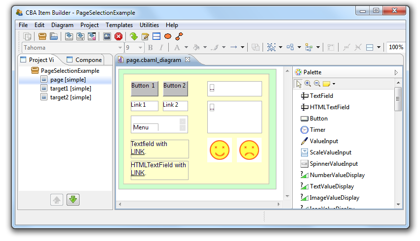                                                                                                                                                                                                         |
| Figure 129. Examples for Navigation Implementation by Buttons. Note that the project example always contains two elements (Buttons, Images, Hyperlink, etc.) linked to different pages. |

Note that the implementation of a link slightly differs regarding the kind of element that contains the link. The standard procedure is to right-click an element and to select *Link Page* from its context menu. This works for buttons as well as for images:

| NavigationWithImagesExample.zip| Edit View and Preview                                            |
|---------------------------------------------------------------------------------------------------|
|                                                                                                   |
| Figure 130. Navigate with Images from Page to Page |

For more complex text fields, for instance, the link has to be implemented within the text editor:

| TextFieldNavigation.zip| Edit view and Preview                                                |
|-----------------------------------------------------------------------------------------------|
| 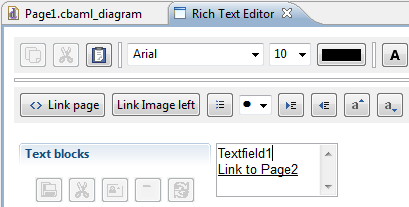                                                                |
| Figure 131. Linking to Different Pages by Text |

In case of listing elements, such as combo boxes and menus, the Component View (see section II.3.1.4) is needed to set links to other pages:

| NavigateWithComboBoxExample.zip| Edit view and Preview                                                                                                 |
|--------------------------------------------------------------------------------------------------------------------------------------------------------|
|                                                                                                                                                        |
| Figure 132. Navigate with a Combo Box to Different Pages |

| MenuBarExample.zip| Edit View/Preview                                                                                                                     |
|-----------------------------------------------------------------------------------------------------------------------------------------------------------|
|                                                                                                                                                           |
| Figure 133. Navigate with a Menu Entries to Different Pages |

#### Navigation by Using Buttons and Images

| **Task:** Navigate with buttons from page to page. |
|----------------------------------------------------|
| **Instructions:**                                  |
|                                                    |
|                                                    |
|                                                    |

#### Navigation by Using Text or Text Passages

| **Task:** Navigate with a text, text passages, or hyperlinks to another page. |
|-------------------------------------------------------------------------------|
| **Instructions:**                                                             |
|                                                                               |
|                                                                               |

|     | Create two simple pages (?page?, ?target?) at least prepared with frame and panel (see III.1.1.1).               
                                                                                                                         
       Open the first page ?page? and add a regular text field.                                                          
                                                                                                                         
       Open the Rich Text Editor by double clicking and type in some text.                                               
                                                                                                                         
       Select the text or single text passages with the mouse in the Rich Text Editor.                                   
                                                                                                                         
       Click to the button  and choose ?target?-page from the page-list. Confirm with OK.  
                                                                                                                         
       **IB** **Examples:** PageSelectionexample.zip | TextFieldNavigation.zip                                           |
|-----|------------------------------------------------------------------------------------------------------------------|

#### Navigation by Using Entries from a Selection

| **Task:** Navigate with a combo box, list, or menu entry, respectively. |
|-------------------------------------------------------------------------|
| **Instructions:**                                                       |
|                                                                         |
|                                                                         |
|                                                                         |

#### Gallery: Conditional Links 

This Gallery section shows how you can extent the linking feature by restricting it to certain conditions to be fulfilled as well as to different events. This is especially useful, for instance, when you want to give immediate feedback to your test takers performance.

An extension of the usual linking method (i.e., navigation by attributing a page to a certain element via *Link Page*) is to set conditional links (see III.1.2.6). First, a default link which applies when no condition is fulfilled has to be set. Conditions and linked pages then have to be defined. For definition links need to be written in a syntax editor for conditional linking. In Cookbook-section III.1.2.6 as well as in the example in Figure 134, you can see how conditional linking is defined for the selection of a specific radio button:

| ItemLevelFeedbackPageConditionalLink.zip| Edit View, Conditional Link Syntax and Preview                                                                              |
|-----------------------------------------------------------------------------------------------------------------------------------------------------------------------|
|                                                                                                                                         |
|                                                                                                                                         |
| Figure 134. Linking to Different Pages by Previously Defined Conditions |

Another method to navigate between pages is to link via state changes in FSMs (see Cookbook-section III.1.2.7 as well as III.1.2.8). The link mechanism is similar to conditional linking. The binding to state changes, however, allows for parallel changes in the user-interface as well as for more interactivity with the test taker. For implementing navigation via FSMs states it just has to be assigned to certain pages. The test taker, then, navigates by state transition (see II.5.3.3):

| NavigateWithStates.zip| State Machine, State Machine Rules and Preview                                                                       |
|----------------------------------------------------------------------------------------------------------------------------------------------|
| 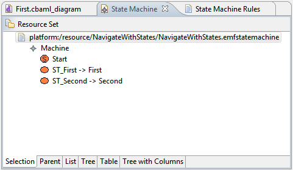                                                                                                               |
|                                                                                                                |
| Figure 135. Example for Navigation with States |

Navigation via state transition is especially useful for implementing a timer function. For doing so, a timed event is needed (see 0). When the time runs out, however, state transition can lead the test taker to a time-out page:

| SimpleTimerExample.zip| Edit View, State Machine, State Machine Rules and Preview                                                                |
|--------------------------------------------------------------------------------------------------------------------------------------------------|
|                                                                                                                                                  |
|                                                                                                                    |
| 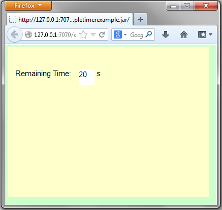                                                                                                                   |
| Figure 136. Example for Navigation by Timed Events |

The implementation of the illustrated features is described in the following sections.

#### Link to Pages According to a Response 

| **Task:** Create an item level feedback page by implementing a conditional link (see Figure 134).                                                                             |
|-------------------------------------------------------------------------------------------------------------------------------------------------------------------------------|
| **Instructions:**                                                                                                                                                             |
| Create three simple pages (?Page?, ?True?, ?False?) at least prepared with Frame and Panel (see III.1.1.1).                                                                   
                                                                                                                                                                                
 Add a RadioButtonGroup with radio button ?A1? and radio button ?A2? (user-define ID?s must be defined!). Note that the use of other click response elements is also possible.  
                                                                                                                                                                                
 Add a button ?Go? with an user-defined ID and right-click on it to open its context menu. Select on *Link Page*.                                                               
                                                                                                                                                                                
 First, select the page ?False? as default page in window ?Select page?.                                                                                                        
                                                                                                                                                                                
 Second, click on ?Edit Condition? and type in the condition (?A1?) that leads to the ?True? page, e.g.,                                                                        
                                                                                                                                                                                
 **IB** **Examples:** ItemLevelFeedbackPageConditionalLink.zip                                                                                                                  |

#### Link to Pages While Changing an Item?s State

| **Task:** Create an item level feedback page by assigning pages to different states (see Figure 135).                                                                                                                                                                        |
|------------------------------------------------------------------------------------------------------------------------------------------------------------------------------------------------------------------------------------------------------------------------------|
| **Instructions:**                                                                                                                                                                                                                                                            |
| Create two simple pages (?First?, ?Second?) at least prepared with Frame and Panel (see III.1.1.1).                                                                                                                                                                          
                                                                                                                                                                                                                                                                               
 Add a click response element, e.g., a button.                                                                                                                                                                                                                                 
                                                                                                                                                                                                                                                                               
 Open the FSM Editor by clicking on *Project* on the menu entry or menu bar icon, choose *Edit State Machine* and go to the *State Machine Rules*.                                                                                                                             
                                                                                                                                                                                                                                                                               
 Add one click-**event** for each page change (?EV\_GoToFirst?, ?EV\_GoToSecond?) in the syntax? event part (see II.5.2).                                                                                                                                                      
                                                                                                                                                                                                                                                                               
 Open the button?s context menu by right-clicking each button. Select ?Link Select Event? and connect each button to a corresponding event (button of ?First? page with ?EV\_GoToSecond? and button of ?Second? page with ?EV\_GoToFirst?, respectively).                      
                                                                                                                                                                                                                                                                               
 Go to the *State Machine* editor and add three **states**: one start-state (?Start?) and two normal-states (?ST\_First?, ?ST\_Second?) (see II.5.3).                                                                                                                          
                                                                                                                                                                                                                                                                               
 Connect the normal states to the corresponding pages (i.e., ?ST\_First? to ?First?, ?ST\_Second? to ?Second?) by right-clicking the states. Select ?Configure State? from their context menu and type in the name of the page to be connected in the section ?Page to open?.  
                                                                                                                                                                                                                                                                               
 Go to the *State Machine Rules* and add rules for initiating the FSM ( **Start -\> ST\_First{true}** ) and changing between the normal states ( **ST\_First =\> ST\_Second{EV\_GoToSecond}** as well as **ST\_Second =\> ST\_First{EV\_GoToFirst}** ).                        
                                                                                                                                                                                                                                                                               
 Your FSM works after you saved the file by ?Generate and Save?.                                                                                                                                                                                                               
                                                                                                                                                                                                                                                                               
 **IB** **Examples:** NavigateWithStates.zip | NavigateWithStatesInRegions.zip                                                                                                                                                                                                 |

#### Close an Item when the Time is Over 

| **Task:** Change current page when the time is over (see Figure 136).                                                                                                                                                                                                              |
|------------------------------------------------------------------------------------------------------------------------------------------------------------------------------------------------------------------------------------------------------------------------------------|
| **Instructions:**                                                                                                                                                                                                                                                                  |
| Create two simple pages (?PageRunning?, ?PageOut?) at least prepared with frame and panel (see III.1.1.1).                                                                                                                                                                         
                                                                                                                                                                                                                                                                                     
 Add a NumberValueDisplay from the Palette to the Panel.                                                                                                                                                                                                                             
                                                                                                                                                                                                                                                                                     
 Open the FSM Editor by clicking on *Edit State Machine*.                                                                                                                                                                                                                            
                                                                                                                                                                                                                                                                                     
 Add three **states**: one start-state (?Start?) and two normal-states (?TimerRuns?, ?TimeOut?) (see II.5.3).                                                                                                                                                                        
                                                                                                                                                                                                                                                                                     
 > Connect the normal states to the corresponding pages (i.e., ?TimerRuns? to ?PageRunning?, ?Timeout? to ?PageOut?) by right-clicking the states. Select ?Configure State? from their context menu and type in the name of the page to be connected in the section ?Page to open?.  
                                                                                                                                                                                                                                                                                     
 Add one **variable** (?SecondsLeft?) (see II.5.1).                                                                                                                                                                                                                                  
                                                                                                                                                                                                                                                                                     
 Go to the *State Machine Rules*.                                                                                                                                                                                                                                                    
                                                                                                                                                                                                                                                                                     
 Add one time-**event** (?TimerTick 1?) in the syntax? event part (see II.5.2).                                                                                                                                                                                                      
                                                                                                                                                                                                                                                                                     
 Add the **rules** between States, Variables and Events (see II.5.4).                                                                                                                                                                                                                
                                                                                                                                                                                                                                                                                     
 > Start with the transition from the start-state ?Start? to the first normal-state ?TimerRuns?. When the times starts (i.e., the condition is true), the variable ?SecondsLeft? should be set to the initial time.                                                                  
 >                                                                                                                                                                                                                                                                                   
 > Every time the time-event ?TickTimer? occurs (i.e., every second left) and the variable ?SecondsLeft? is greater than 1, the state ?TimerRuns? should convert to itself. In doing so, the variable ?SecondsLeft? should be reduced by 1.                                          
 >                                                                                                                                                                                                                                                                                   
 > When the time-event ?TickTimer? occurs, but the variable ?SecondsLeft? is 1 or less, the state ?TimerRuns? should convert to the second state ?TimeOut? which automatically leads the test taker to the page ?PageOut?.                                                           
                                                                                                                                                                                                                                                                                     
 Right-click on the NumberValueDisplay in the panel and select ?Link Variable? from its context menu. Select the variable ?SecondsLeft? and confirm with OK.                                                                                                                         
                                                                                                                                                                                                                                                                                     
 Your FSM works after you saved by ?Generate and Save?.                                                                                                                                                                                                                              
                                                                                                                                                                                                                                                                                     
 **IB** **Examples:** SimpleTimerExample.zip                                                                                                                                                                                                                                         |

### X-Pages 

#### Add a Remaining Page Part 

| **Task:** Navigate by the help of a combo box, list, or menu entry, respectively. |
|-----------------------------------------------------------------------------------|
| **Instructions:**                                                                 |
| *Create a X-Page*                                                                 |
| *Design a X-Page*                                                                 |
| *Connecting a X-Page*                                                             |

> **Important Note 1**: The size of the X-Page frame is added to other pages? frame size. Example: A 60x60px X-Page and a 60x60px SimplePage result in a total size of 120x60px in horizontal setting.
>
> **Important Note 2**: Navigation elements in X-Pages will only link to other X-Pages.
>
> **Important Note 3**: X-Pages will be only previewed in combination with their task.

#### Permanent Instruction during Item Processing

| **Task:** Navigate between pages while a general instruction remains constantly.                                  |
|-------------------------------------------------------------------------------------------------------------------|
| **Instructions:**                                                                                                 |
| Create two simple pages (?First?, ?Second?) and one X-Page prepared with frame and panel (see III.1.1.1).         
                                                                                                                    
 Create a button on each simple page and link them among themselves.                                                
                                                                                                                    
 Open the Task Editor and create a new task (see II.4.1). Select ?First? as Start Page and X-Page as Start X-Page.  
                                                                                                                    
 The X-Page works after you saved your file by ?Generate and Save?.                                                 |

**IB Examples:**

| XPageNavigation.zip| Preview                                                                        |
|-----------------------------------------------------------------------------------------------------|
|                                                                       |
| Figure 137. An X-Page Remains During Item Processing |

#### Change the Instruction during Item Processing

| **Task:** Navigate between different instruction parts.                                                                 |
|-------------------------------------------------------------------------------------------------------------------------|
| **Instructions:**                                                                                                       |
| Create one simple page and two X-Pages (?X1?, ?X2) prepared with frame and panel (see III.1.1.1).                       
                                                                                                                          
 Create a button on each X-Page and link them.                                                                            
                                                                                                                          
 Open the Task Editor and create a new task (see II.4.1). Select the simple page as Start Page and ?X1? as Start X-Page.  
                                                                                                                          
 The X-Pages work after you saved by ?Generate and Save?.                                                                 |

**IB Examples:**

| XPageNavigationXPagetoXPage.zip| Preview                                                           |
|----------------------------------------------------------------------------------------------------|
|                                                                      |
| Figure 138. Changing X-Pages During Item Processing |

#### Gallery: Different X-Pages and Underlying Layout Settings

You can add some more features to your X-Pages, e.g., the alignment of the X-Page or adding a slider. The following gallery part introduces several X-Page settings and shortly describes their functions. Call up the X-Page settings for a specific IB Task from the Task Browser clicking the button ?Layout settings?. The setting dialog opens:

| XPageExample.zip| Task Browser                                                                             |
|------------------------------------------------------------------------------------------------------------|
| 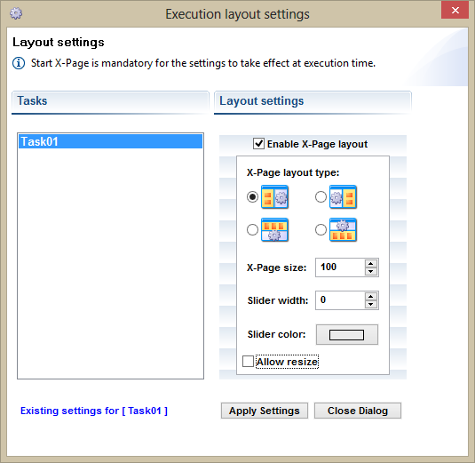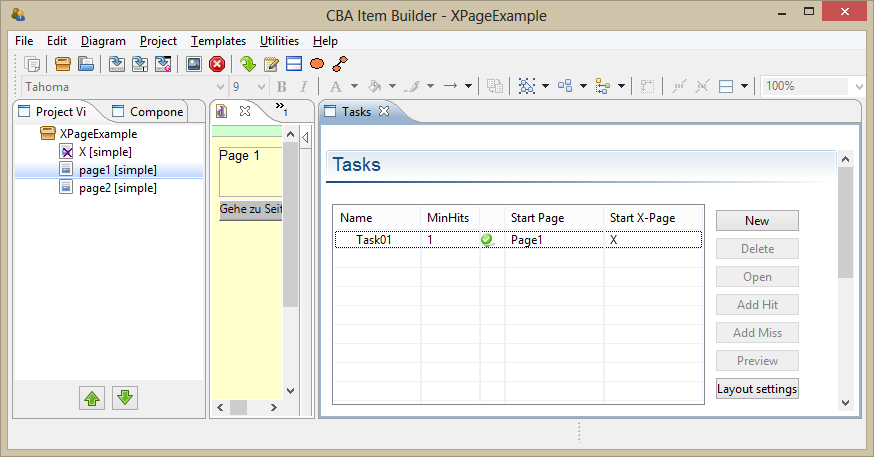                                               |
| Figure 139. Tasks Definition and Layout Settings for X-Page |

In Table 34 you find an overview explaining layout setting properties of X-Pages. In the given IB Examples below several layout settings are varied.

Table 34: Layout Settings for the IB X-Page (Task Editor View)

| **Setting**             | **Description**                                                                                                        |
|-------------------------|------------------------------------------------------------------------------------------------------------------------|
| X-Page layout type      | Shows on which side the x-Page is displayed.                                                                           |
|                         | Defines the minimum display width of the x-Page (probably depending on the size of the x-page display of scroll bars). |
| Slider width            | Defined distance between x width of a slider-page and other pages.                                                     |
|                         | Colour of Slider (if selected).                                                                                        |
| CheckBox ?Allow resize? | Checkmark allows scrollbars if (defined otherwise by the slider) the pages are scaled.                                 |

**
**

**IB** **Examples:**

| XPageExample.zip| X-Page Settings and Preview                                                            |
|----------------------------------------------------------------------------------------------------------|
|                                                                            |
| Figure 140. Example of an X-Page with no Special Settings |
| XPageExampleRight.zip| X-Page Settings and Preview                                                       |
|                                                                            |
| Figure 141. Example with a Right-Aligned X-Page           |

| XPageExampleSlider.zip| X-Page Settings and Preview                                           |
|-----------------------------------------------------------------------------------------------|
| 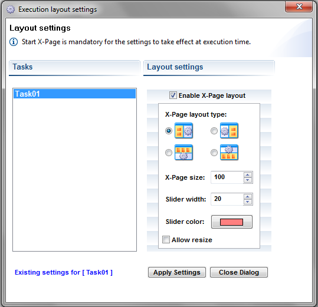                                                                |
| Figure 142. Example of an X-Page with a Slider |

### Web Browser and Web Child Pages

The simple web browser consists of the navigation area and the child area that shows the selected web pages at runtime. The web browser page is the container for both areas. In the navigation area you can add some of the well known navigation controls of a common web browser.

Every button listed in the palette window provides a special functionality at runtime:

**Back button and Forward button:** The order in which pages were called at runtime is memorized by the item. Using these buttons the user can navigate backward and forward through the web pages called so far.

**Home button:** The page linked to the button at design time will be displayed at runtime when the user clicks the button.

**Bookmark button:** The current page can be bookmarked at runtime. Clicking on the button will offer the feature ?Add bookmark? and ?Manage bookmark ??. Select ?Add bookmark? to add the current pages URL to the list of bookmarks. The selection of ?Manage bookmarks?? will produce a dialog which lists the bookmarks already added and offers the possibility to delete one or more entries.

**URL Input field:** This is not really a input field, you cannot enter a URL here to load the entered page. The URL string of the current web child (if specified) will be displayed here

A context menu is presented when the option ?Show browser context menu? is selected.

Note that the following texts are defined in the general project settings (see section II.2.2.8)

Context Menu Back

Context Menu Forward

Context Menu Home

#### Simulate a Web Browser and a Web Page

| **Task:** Simulate a Web environment.                                                                                                                                                        |
|----------------------------------------------------------------------------------------------------------------------------------------------------------------------------------------------|
| **Instructions:**                                                                                                                                                                            |
| *Create a X-Page*                                                                                                                                                                            |
| *Create a web browser Page *                                                                                                                                                                 |
| *Design web browser*                                                                                                                                                                         |
| *New Task*                                                                                                                                                                                   |
| *Create a Simple Page*                                                                                                                                                                       
                                                                                                                                                                                               
 *Child1*                                                                                                                                                                                      |
|                                                                                                                                                                                              |
| *Create a Simple Page Child2*                                                                                                                                                                |
| *Create a Simple Page*                                                                                                                                                                       
                                                                                                                                                                                               
 *Child3*                                                                                                                                                                                      |
| *Linking between the Pages*                                                                                                                                                                  |
| BrowserExampleSimple.zip|Edit View, Preview and Settings                                                                                                                                     |
| 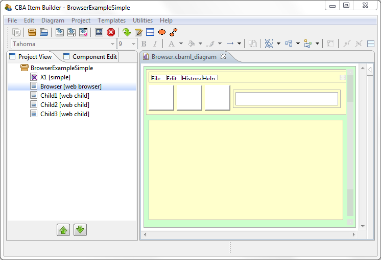                                                                                                                                                               |
| 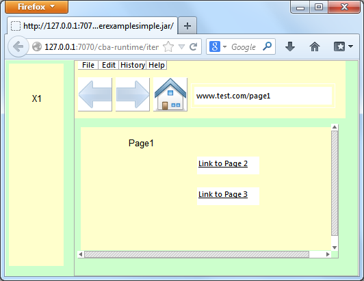                                                                                                                                                               |
| Figure 143. Example for a Webbrowser Simulation |

#### Gallery: Global Icons Settings

To open the global settings dialog right click on the project name in the project view and select the entry ?Global Icons? from the context menu.

| BrowserGlobalIconExample.zip|Edit View, Preview and Settings                                     |
|--------------------------------------------------------------------------------------------------|
|                                                                    |
|                                                                    |
| *Figure 144. Example for a Webbrowser Simulation* |

### Tabfolder Page

#### Simulate a Browser with Multiple Tabs

**Task:** Create a TabfolderPage with different tabs to close.

**Instruction: **

-   Create a Project.

-   Add a new tabfolder page and type in ?tabfolder? as tabfolder page name.

-   Create three simple pages: simple1, simple2 and simple3.

-   Double-click on tabfolder page.

-   Create a TabfolderFrame.

-   Create a TabfolderGroup.

-   Create three TabButtons within the TabfolderGroup.

-   Rename the TabButtons 1, 2 and 3.

-   Right-click on each TabButton and Show Properties View and change Misc closable from false to true.

-   Double-click on each of the three simple pages and add one frame and panel on the same position. Change the backgroundcolor of the panel.

> **IB Example:** TabfolderExample.zip

| TabfolderExample.zip| Edit View and Preview                                                           |
|-------------------------------------------------------------------------------------------------------|
|                                                                         |
| 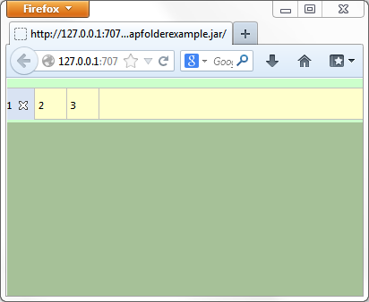                                                                        |
| Figure 145. Edit View and Preview TabfolderExample.zip |

### Taskbar Page

#### Simulate a Desktop

The TaskbarGroup is a special container for TaskBar Buttons. It must be placed on the top, bottom, left or right side of the frame.The TaskbarButton is a button with a special behaviour at runtime to activate the corresponding child page. The child page is linked to the button at design time.

The Taskbar StartButton is a special kind of TaskbarButton with a particular behaviour at runtime to display the empty desktop.

**Task:** Create TaskbarButtons on a TaskbarPage.

**Instruction:**

-   Create a new Project TaskbarExample

-   Add a new taskbar page and name it Taskbar.

-   Create three simple pages and name it Desktop, Page1 and Page2.

-   Double-click on the Taskbar page.

-   Create a TaskbarFrame.

-   Create a TaskbarGroup on the buttom of the Taskbar.

-   Create a TaskbarStartButton and name it Start.

-   Create a TaskbarButton and name it Page1.

-   Create a TaskbarButton and name it Page2.

-   Left-click on Start Button. Right-click on Start Button. Link Page to Desktop.

-   Right-click on Start Button. Show Properties View. Click on Misc Is Activated and choose true.

-   Left-click on Page1 Button. Right-click on Page1. LinkPage to Page1.

-   Left-click on Page2 Button. Right-click on Page2. LinkPage to Page2.

-   Double-click on the Desktop page.

-   Create a Frame and a Panel.

-   Create an HTML TextField on the Panel. Double-click on this HTML TextField and write Desktop. Save and close.

-   Create a Button on the Panel and name it Page 2. Change the colour of the Button.

-   Right-click on Button Page 2. Set Command to Empty. Link Page to Page 1.

-   Double-click on Page1. Create a Frame and a Panel.

-   Create a Button on the Panel and name it Page 1. Change the colour of the Button.

-   Right-click on Button Page 1. Set Command to Empty. Link Page to Desktop.

-   Double-click on Page2. Create a Frame and a Panel.

-   Create a HTML TextField on the Panel.

-   Double-click on the HTML TextField and write Page 2 in the TextField. Save and close.

> **IB Example:** TaskbarExample.zip

| TaskBarExample.zip| Edit View                                                 |
|-------------------------------------------------------------------------------|
|                                                 |
|                                                 |
| Figure 146. TaskbarExample.zip |

### Dialogs and Modal Dialogs

| 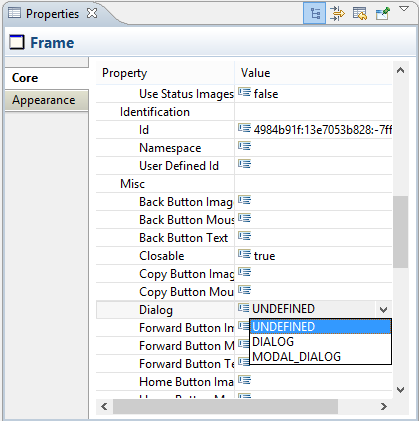                                                                              |
|-------------------------------------------------------------------------------------------------------------|
| Figure 147. Defining Dialogs in the Property View of a Frame |

| SimpleDialogExample.zip| Preview                                                                                                                |
|-------------------------------------------------------------------------------------------------------------------------------------------------|
| 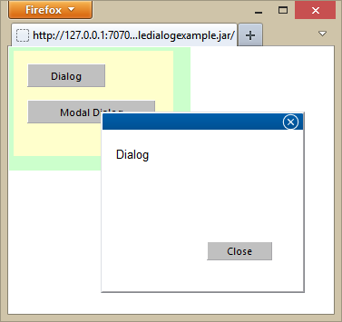                                                                                                                  |
| Figure 148. Example for Dialog and a Modal Dialog |

#### Specific Properties for Dialogs

Although dialogs are specified as frames on simple pages, the following four properties are specific for frames used as dialogs:

1.  *Modal*: Dialogs are shown as modal dialogs if the property ?Modal? is specified as true.

2.  *Transparency*: Dialogs and modal dialogs are rendered (semi-)transparent, when a number different from 0 (= non transparent) and smaller than or equal 100 (= invisible) is specified in the frames property ?Transperency? (see **Fehler! Verweisquelle konnte nicht gefunden werden.** for an example of a dialog with 50.0 % transparency).

3.  *Text:* The ?Text? property of the frame defining a dialog or a modal dialog is displayed as title text.

4.  *Closable*: If the property ?Closable? is set to ?true?, dialogs can be closed with the small ?X? in the upper right corner of the dialog window (i.e., an optional close icon on the top right corner).

Select the frame defining the dialog and edit the properties to change the described characteristics of dialogs in the Property View (see, e.g., Figure 149).

| 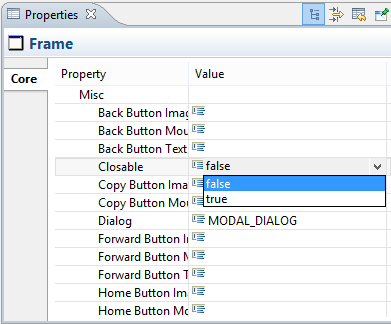                                                                                                             |
|--------------------------------------------------------------------------------------------------------------------------------------------|
| Figure 149. Specify a Dialog as Not Closable |
| TransparentDialogExample.zip| Preview                                                                                                      |

Use Specific Response Elements
----------------------------------------------------------------------------------------------------------------------------

### CheckBox

#### Generate a Simple Checkbox Item 

**Example**: Creating a multiple-choice selection which can be chosen from several alternatives.

**Instructions:**

-   Create a new Project **CheckBoxExampleSimple**

-   Add a New Simple Page **MultipleChoice**

-   Add a Frame and Panel

-   Add an HTML TextField and type in **Choose all relevant options!**

-   Select CheckBox and draw a rectangle on the panel.

-   Then right-click and open the properties:

-   Repeat until you create three check boxes.

-   2. Check Box:

-   3. Check Box:

-   Select Browse Tasks and create a new task

-   Name the Task Checkbox, define MinHits=1 and select as Start PageMultipleChoice

| CheckboxExample.zip| Edit View                                                                                |
|---------------------------------------------------------------------------------------------------------------|
|                                                                                 |
| Figure 150. Edit View for the Simple Checkbox Item             |
| CheckBoxExampleSimple.zip| Edit View and Preview                                                              |
| 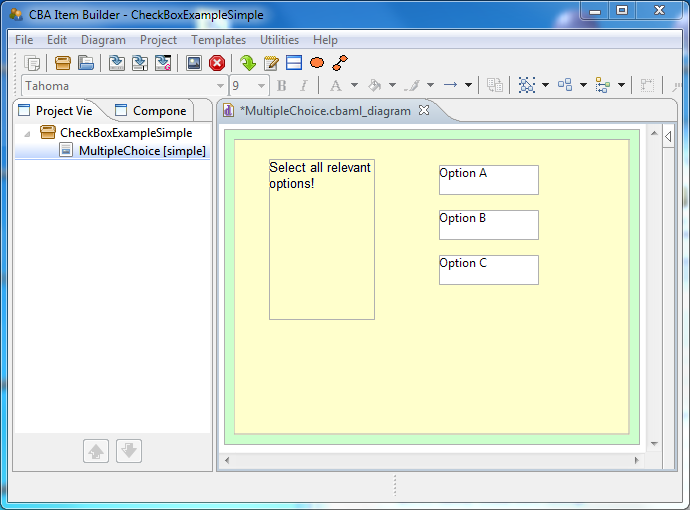                                                                                |
| Figure 151. Edit View and Preview for the Simple Checkbox Item |

### Radio Buttons

#### Create a SimpleRadioButton Item

**Example**: Creating a multiple-choice selection can be chosen from the only one alternative.

**Instructions:**

-   Select the RadioButtonGroup as a container for related radio buttons from the palette and draw a rectangle on the panel.

-   Select RadioButton from the palette and draw a rectangle into the RadioButtonGroup.

-   Coordinates of the radio buttons refer to the RadioButtonGroup.

-   If X = 0, Y = 0, then there is the radio button in the upper left corner of the RadioButtonGroup.

> **Important Notes:** Regardless of the RadioButtonGroup you created earlier, you can create other RadioButtonGroups by clicking on RadioButtons. As RadioButton options texts and images can be used.

| RadioButtonExample.zip| Edit View                                                               |
|-------------------------------------------------------------------------------------------------|
| 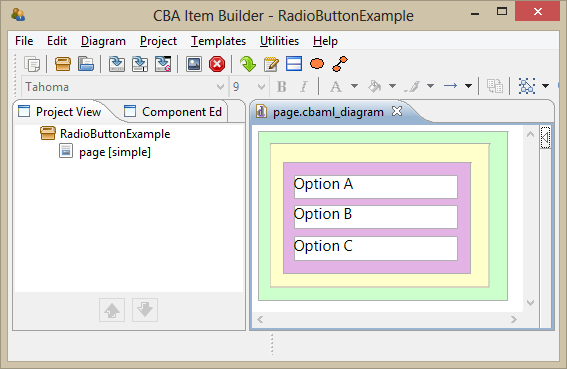                                                                  |
| Figure 152. Edit View for the RadioButtonExample |
| RadioButtonExample.zip| Preview                                                                 |
|                                                                   |
| Figure 153. Preview for the RadioButtonExample   
                                                                                                  
 | ImageExample.zip| Preview                                                                |     
 |------------------------------------------------------------------------------------------|     
 |                                                            |     
 | Figure 154. Preview for the ImageExamples |     |

### Input Fields

#### Create an Item with a SingleLineInputField and a InputField

Note that SimpleTextFields can also serve as text input fields (see III.2.3), texts on web child pages (URL text, page description and tab text; (see III.1.4), and result text for compution with calculation engines (see **Fehler! Verweisquelle konnte nicht gefunden werden.**), (Figure 51).

**Example**: Creating an Item with a SingleLineInputField and a InputField

**Instructions:**

-   Create a new Project

-   Add a Frame and a Panel

-   Add a Textfield and name it SingleLineInputField

-   Add a SingleLineInputField

-   Add another Textfield and name it Multiline Text

-   Add an InputField

**IB Examples:** InputFieldExample.zip

| InputFieldExample.zip| Edit View                                                               |
|------------------------------------------------------------------------------------------------|
|                                                                  |
| Figure 155. Edit View for the InputFieldExample |

The InputField is similar to the text box. You can create a box and enter text if needed. In case the typed in text does not fit in the input field a vertical scrollbar will appear automatically in most browsers. Note that in Firefox an input field must have a minimum of 36 px in height for the vertical scrollbar to appear.

The SingleLineInputField works exactly the same way except for not having a box but a line where you can enter a text. The attribute of the SingleLineInputField can be set to read only. This function is useful when creating a web browser and you don not want the browsers address bar to be editable. To do so open the SingleLineInputField?s properties view and set the value of the property ?read only? to ?true?.

#### Context Menus for Text and Input Fields

A context menu is shown when the option ?Show edit context menu? is enabled. Note that the following texts are defined in the general project settings (see section II.2.2.8)

Context Menu Cut

Context Menu Copy

Context Menu Paste

### Combo Box and Lists 

A combo box is a mix of a drop-down menu and a textbox which enables the user to choose from a list of several items (e.g., commands/links to other pages or images). Adding a ComboBox to a page is very similar as adding a Menubar with Menus. To create a ComboBox select the ComboBox-Object from the palette and drag and draw a ComboBox on the panel. A name can be set directly after by typing it in the appearing TextField or afterwards by using the Properties View. Thereafter open the Component Subtree Tab and click on the panel, so the ComboBox appears in the Component Subtree Tab. To add (a) ComboBoxItem(s) right-click the ComboBox and select ?Add Combo Box Item? from the popup box. A dialog box will show up in which a name for the ComboBoxItem has to be entered. This operation can be repeated for all MenuItems which should be added to a Menu.

To link the ComboBoxItems to Images or other Pages, right-click the concerning ComboBoxItem in the Component Tree Tab and select ?Link Image? or ?Link Page? from the popup box.

The grafic shows the Component Subtree Tab with a list of all available objects (ComboBox and ComboBoxItems):

#### Create a Simple ComboBox Item

**Example**: Creating a simple ComboBox

**Instructions:**

-   Create a new Project ComboBoxSimple

-   Start with a simple Page name it Selection

-   Frame and Panel

-   Add a Combo Box on the panel

-   Right-click show properties and edit Font, Fontsize, Height, Width

-   Defined User Id=ComboBox

-   *Right-click on the* ComboBox *entry in the component view to add items to the* ComboBox*. *

-   It is also possible to add items with a Right-click to your ComboBox on the panel

-   Select Add Combo Box Item

-   Text = Choose one page to navigate to

-   User Defined Id = navigate

-   Select Add Combo Box Item

-   Text = Item 1, User Defined Id = Item\_1

-   Select Add Combo Box Item

-   Text = Item 2, User Defined Id = Item\_2

-   Select Add Combo Box Item

-   Text = Item 3, User Defined Id = Item\_3

**IB Examples:** ComboBoxExample.zip

| ComboBoxExample.zip| Edit View                                                               |
|----------------------------------------------------------------------------------------------|
| 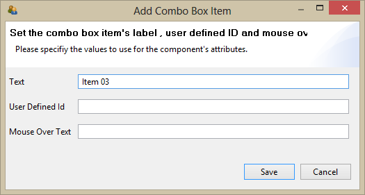                                 |
| Figure 156. Edit View for the ComboBoxExample |

| ComboBoxExample.zip| Preview                                                               |
|--------------------------------------------------------------------------------------------|
| 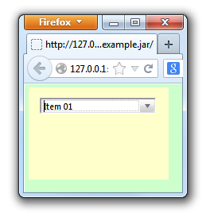                                                             |
| Figure 157. Preview for the ComboBoxExample |

| ComboBoxSimple.zip| Preview                                                               |
|-------------------------------------------------------------------------------------------|
|                                                             |
| Figure 158. Preview for the ComboBoxSimple |

#### Create a simple List Item

**Example**: Creating a simple List Item

**Instructions:**

-   Create a new Project ListSimple

-   Start with a simple Page name it Selection

-   Frame and Panel

-   Add a List on the panel

-   Right-click show properties and edit Font, Fontsize, Height, Width

-   Defined User Id=List

-   *Right-click on the* List *entry in the component view to add items to the* List

-   It is also possible to add items with a Right-click to your List on the panel

-   Select Add List Item

-   Text = Choose one page to navigate to

-   User Defined Id = navigate

-   Select Add List Item

-   Text = Item 1, User Defined Id = Item\_1

-   Select Add List Item

-   Text = Item 2, User Defined Id = Item\_2

-   Select Add List Item

-   Text = Item 3, User Defined Id = Item\_3

**IB Example:** ListBoxExample.zip

| ListBoxExample.zip| Edit View                                                                 |
|-----------------------------------------------------------------------------------------------|
| 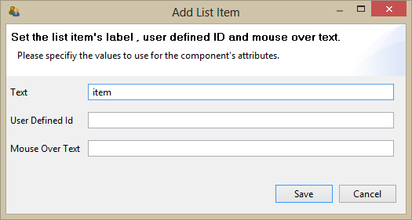                                  |
| Figure 159. Edit View for the ListBoxExample   |
| ListSimple.zip| Preview                                                                       |
| 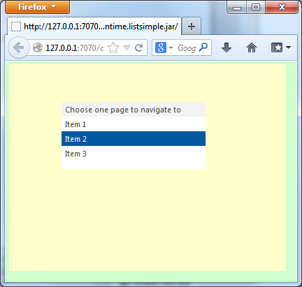                                                                |
| Figure 160. Preview for the ListSimple Example |

#### Gallery: Differences and similarities between ComboBox Item and ListBox Item

| ComboBox                       | List                           |
|--------------------------------|--------------------------------|
| 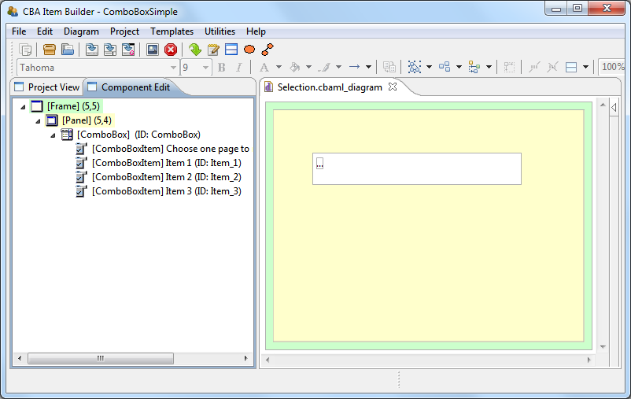 |  |
| 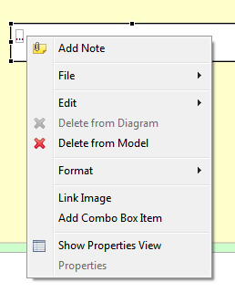 |  |
| 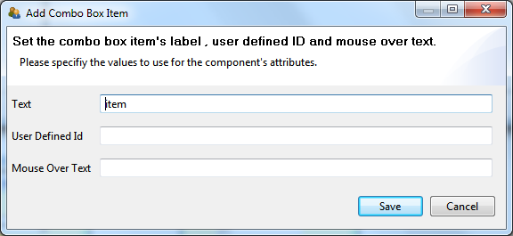 | 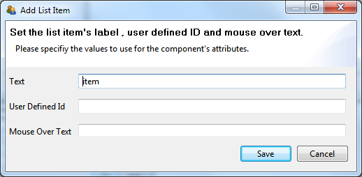 |
| 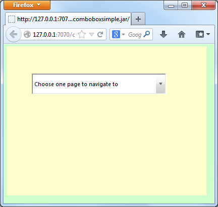 |  |

| Figure 161. Comparison between ComboBox and List |
|-------------------------------------------------------------------------------------------------|

### Menu

**Example:** Create a Menubar

**Instructions: **

-   Start with a Frame and Panel

-   Add a Menubar on the Panel

-   Add Menu on the Menubar

-   Name the Menu File

-   Right-click on the Menu

-   Add Menu Item

-   Add the Text, User Defined Id and Mouse Over Text

-   Add second Menubar on the Panel

-   Add Menu on the second Menubar

-   Name the Menu Edit

-   Right-click on the Menu

-   Add Menu Item

-   Add the Text, User Defined Id and Mouse Over Text

-   Add third Menubar on the Panel

-   Add Menu on the third Menubar

-   Name the Menu About

-   Right-click on the Menu

-   Add Menu Item

-   Add the Text, User Defined Id and Mouse Over Text

A Menu includes a list of one or more MenuItems (e.g., commands/links to other pages or images) which can be selected by the user. Before one or several menus with its MenuItems can be added to a page, a MenuBar has to be created first, in which the menu(s) will be placed afterwards. This is done by selecting the menubar-object and placing a MenuBar in an existing panel by drag and drop. Afterwards (a) Menu(s) can be placed inside the MenuBar also by drag and drop. Therefore the menu-object has to be selected from the palette. A name can be assigned to the menu directly by typing it in the appearing TextField. This can also be done later on in the Properties View by editing the value for the property ?Text? under the Core rider.

The image shows a MenuBar with two Menus:

To add (a) MenuItem(s) to the menu(s) you first have to change from the Project View to the Component Subtree Tab by clicking on it. This can be found left to the Project View Tab. Thereafter left-click the Panel and the Menubar will appear under the Component Subtree Tab. To add (a) MenuItem(s) open the Subtree by clicking on the ?+? symbol left to the name of the MenuBar. A list with all related menus will appear. Right-click on the relevant menu and select ?Add Menu Item? from the appearing pop up menu. A dialog box will show up in which a name for the MenuItem has to be entered. This operation can be repeated for all MenuItems which should be added to a Menu.

MenuItems can be linked to images or pages by selecting a relevant MenuItem from the subtree. From the popup box which appears after right-clicking the MenuItem ?Link Image? or ?Link Page? can be selected. A MenuItem can be deleted by clicking on ?Delete Menu Item? which can also be found in the same pop up box.

The image shows the Component Subtree Tab with a list of all available objects (MenuBar and Menus with MenuItems):

### Image Map

The ImageMap element is a type of container for ImageFields and the ImageTextFields. It allows merging an image and text fields into a single image. Use it if you want to insert a picture. In contrast to the Image Field it is possible to change the size of a picture. Here it is also possible to add other elements, for example, an Image Text Field. First, open a panel, then click right, choose ?link image?. Inside the image map several parts can be made clickable: first click on the Image Area, then place it on the panel, then place an ?Anchor Point? inside the image area. Points will be visible that are draggable, if you click on the line and drag it, new points will appear: if you click in the image area you can choose the background color, for example.

To create an ImageArea within an image map select the ?AnchorPoint?-Tool and click into the area of the image map where you want to place the ImageArea:

You will see an AnchorPoint in form of a ?little square?. First, deselect the square by clicking somewhere inside the panel.

Afterwards point the mouse over the angle of the square on which you would like to align the ImageArea. Two opposed arrows will appear. Click on one of the arrows. A dashed square will show up. Then move the pressed mouse somewhere outside the dashed square until it disappears and then the same direction back until the dashed square reappears. Now drop the mouse. The ImageArea will appear. You can change its shape and size by clicking and dragging each of its corners.

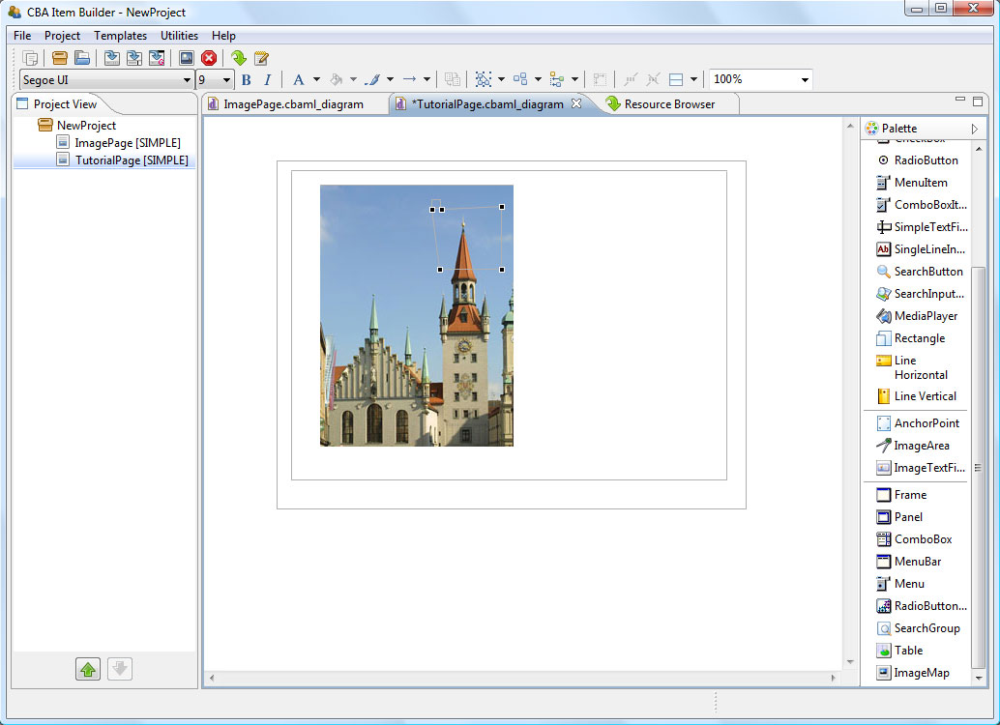

To get a more precise shape you can add additional corners to the ImageArea. Place the mouse pointer over the area of one of the ImageArea?s angles to which you want to add a corner. A little ?+?-symbol will show up. Drag and drop to the direction, where you want to place the additional corner and drop the mouse.

Corners can be moved to a new position by drag and drop. Corners that you do not need anymore can be removed by aligning them with two other corner points.

If you want to move the whole ImageArea, just click the AnchorPoint and drag.

If you want to change the colour of the ImageArea when clicked at runtime, you can adjust that within the appearance-tab of the properties-view of the AnchorPoint (not of the angles).

The transparency can be modified by editing the value ?transparency? in the core-rider of properties-View. Values from 0-100 are allowed.

To create an ImageTextField within an ImageMap you use the ImageTextField-Tool:

The size and the position of the ImageTextField can be changed by clicking and dragging.

Double click on the ImageTextField to open the Rich Text Editor. Here you can enter and edit your text.

You can define the rotation degree of the imagetexfield (values from -180? to 180?). As long as you have a horizontal or vertical ImageTextField (e.g.. -180?, -90?, 0?, 90?, 180?), you can change its size by click and drag of the rectangle. If it is rotated apart from that, you have to change its size by going into the properties and edit the values for ?editheight? and/or ?editwidth?. To put the changes into effect you will have to open the Rich Text Editor afterwards and click on ?save changes?.

Note that (although the functionality is available in the RTE) embedded links will not work in ImageTextFields!

An ImageTextField behaves like a TextField, but does not support embedded links (however font, size, style, color and alignment can be modified). At runtime the portions of the text of an ImageTextField cannot be selected (unlike TextFields, where part of the text can be selected for copy and paste). An ImageTextField can be defined as an ImageArea. This allows making the ImageTextField selectable as a whole.

You should check if the way you created the ImageMaps and ImageTextFields is contradictory at runtime.

At runtime (and in the preview) the test person can select Image-Areas by clicking (the Image-Area is then highlighted according to the attributes you selected). The designer can use the attribute ?selectable? (true?) if the TextField is supposed to be selectable at runtime. Those TextFields behave like ImageAreas when clicked.

This means that you have to make sure that a selectable ImageTextField and a selectable ImageArea do not overlap.

Multiple Select: You can select one or several ImageAreas/TextFields within one ImageMap. You deselect by clicking on the ImageArea/TextField again.

Single Select: Only one selectable element within one ImageMap can be selected at once (at runtime).

You can set the status to one of the two by going to the core-tab in the properties-menu of the ImageMap (right click when ONLY the image is selected in the designer view) and then set ?Multiple-Select-Mode? to ?true? or ?false?.

The functionality ?validity?helps you to find out whether there are overlaps. Right click outside of the Frame and you will find the command ?validate? in the context-menu:

?Validity? will show you all the overlaps and also gives and explanation.

### Highlighting

#### Scoring highlighted text within one text block

For the evaluation of highlighted text at runtime, it is needed to define so called Text Blocks in TextFields. Scoring Rules refer to defined text blocks in hit and miss conditions and evaluate whether a text block has been selected completely or partially.

Several text blocks can be defined. They can overlap and may consist of fragments. Text blocks can be used to delimit correct answers in a text but also to delimit false answers.

A text block can be defined by highlighting text in the Rich Text Editor, clicking the ?New text block? button afterwards and setting a name in the appearing popup dialog. The extent of an existing text block can be changed by first selecting the regarding text block from the menu on the left, then highlighting the text area which should be defined for the text block and by clicking the ?Change text block? button afterwards.

A distant text part can be added to an existing text block without changing the existing text parts, by highlighting the text which should be added an by then clicking the ?Add to the text block? button.

The following tool bar is available for the management of text blocks:

The first button ?New text block? creates a new text blocks. A unique name has to be specified. This button is context sensitive and only active when some text is selected. The ?Delete? button allows deleting a text block (with all its text fragments) or only an individual text block fragment, depending of the selected element in the text block tree structure. This button is context sensitive and only active when some text block or text block fragment is selected in the text block list.

The third button ?Change text block? is used to modify a text block. It is active when a text block is selected in the text block list and a selection is made in the text. When pressed the complete text block is replaced with the new selected text.

The fourth button ?Add to text block? is used to add a new text block fragment to an existing text block. It is active when a text block is selected in the text block list and a text is selected. When presses the selected text block fragment will be added to the current text block.

The last button ?Refresh? is used to refresh the text block list (and tree structure) after text has been changed in the Rich Text Editor which might implicitly delete or modify text block fragments or complete text blocks.

*The following Example shows the definition of Text Blocks for the Minimum and Maximim Correct Response and for the Miss Area: *

Question: What is the latest time that children should arrive at preschool?

Minimum: ?9?

Maximum: ?Please have your child here by 9:00 am.?

To score the highlighted text response to this question at runtime, text blocks have to be defined. The picture shows the definition of the Minimum Correct Response (Text Block T1):

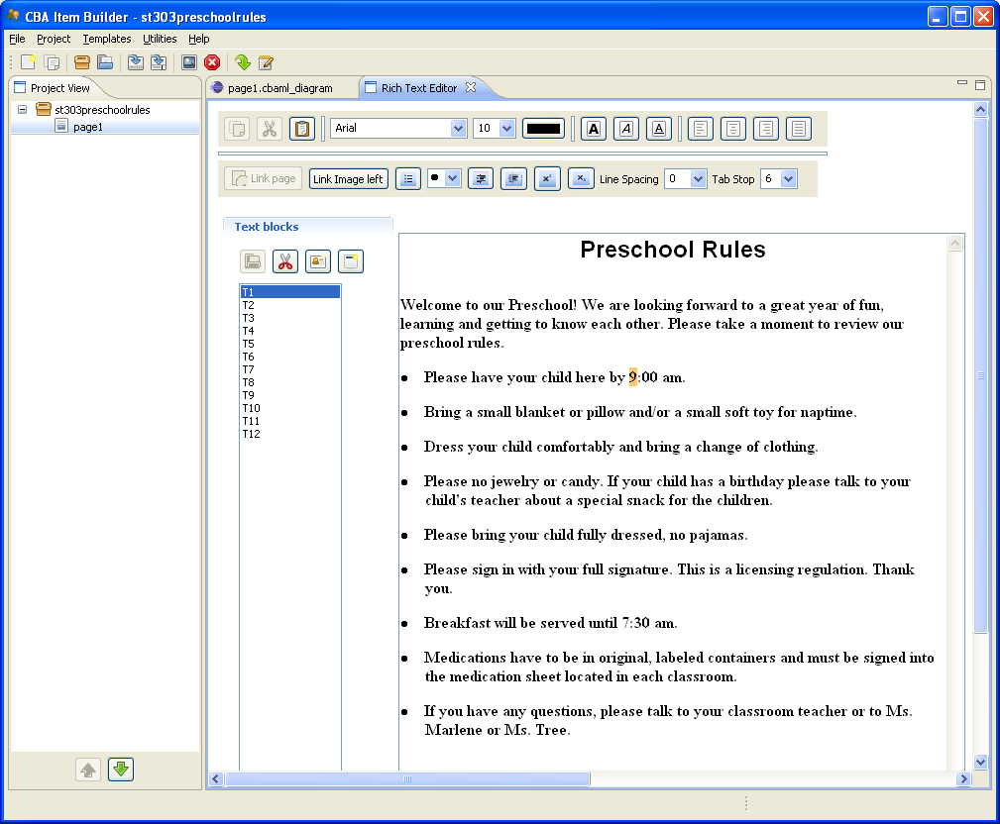

The following two pictures show the definition of the complement of the maximum correct response, i.e., the miss area.

In the example, it was not possible to create one text block for the miss area using the ?Add to the Text Block?-function, because the first paragraph and the bullet points are in two different TextFields.

This picture shows the first part of the Miss Area (Text Block T2):

This picture shows the second part of the miss area (Text Block T3):

Once the text blocks are defined, the Scoring Rule can be entered into the CBA Item Builder stimulus.

First, a Task needs to be created in the Task view menu (Project/Browse Tasks) by clicking the ?New?-button and setting a Task name. The amount of minimum hits is always 1 (as only one hit condition should be defined). Every question is one task. For each task, a starting page will have to be defined. Click the ?Tasks Start Page? column and select the page from the appearing drop down menu. You can choose all pages which also appear under Project View.

For each task hits and misses have to be added. To define a hit condition first select the according task from the tasks table, then click the ?Add Hit?-button. The hits table relative to the selected task is now active and name and weight have to be set. Then click the ?Open?-button right to the hits table. A condition tab will open where the hit Condition is defined, e.g., complete (T1). Here, the hit condition ?complete (T1)? means that a correct sore requires the complete selection of text block T1 ?9?.

This picture shows the definition of the hit condition:

> 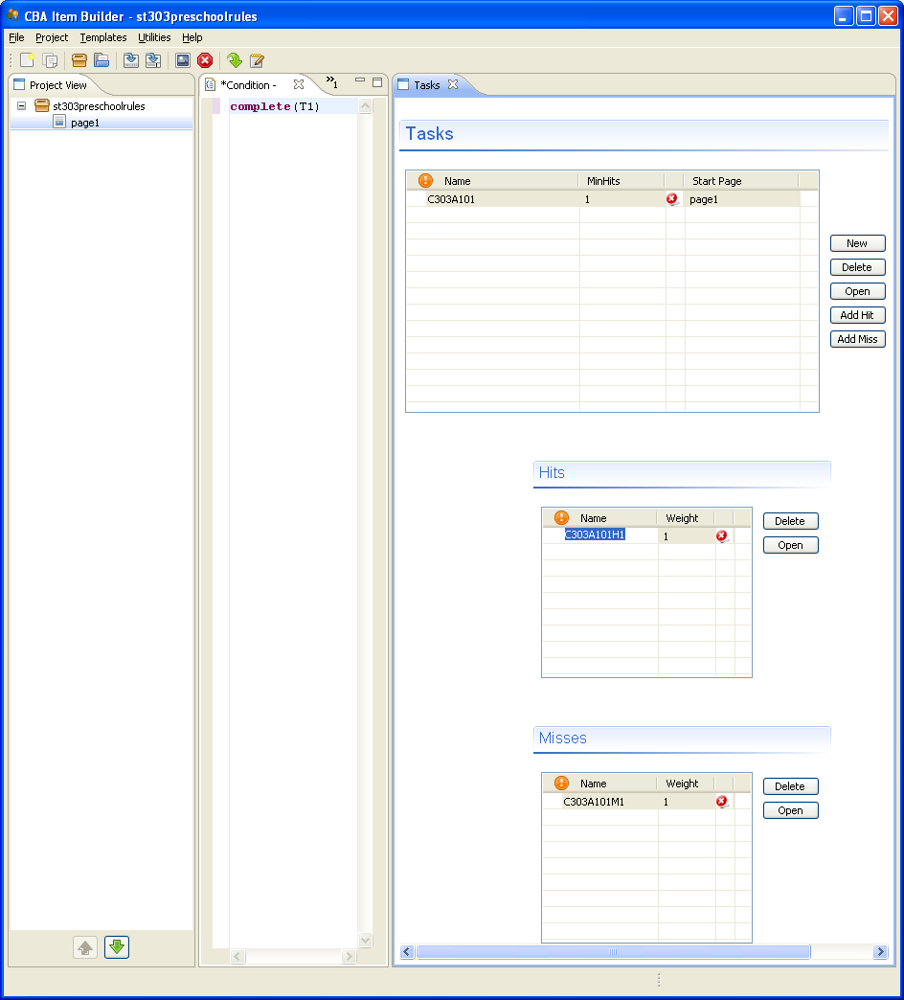
>
> Thereafter the miss condition is defined by opening and editing the condition tab for the misses, e.g., ?partial? (T2, T3). Here, the miss condition ?partial (T2, T3)? means that a response is scored as incorrectly if parts of T2 and/or T3 are selected.

This picture shows the definition of the miss condition:

Using Dynamic Functions
---------------------------------------------------------------------------------------------------------------------

### Value Displays

#### ImageValueDisplay

**Task:** Display different images according to test takers selection.

**Instruction:**

-   Start with a prepared simple page (see III.1.1.1).

-   Switch to the FSM and create a variable named ?V\_Example? (see II.5.1.1).

-   Save the project in order to ensure the FSM variables are available in the page editor.

-   Add a ScaleValueInput to the panel and assign the variable ?V\_Example? (right-click on the ScaleValueInput, select the entry ?Link Variable? and select the variable ?V\_Example?).

-   Open the ?Resource Browser? and add the images 1.fw.png, 2.fw.png, 3.fw.png and 4.fw.png from the Folder ?ValueDisplayExampleSimple?.

-   Open the ?Value Map? editor and create a new value map named ?M\_Example? (see 5.1.4).

-   Add new entries assigning the guard value 1 to the image 1.fw.png, the value 2 to the image 2.fw.png and proceed similar for the values 3 and 4.

-   Add an ImageValueDisplay to the panel and assign the variable ?V\_Example? (see above) as well as the value map ?M\_Example? (right-click on the ImageValueDisplay again, select the entry ?Link Value Map?).

-   Link the value map ?M\_Example? in the same way to the ScaleValueInput.

**IB Example:** ValueDisplayExampleSimple.zip

| ValueDisplayExampleSimple.zip | Design & Preview                                            |
|---------------------------------------------------------------------------------------------|
|                                                               |
| Figure 162. Example for an ImageValueDisplay |

Things you might need to know ?
==========================================================================================================================================================================================================================================================================

Version 4-16

Advanced organizer

Things of Suboptimal Usability
------------------------------

Usability is not yet optimal:

| **Problem**                                                                                         | **Workaround**                                                                                                                                                                                                              |
|-----------------------------------------------------------------------------------------------------|-----------------------------------------------------------------------------------------------------------------------------------------------------------------------------------------------------------------------------|
| Preview a project, a page, or a task twice does not work.                                           | Only occurs if you have installed the IB under Windows 7 at drive C:\\ Use ?Generate and save?, then you can open the preview again.                                                                                        |
| Preview does not work (white screen).                                                               | Close the IB and re-start it.                                                                                                                                                                                               |
| Preview does not work (Firefox is not opening).                                                     | Check if no any other preview is already open. If so, close it. Use ?Generate and save?, then you can open the preview again.                                                                                               |
| ?Close Project? definitely closes your current project.                                             | The IB does not ask you if you really want to close your project. You should better always save your work in case you click ?Close project? by accident.                                                                    |
| User-defined IDs should be used for each element.                                                   | IB generated IDs are just temporary and change every time you save your project (see II.3.2.3).                                                                                                                             |
| You cannot drop elements from the palette.                                                          | You always have to create a container (i.e., normally a frame and panel) at first.                                                                                                                                          |
| You cannot duplicate some elements.                                                                 | Sorry, it is not always working. Try using the template function (see II.3.6).                                                                                                                                              |
| The clipboard in the graphical is not implemented.                                                  | Menu entries in the menu ?Edit? (i.e., Cut, Paste and Copy) are always disabled.                                                                                                                                            |
| Missing some fonts. / Too many fonts.                                                               | List of fonts depends on the fonts installed on your system, i.e., the list might be rather long and you cannot type into the dialog elements to change the font.                                                           |
| Appearance tab in the properties is not displayed.                                                  | It might occur when you create an element (e.g., a frame) at first. Click at another element or into the undefined drawing area to deselect your newly created element and then re-click on it. Appearance tab now appears. |
| Regular buttons are not visible in web browser toolbars.                                            | Regular buttons in web browser toolbars need to have an activated image status. Define buttons as image buttons and link an image as activated image.                                                                       |
| The text properties from the Core tab or menu line do not work.                                     | Try to customize them under the appearance tab.                                                                                                                                                                             |
| Re-definition of table cells does not work.                                                         | Row and column number has to be configured at the beginning of table creation and is irreversable. Sorry, you have to define a new table.                                                                                   |
| Removal of tree column does not work.                                                               | Create a new tree view or set the width of the column to 0. Columns apply to both tree and tree view. To hide the tree it must have the same width.                                                                         |
| The line width in rectangles does not change in the Drawing Area.                                   | It is correctly displayed at runtime.                                                                                                                                                                                       |
| The Properties View seems to be frozen. It hangs for a selected element.                            | In that case close the page and re-open it again.                                                                                                                                                                           |
| Some menu items are missing in the Component View.                                                  | Create a new MenuItem in the Component View and delete it afterwards. This ?repairs? the broken menu items.                                                                                                                 |
| Parallel assignment of FSM events with commands or (conditional) links to an element does not work. | Define an additional page and use a regular link for the assignment of the command or conditional link, respectively.                                                                                                       |
| Conditional links coming from taskbar pages with start buttons does not work.                       | Re-define the taskbar start button as regular taskbar button.                                                                                                                                                               |
| The page links for Image Maps, Image Areas and Image Text Fields do not work.                       | Try to use another element for linking.                                                                                                                                                                                     |
| Content of MicroFin Model Panel is not restored when coming back to a previous task.                | The state of the graphical model (i.e., State, Transition, and Weight) is lost.                                                                                                                                             |
| Linking images to spreadsheet table cells affects the whole column.                                 | The column is then left-aligned and the content of any other cell in that column is displayed left of the horizontal space taken by the image.                                                                              |
| Toolbar of an editable HTML text field is not displayed.                                            | Probably the HTML text field size is not large enough. Resize the width and height parameters.                                                                                                                              |

Things You Might Not Expect to Work but Actually Do
---------------------------------------------------

The IB is always good for a surprise:

| **Element**                                   | **Workaround**                                                                                                                                                                       |
|-----------------------------------------------|--------------------------------------------------------------------------------------------------------------------------------------------------------------------------------------|
| Change properties for a selection of objects? | ? works for background color.                                                                                                                                                        |
| TAO Integration                               | The current official release of TAO (Version 2.5) does not contain the appropriate connector for CBA-ItemBuilder items. For an intermediate version please contact <roelke@dipf.de>. |

Things That Do Not Work
-----------------------

*Ignore* the following elements of the graphical user interface, as they are most often not useful:

| **Element**                          | **Functioning**                                                                                                   |
|--------------------------------------|-------------------------------------------------------------------------------------------------------------------|
| ?Arrange Selection? in the menu bar? | ? re-arranges all (or the selected) elements. However, this will rarely be a useful feature when designing items. |

List of Figures
===============

[Figure 1. Illustration of Correspondence to ZIP-File Examples in the IB Manual iv](#_Toc380472962)

[Figure 2. Idea of code generation and item presentation in the IB 3](#_Toc380472963)

[Figure 3. Example of Selection/Identification Implemented with Check Boxes in the IB (from Scalise, 2006, Figure 2) 5](#_Toc380472964)

[Figure 4. Examples of Multiple Choice with Radio Buttons (from Scalise, 2006, Figure 2 and Figure 4) 6](#_Toc380472965)

[Figure 5. Example of Rearrangement Implemented with RadioButtons in the IB (from Scalise, 2006, Figure 12) 6](#_Toc380472966)

[Figure 6. Example of an Item Using Image Maps to Provide Clickable Areas in a Coordinate 7](#_Toc380472967)

[Figure 7. Example of Substitution / Correction with Combo Box (from Scalise, 2006, Figure 14) 7](#_Toc380472968)

[Figure 8. Example of Completion with Single Line Input Field (from Scalise, 2006, Figure 19) 8](#_Toc380472969)

[Figure 9. Example of Completion with Single Line Input Field (from Scalise, 2006, Figure 18) 8](#_Toc380472970)

[Figure 10. Example of Construction with Input Field (from Scalise, 2006, Figure 25) 9](#_Toc380472971)

[Figure 11. Example of Construction with Buttons (from Goldhammer et al., 2012, released item) 9](#_Toc380472972)

[Figure 12. Example of Construction with Menu Entries (from Goldhammer et al., 2012, released item) 10](#_Toc380472973)

[Figure 13. Example of a Drag and Drop item 10](#_Toc380472974)

[Figure 14. Example of Construction with Highlightable Text (from NCES, 2013, released OECD PIAAC sample item) 11](#_Toc380472975)

[Figure 15. Example Page of a Questionnaire 11](#_Toc380472976)

[Figure 16. Setup wizard for the IB 14](#_Toc380472977)

[Figure 17. Start the IB by (double-)clicking on ?cba-itembuilder.exe? 15](#_Toc380472978)

[Figure 18. How to create a Shortcut on the Desktop 15](#_Toc380472979)

[Figure 19. Uninstall IB 16](#_Toc380472980)

[Figure 20. About Dialog of the IB 16](#_Toc380472981)

[Figure 21. Main Window of the IB 17](#_Toc380472982)

[Figure 22. Menu Entries and Icons for Creating a New Project or Opening an Existing One 18](#_Toc380472983)

[Figure 23. Preview a Project or a Page 19](#_Toc380472984)

[Figure 24. Preview Scope 19](#_Toc380472985)

[Figure 25. CBA Item Size 20](#_Toc380472986)

[Figure 26. Menu Entry and Icon for Closing an Opened Project 20](#_Toc380472987)

[Figure 27. Global project settings 21](#_Toc380472988)

[Figure 28. Central Elements of the IB User Interface 22](#_Toc380472989)

[Figure 29. Menu Bar and Menu Buttons 22](#_Toc380472990)

[Figure 30. Context Menu for the Current Project 25](#_Toc380472991)

[Figure 31. Context Menu for a Selected Page 25](#_Toc380472992)

[Figure 32. Multiple Page Editors above the Drawing Area 25](#_Toc380472993)

[Figure 33. Context Menu of Elements 26](#_Toc380472994)

[Figure 34. Show (or Hide) the Palette 26](#_Toc380472995)

[Figure 35. Opening the Properties View 27](#_Toc380472996)

[Figure 36. Editing Properties 27](#_Toc380472997)

[Figure 37. Settings for Properties View 28](#_Toc380472998)

[Figure 38. ?Rulers & Grid? for the IB drawing area 28](#_Toc380472999)

[Figure 39. ?Snap to Grid? and ?Snap to Shape? 29](#_Toc380473000)

[Figure 40. Preference Settings for ?Rulers & Grid? for the IB Drawing Area 29](#_Toc380473001)

[Figure 41. Frame and Panel in the Drawing Area of the IB 32](#_Toc380473002)

[Figure 42. Hierarchical Structure of Frame and Panel 33](#_Toc380473003)

[Figure 43. Additional Elements and Containers on a Panel 34](#_Toc380473004)

[Figure 44. Hierarchical List of Pages Elements in the Component View of the IB 34](#_Toc380473005)

[Figure 45. Additional Menu Bar for Editing a Page 35](#_Toc380473006)

[Figure 46. Example for User Defined IDs 36](#_Toc380473007)

[Figure 47. Editor for User Defined IDs 36](#_Toc380473008)

[Figure 48. The Resource Browser implemented in the IB 37](#_Toc380473009)

[Figure 49. Project Icon Editor 38](#_Toc380473010)

[Figure 50. Examples of Basic Design Elements in the IB 39](#_Toc380473011)

[Figure 51. Different Input Sources of SimpleTextFields 40](#_Toc380473012)

[Figure 52. HTMLTextField editor 41](#_Toc380473013)

[Figure 53. Text Editor for Rich Text 41](#_Toc380473014)

[Figure 54. Link Image 42](#_Toc380473015)

[Figure 55. Examples for the Use of Images to Design Pages 43](#_Toc380473016)

[Figure 56. Link Image to Buttons 44](#_Toc380473017)

[Figure 57. Standard Button (Text), Standard Button (Image) and Image Button 45](#_Toc380473018)

[Figure 58. Implementing a video player within an IB item 45](#_Toc380473019)

[Figure 59. Sorting of Pages in the Project View 47](#_Toc380473020)

[Figure 60. Links can be Assigned to Different Input Elements 47](#_Toc380473021)

[Figure 61. How to Link Pages 48](#_Toc380473022)

[Figure 62. Principle of Conditional Linking 49](#_Toc380473023)

[Figure 63. Conditional Link Example 50](#_Toc380473024)

[Figure 64. Default Link (left) and Condition (right) for the ConditionalLiniking Example 50](#_Toc380473025)

[Figure 65. Saving a page as template 51](#_Toc380473026)

[Figure 66. Message of Correct Template Saving 51](#_Toc380473027)

[Figure 67. Template Browser in the IB 52](#_Toc380473028)

[Figure 68. Menu Bar Entry and Icon for Creating a Page from a Template 52](#_Toc380473029)

[Figure 69. Create a New Page from Page Template 53](#_Toc380473030)

[Figure 70. Exporting Pages from Context Menu (left) or from Template Browser (right) 53](#_Toc380473031)

[Figure 71. Message of Correct Exporting Pages 54](#_Toc380473032)

[Figure 72. Importing Pages from Menu Bar (left) or from Template Browser (right) 54](#_Toc380473033)

[Figure 73. Developing a General Item Concept 55](#_Toc380473034)

[Figure 74. Icon for Opening the Task Editor 56](#_Toc380473035)

[Figure 75. Entries for Definition of an IB Task 57](#_Toc380473036)

[Figure 76. Composition of the Item Score 58](#_Toc380473037)

[Figure 77. Defining Hits and Misses in the Task Editor 59](#_Toc380473038)

[Figure 78. Elements of an IB Item Score (Scoring Viewer in the Preview) 60](#_Toc380473039)

[Figure 79. Example for Scoring Syntax (Simple Condition) 61](#_Toc380473040)

[Figure 80. Example for a Simple Logical Object that also Serves as Conditional Operator 61](#_Toc380473041)

[Figure 81. Example for a Comparison 61](#_Toc380473042)

[Figure 82. Error Message for Incorrect Syntax 62](#_Toc380473043)

[Figure 83. Scoring Example Checkbox (Design View and User-Defined IDs) 66](#_Toc380473044)

[Figure 84. Scoring Example Checkbox (Task definition) 66](#_Toc380473045)

[Figure 85. Adding Hits and Misses 67](#_Toc380473046)

[Figure 86. Scoring Example Checkbox (Hit and two Miss Conditions) 68](#_Toc380473047)

[Figure 87. Scoring Example Text Input (Design View and User-Defined IDs) 69](#_Toc380473048)

[Figure 88. Using the IB Scoring Viewer 69](#_Toc380473049)

[Figure 89. Name Variable Values 71](#_Toc380473050)

[Figure 90. Example for Input Elements Associated with Variables 72](#_Toc380473051)

[Figure 91. Different Settings for the ScaleVariableInput - Element 72](#_Toc380473052)

[Figure 92. Linking a Variable 73](#_Toc380473053)

[Figure 93. Example for Value Maps 74](#_Toc380473054)

[Figure 94. Edit a Value Map Entry in the IB 75](#_Toc380473055)

[Figure 95. Edit the Numeric Value of a Value Map Entry in the IB 75](#_Toc380473056)

[Figure 96. Example for Different Value Displays 76](#_Toc380473057)

[Figure 97. Linking Variables and Linking Value Maps 76](#_Toc380473058)

[Figure 98. Syntax for the FSM Definition 77](#_Toc380473059)

[Figure 99. Example for Events 77](#_Toc380473060)

[Figure 100. Setting Raised Events 78](#_Toc380473061)

[Figure 101. Graphical Editor to Define States 79](#_Toc380473062)

[Figure 102. Defining States 79](#_Toc380473063)

[Figure 103. Defining Regions 80](#_Toc380473064)

[Figure 104. Assigning Pages to FSM States 81](#_Toc380473065)

[Figure 105. Example for FSM Syntax 81](#_Toc380473066)

[Figure 106. StateMachine Diagram for Visualizing States and State Transitions Within a FSM 86](#_Toc380473067)

[Figure 107. Edit View of Two Pages with ImageValueDisplays 87](#_Toc380473068)

[Figure 108. Value Map (A), State Machine (B) and State Maching Rules (C) for Implementing Visual Feedback 88](#_Toc380473069)

[Figure 109. Preview of Different Pages during the Item Presentation 89](#_Toc380473070)

[Figure 110. Edit View of Used Pages. Pages in Part A and B Contain NumberValueDisplays 90](#_Toc380473071)

[Figure 111. State Machine (A) and State Maching Rules (B) for Implementing Navigation and Navigation Restrictions 91](#_Toc380473072)

[Figure 112. Preview of Different Pages and Timer Settings during the Items Presentation 92](#_Toc380473073)

[Figure 113. Assigning Commands 93](#_Toc380473074)

[Figure 114. Regular Expression in the Property ?Input Validation Pattern? 96](#_Toc380473075)

[Figure 115. Scoring Regular Expressions 98](#_Toc380473076)

[Figure 116. Example for Requesting ItemScore Parameters 99](#_Toc380473077)

[Figure 117. Example for Requesting FSM Variable Parameter 100](#_Toc380473078)

[Figure 118. Syntax Editor for Conditional Linking 101](#_Toc380473079)

[Figure 119. Syntax Editor for Task Initializing 102](#_Toc380473080)

[Figure 120. Multiple Syntax Lines for Multiple Conditional Links 103](#_Toc380473081)

[Figure 121. Definition of Multiple Conditions and Multiple Initializations 103](#_Toc380473082)

[Figure 122. Example for Using Regular Expression (Character Strings) for Defining Conditions 104](#_Toc380473083)

[Figure 123. Example for Using a Comparision as Condition 106](#_Toc380473084)

[Figure 124. Example for Using Initialization to Setting Up the User-Interface 108](#_Toc380473085)

[Figure 125. Example of a SimplePage 111](#_Toc380473086)

[Figure 126. Example of a Welcome-Page 111](#_Toc380473087)

[Figure 127. Example of a Button with Text and Additional Mouse Over Text to Guide Test takers 112](#_Toc380473088)

[Figure 128. Example of IB Item with Images 113](#_Toc380473089)

[Figure 129. Examples for Navigation Implementation by Buttons. Note that the project example always contains two elements (Buttons, Images, Hyperlink, etc.) linked to different pages. 113](#_Toc380473090)

[Figure 130. Navigate with Images from Page to Page 114](#_Toc380473091)

[Figure 131. Linking to Different Pages by Text 114](#_Toc380473092)

[Figure 132. Navigate with a Combo Box to Different Pages 114](#_Toc380473093)

[Figure 133. Navigate with a Menu Entries to Different Pages 115](#_Toc380473094)

[Figure 134. Linking to Different Pages by Previously Defined Conditions 117](#_Toc380473095)

[Figure 135. Example for Navigation with States 118](#_Toc380473096)

[Figure 136. Example for Navigation by Timed Events 119](#_Toc380473097)

[Figure 137. An X-Page Remains During Item Processing 121](#_Toc380473098)

[Figure 138. Changing X-Pages During Item Processing 122](#_Toc380473099)

[Figure 139. Tasks Definition and Layout Settings for X-Page 123](#_Toc380473100)

[Figure 140. Example of an X-Page with no Special Settings 124](#_Toc380473101)

[Figure 141. Example with a Right-Aligned X-Page 124](#_Toc380473102)

[Figure 142. Example of an X-Page with a Slider 125](#_Toc380473103)

[Figure 143. Example for a Webbrowser Simulation 128](#_Toc380473104)

[*Figure 144. Example for a Webbrowser Simulation* 128](#_Toc380473105)

[Figure 145. Edit View and Preview TabfolderExample.zip 130](#_Toc380473106)

[Figure 146. TaskbarExample.zip 131](#_Toc380473107)

[Figure 147. Defining Dialogs in the Property View of a Frame 132](#_Toc380473108)

[Figure 148. Example for Dialog and a Modal Dialog 132](#_Toc380473109)

[Figure 149. Specify a Dialog as Not Closable 133](#_Toc380473110)

[Figure 150. Edit View for the Simple Checkbox Item 134](#_Toc380473111)

[Figure 151. Edit View and Preview for the Simple Checkbox Item 135](#_Toc380473112)

[Figure 152. Edit View for the RadioButtonExample 136](#_Toc380473113)

[Figure 153. Preview for the RadioButtonExample 136](#_Toc380473114)

[Figure 154. Preview for the ImageExamples 136](#_Toc380473115)

[Figure 155. Edit View for the InputFieldExample 137](#_Toc380473116)

[Figure 156. Edit View for the ComboBoxExample 139](#_Toc380473117)

[Figure 157. Preview for the ComboBoxExample 139](#_Toc380473118)

[Figure 158. Preview for the ComboBoxSimple 140](#_Toc380473119)

[Figure 159. Edit View for the ListBoxExample 141](#_Toc380473120)

[Figure 160. Preview for the ListSimple Example 142](#_Toc380473121)

[Figure 161. Comparison between ComboBox and List 143](#_Toc380473122)

[Figure 162. Example for an ImageValueDisplay 159](#_Toc380473123)

[2] Note that in the current version the IB does not support the assignment of images to check box elements. This is, however, possible for radio buttons.
